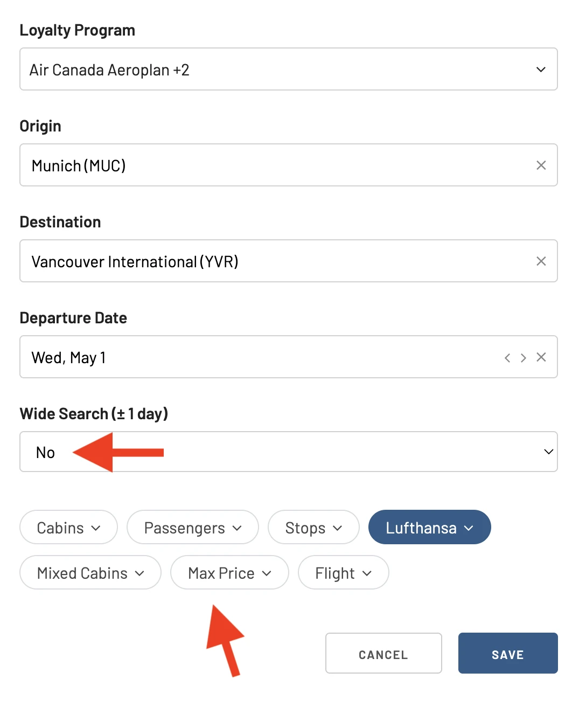

After a series of strikes that hit hard, Lufthansa is ready to share some exciting news for long-haul travelers. Lufthansa's new premium travel experience, Allegris, takes off on May 1st, 2024.

The first route will depart from Munich, Germany, towards the beautiful Canadian city of Vancouver. Toronto will soon follow, with alternating service between the two destinations in the initial months. As Lufthansa receives more Airbus A350s equipped with the Allegris cabin, Chicago and Montreal will be added to the summer schedule.

Travelers already booked on these flights will be automatically upgraded to the new Allegris cabin. According to Lufthansa's announcement, selecting your seat in Business Class is completely free for a limited time.

Remember that confirmation of whether a specific flight offers the Allegris experience will be available three weeks before departure.

## How to book the new Lufthansa Allegris with points or miles

### 1. Visit [AwardFares](https://awardfares.com/signup)

Creating an account is optional, but registration is free and unlocks additional features. [Sign up here to get started.](https://awardfares.com/signup)

### 2. Choose your favorite Frequent Flyer Program

Currently, AwardFares supports several programs allowingyou to book Lufthansa flights with points or miles, including [**SAS EuroBonus**](https://awardfares.com/search?..;z:sas), [**United MileagePlus**](https://awardfares.com/search?..;z:united), and [**Aeroplan**](https://awardfares.com/search?..;z:aeroplan).

Use the *Loyalty Program* field to choose your favorite one.

### 3. Add a Route

In this case, we search for the [Munich (MUC) to Vancouver (YVR) route](https://awardfares.com/search?MUC.YVR.2024-05-01;a:LH;o:duration;so:a;z:aeroplan,sas,united). You can also search for flights to Toronto as an alternating service. As the airline receives more A350s refitted with Allegris, more routes will be available.

### 4. Select Dates

The first flight is set for May 1st. Make sure to set that up using AwardFares' calendar. With our Timeline view, checking available seats across different days is very straightforward.

In addition, you can tap anywhere on the flight to display more details in an expanded view, such as pricing options, aircraft type, and even [get the current seat maps](https://blog.awardfares.com/seatmaps-guide/) to see which seats are free or occupied.

### 5. Book

Once you find your desired flight, click the **Book** button. AwardFares will redirect you to the loyalty program's website to finish the booking process.

## No seats available? Get notified with Alerts

It is extremely common for airlines to limit the number of seats released as awards when a new product or service is introduced or even not release any seats at all at the beginning. No worries; patience is key, but we are here to help.

AwardFares lets you set up alerts in an easy way, tracking your desired flights and notifying you via email when seats open up. For example, as of today, there are no seats available on the inaugural flight from Munich (MUC) to Vancouver (YVR):

To set up a new alert for this flight, tap on the **Track** button and turn on the toggle.

A popup will display *Alert Created*, and you can see the newly created alert under the **Alerts** pane (top bar).

You can also edit the alert by tapping on the *edit* icon (pencil). For example, you can adjust the date or cabin, set up a wide search (for +-1 day), or set a max price.

For a full guide on our Alerts, [read here](https://blog.awardfares.com/alerts/).

## What is Lufthansa Allegris?

Lufthansa's Allegris is a new travel experience for long-haul flights featuring upgraded cabins in all classes, including new First Class Suites (with double beds), Business Class Suites, Premium Economy, and Economy. It will officially launch in May 2024.

<figure>

</figure>

## Want More Award Travel Intel?

You can [try AwardFares for free](https://awardfares.com/). We are rolling out new features and improvements regularly, so [sign up for our monthly newsletter](https://awardfares.com/newsletter) to stay on top of the latest news, announcements, and pro tips.

With our [Gold and Diamond tiers](https://awardfares.com/pricing), you can access premium features such as unlimited daily searches, alerts, seat maps, flight schedules, and more!

## Learn More

Our guides have all the information you need to be a pro travel hacker and explore the world on points. Here are some related posts you might enjoy:

- [Essential Guide to Book Lufthansa Flights with SAS EuroBonus Points](https://blog.awardfares.com/lufthansa-with-eurobonus-guide/)
- [How To Find Cheap Award Flights And Identify Good Redemptions (Step-by-step)](https://blog.awardfares.com/how-to-find-cheap-award-flights/)
- [AwardFares vs Seats.aero: 7 Key Advantages That Elevate Your Award Travel](https://blog.awardfares.com/awardfares-vs-seats-aero/)