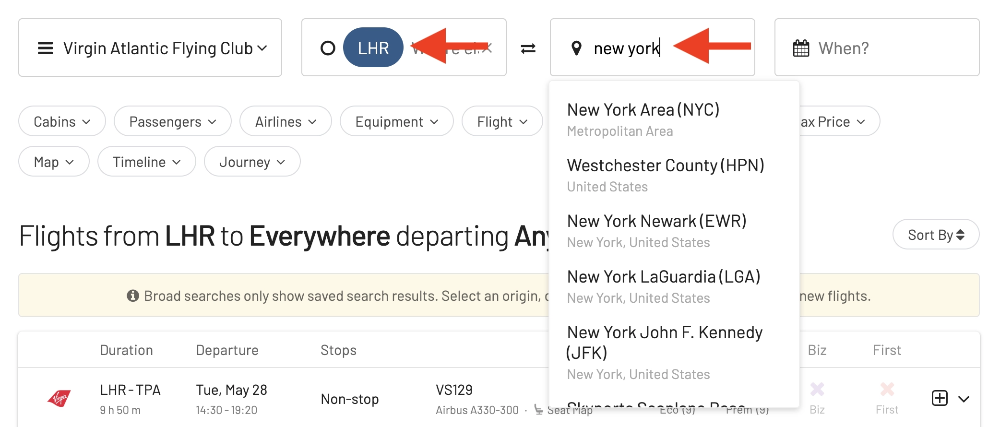
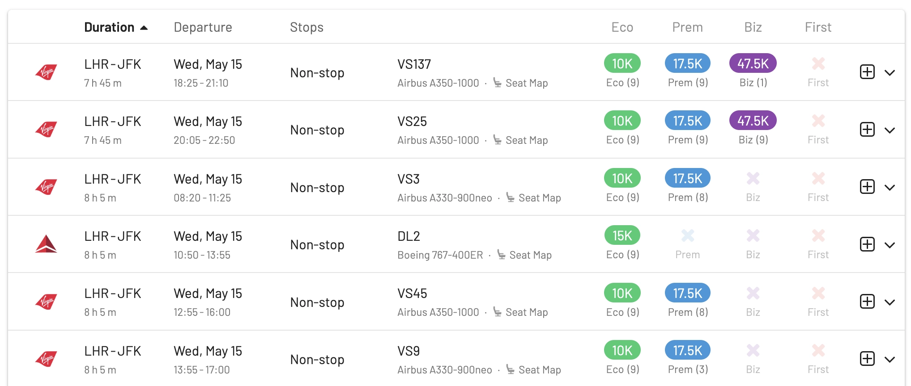
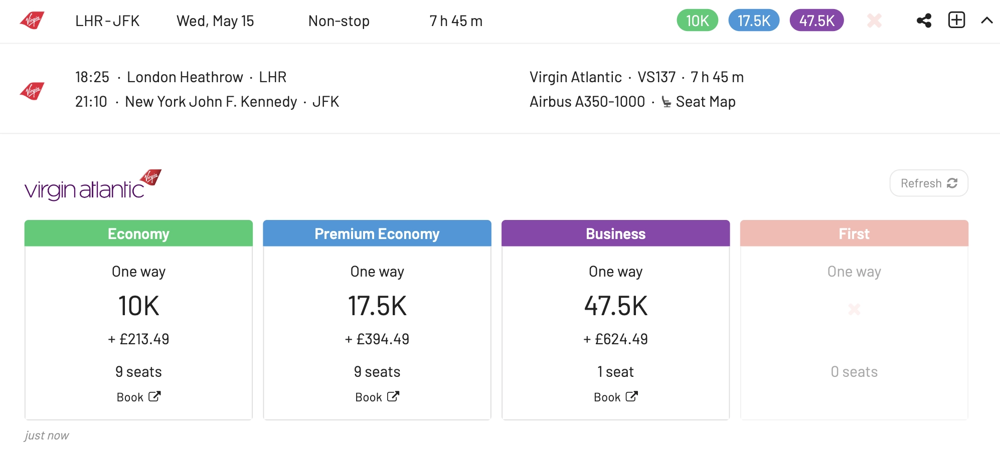
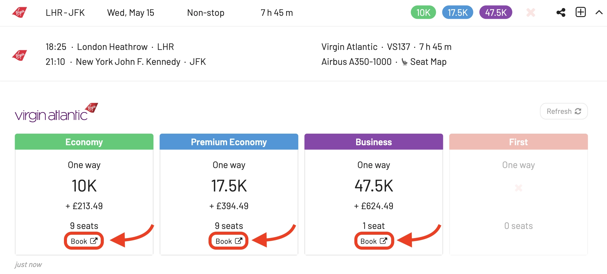
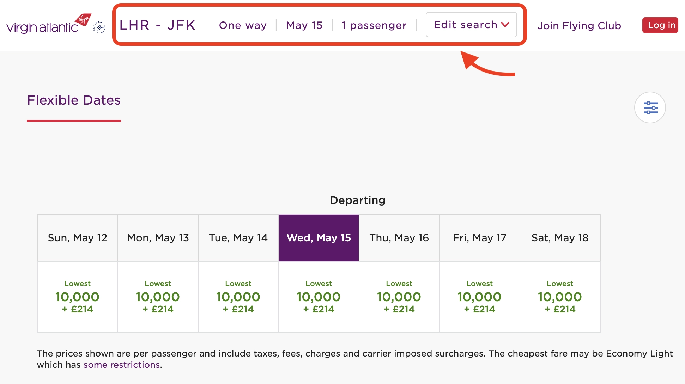

After a series of strikes that hit hard, Lufthansa is ready to share some exciting news for long-haul travelers. Lufthansa's new premium travel experience, Allegris, takes off on May 1st, 2024.

The first route will depart from Munich, Germany, towards the beautiful Canadian city of Vancouver. Toronto will soon follow, with alternating service between the two destinations in the initial months. As Lufthansa receives more Airbus A350s equipped with the Allegris cabin, Chicago and Montreal will be added to the summer schedule.

You can now view seat maps for all Allegris flights departing May 1st onwards through Lufthansa's regular booking channels. This includes all the special Allegris seating options, like the five unique business class configurations.

Travelers already booked on these flights will be automatically upgraded to the new Allegris cabin. According to Lufthansa's announcement, for a limited time, selecting your seat in Business Class is completely free.

Keep in mind that confirmation of whether a specific flight offers the Allegris experience will be available three weeks before departure.

## How to book the new Lufthansa Allegris with points or miles

### 1. Visit [AwardFares](https://awardfares.com/signup)

Creating an account is optional, but registration is free and unlocks additional features. [Sign up here to get started.](https://awardfares.com/signup)

### 2. Choose your favorite Frequent Flyer Program

As of today, AwardFares supports several programs that allows you to book Lufthansa flights

Select **Virgin Atlantic Flying Club** from the dropdown menu to start your award flight search.

### 3. Input Your Desired Route

Add your origin and destination airports, and AwardFares will search for available award flights, including those with stops. Filters for non-stop flights are also available.

In this example, we search for flights [between London (LHR) to New York (NYC)](https://awardfares.com/search?LHR.NYC.;z:flyingclub).

### 4. Select Dates

Either input specific dates or use the Timeline View to explore availability over different periods. This view helps you easily compare the availability and class of service across various days.

You'll see the result list right below:

In addition, you can tap anywhere on the flight to display more details in an expanded view, such as aircraft type, and even [get the current seat maps](https://blog.awardfares.com/seatmaps-guide/) to see which seats are free or occupied.

### 5. Sort by Price

AwardFares displays results in real-time, allowing you to sort options by cost-effectiveness across different dates and airlines.

### 6. Book 

Once you find your desired flight, click the **Book** button.

AwardFares will redirect you to Virgin Atlantic's website to complete your booking without the need to re-enter your search criteria, as it will be pre-populated.

## Want More Award Travel Intel?

You can [try AwardFares for free](https://awardfares.com/). We are rolling out new features and improvements regularly, so [sign up for our monthly newsletter](https://awardfares.com/newsletter) to stay on top of the latest news, announcements, and pro tips.

With our [Gold and Diamond tiers](https://awardfares.com/pricing), you can access premium features such as unlimited daily searches, alerts, seat maps, flight schedules, and more!

## Read More

Our guides have all the information you need to be a pro travel hacker and explore the world on points. Here are some related posts you might enjoy:

- [How To Find Cheap Award Flights And Identify Good Redemptions (Step-by-step)](https://blog.awardfares.com/how-to-find-cheap-award-flights/)
- [Seat Maps: Getting The Perfect Seat Even Before Booking](https://blog.awardfares.com/seatmaps-guide/)
- [Demystifying Award Charts: All You Need To Know (2024)](https://blog.awardfares.com/demystifying-award-charts/)
- [Ultimate Guide to Award Release Dates](https://blog.awardfares.com/ultimate-guide-to-award-release-dates/)
