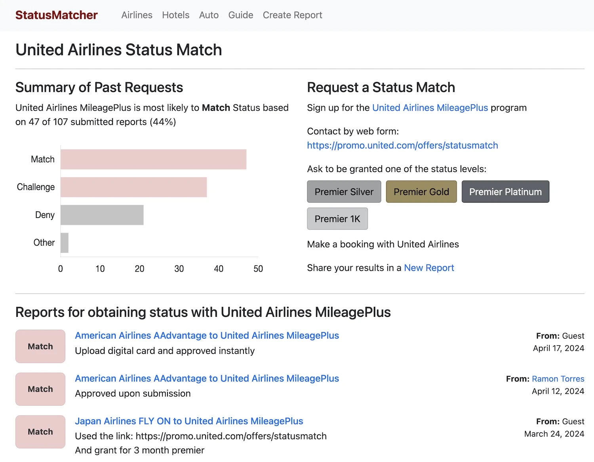
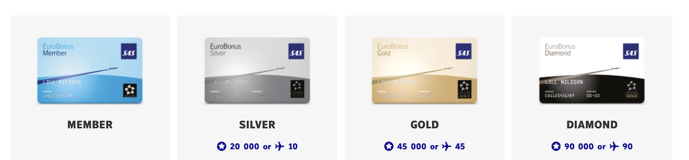
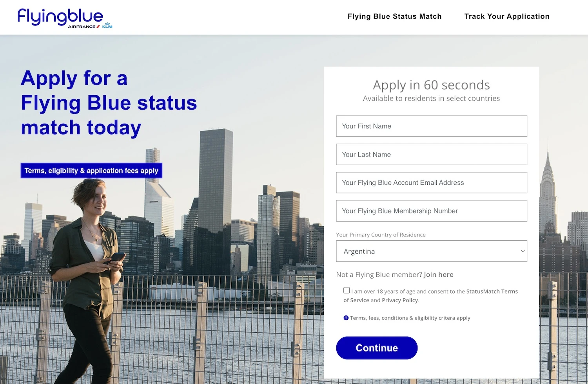

Are you a SAS EuroBonus member with hard-earned status? (e.g., Silver, Gold, or Diamond)? If so, how will the upcoming shift from Star Alliance to SkyTeam affect your travel benefits? If you keep traveling on Star Alliance after September 1st, you will lose benefits on some partner airlines, such as access to the Gold Track, Star Alliance Lounges, and more.

But there's a solution you might not be aware of: **status matching**. These turbulent times can be seen as an open door full of opportunities to try new things, including airlines, routes, and alliances. We recommend everyone familiarize themselves with this (low-effort) practice and take advantage of it, as it may open up a world full of benefits. In this guide, we look at the basics.

## What is Status Matching?

Status matching allows you to leverage your existing elite status in one airline loyalty program to obtain similar status in another program. This can be a great way to maintain perks like priority boarding, lounge access, and baggage allowances even as your preferred airline undergoes changes.

## Benefits of Status Matching

* **Preserve Your Benefits**: Don't lose the perks you've earned! Matching your EuroBonus status ensures a smooth transition and continued access to valuable travel benefits.
* **Explore New Airlines**: Status matching opens doors to new travel options. This can be particularly useful if your travel needs change or SAS routes become less convenient. In this case, it's equally valid to status match to keep your current benefits on Star Alliance, but also to try new alliances, such as oneworld (with British Airways, Iberia, and Finnair).
* **Boost Your Earning Potential**: With status in a new program, you can potentially earn more miles or points on flights with other airlines, given that most programs offer multipliers and accelerated point earnings on higher status levels (i.e., you get a head start!).

## How to Status Match Your EuroBonus Status

### 1. Find a Status Match Offer

Check the websites of airlines you're interested in, particularly those within your target alliance (Star Alliance, SkyTeam, etc.). Look for dedicated loyalty program pages or promotions sections.

One tool we love is [**StatusMathcher.com**](https://statusmatcher.com/). It provides resources and explanations about status matching. It also serves as a community, sharing *field reports* from users about recent successful status matches with various travel programs. Think of it as a guide and information hub, not a direct service for status matching. It can't guarantee matches, but offers valuable insights and helps you navigate the process.

For EuroBonus members, we recommend looking into [United MileagePlus](https://statusmatcher.com/company/united-airlines): this program has a track record of consistently matching other airline status and welcoming other members, and it is a Star Alliance member.

Another thing we recommend is to utilize travel blogs, forums like [FlyerTalk](https://www.flyertalk.com/) or [BusinessClass](https://businessclass.se/), and online communities on Facebook/Reddit/Discord, to discover airlines offering status matches and any specific requirements. Search for threads related to "status match" or "elite status challenge".

### 2. Gather Required Documents

Proof of your current elite status with EuroBonus. This could be a screenshot of your online account showing your tier level or a copy of your membership card. Depending on the airline, you might need additional documents like recent flight activity or a future flight confirmation.

### 3. Submit Your Application

Many airlines have dedicated online forms for status match requests. Alternatively, you might need to directly email the airline's loyalty program department. Their contact information should be available on the airline's website.

### 4. Include Necessary Information

In your application or email, clearly state your request for a status match. Include your full name, EuroBonus membership number, and any other details mentioned in the offer guidelines. Attach the required documents proving your current elite status.

Here's an email template you can copy and paste:

> Subject: Status Match Request - [Your Name] - [Current Airline Loyalty Program] [Your Tier Level] to [Target Airline]
>
> Dear [Target Airline] Loyalty Program Team,
>
> My name is [Your Name] and I am a loyal flyer with [Current Airline] (membership number: [Your Membership Number]). I currently hold [Your Tier Level] status in their [Current Airline Loyalty Program] program.
>
> I am writing to inquire about the possibility of a status match to your [Target Airline] loyalty program. I am very interested in flying [Target Airline] more frequently in the future, and I believe my travel history with [Current Airline] demonstrates a commitment to frequent flying.
>
> As proof of my status with [Current Airline], I have attached a screenshot of my online account showing my current tier level [or a copy of your membership card]. 
>
> [Optional: Briefly mention any additional information that strengthens your request. This could be recent flight activity with your current airline, a planned upcoming trip with the target airline, or specific benefits of the target airline program that interest you.]
>
> Thank you for your time and consideration. I look forward to hearing from you soon regarding this request.
>
> Sincerely,
>
> [Your Name]

### 5. Wait for Processing

Processing times for status match requests can vary depending on the airline. It could take anywhere from a few days to a few weeks.

### 6. Track Your Application (Optional)

Some airlines might allow you to track the status of your application online using your loyalty program login. If you haven't heard back after a reasonable timeframe (around 2 weeks), you can consider politely following up with the airline's loyalty program department. It's also possible to use an open-email tracking service such as [StreakCRM](https://www.streak.com/).

The picture below shows an example of an official status matching website from FlyingBlue. This offer was targeted to members living in the UK, and it was possible to both submit a form and track your application via an official website.

## Additional Tips and Considerations

* Be sure to read the terms and conditions of the status match offer carefully. This will outline the duration of the matched status, any requirements to retain it, and any limitations on benefits.
* **Temporary Matches**: Some status matches might be temporary, lasting only for a specific period. Be sure to understand the terms and conditions before applying.
* **Act quickly!** Many status match offers are limited-time promotions.
* Don't be discouraged if your initial request isn't accepted.
* You can always try contacting the airline directly or look for offers.
* Focus on Long-Term Value: When choosing a program to match to, prioritize airlines that align with your future travel plans and offer benefits you value most.

## Become a EuroBonus Pro

You can [try AwardFares for free](https://awardfares.com/). We are rolling out new features and improvements regularly, so [sign up for our monthly newsletter](https://awardfares.com/newsletter) to stay on top of the latest news, announcements, and pro tips.

With our [Gold and Diamond tiers](https://awardfares.com/pricing), you can access premium features such as unlimited daily searches, alerts, seat maps, flight schedules, and more!

## Read More

Our guides have all the information you need to be a pro travel hacker and explore the world on points. Here are some related posts you might enjoy:

* [How To Find Cheap Award Flights And Identify Good Redemptions (Step-by-step)](https://blog.awardfares.com/how-to-find-cheap-award-flights/)
* [Seat Maps: Getting The Perfect Seat Even Before Booking](https://blog.awardfares.com/seatmaps-guide/)
* [Demystifying Award Charts: All You Need To Know (2024)](https://blog.awardfares.com/demystifying-award-charts/)
* [Ultimate Guide to Award Release Dates](https://blog.awardfares.com/ultimate-guide-to-award-release-dates/)
