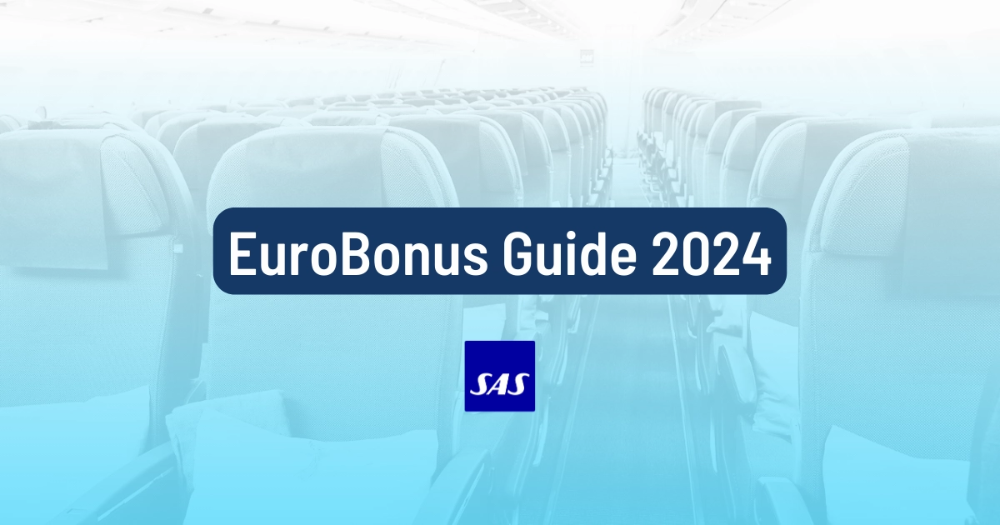
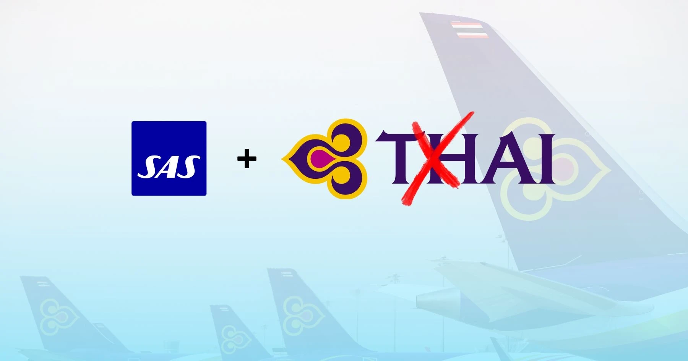

The EuroBonus program is buzzing this spring, and we're here to keep you in the loop with all the latest news. Every month, we summarize the hottest topics, so you can stay effortlessly informed.

This April, there are several key items on the agenda, most notably the ongoing transition from [Star Alliance to SkyTeam](https://blog.awardfares.com/sas-transition-to-skyteam/). Let's jump right in!

## SAS EuroBonus Updates (April 2024)

### 1. SAS will join SkyTeam on September 1

SAS confirmed that the transition to SkyTeam will be effective on September 1, 2024. [You can read all the details around the announcement](https://blog.awardfares.com/sas-transition-to-skyteam/). The shift has a number of implications for booking and redeeming award flights with EuroBonus points.

You can be prepared with our [Ultimate Guide to Using SAS EuroBonus Points](https://blog.awardfares.com/eurobonus-guide/). We carefully crafted the guide to help you find the best (free) flights on SAS and Star Alliance before the airline leaves and, ultimately, on SkyTeam partners once the airline enters the new alliance and integrates with those partners.

  TIME LEFT TO BOOK STAR ALLIANCE AWARDS

### 2. Discounts on cash tickets with SAS (Book by April 22nd)

SAS is running heavily discounted prices on revenue tickets, valid for bookings until April 22nd. We've seen prices starting at 4000kr for both destinations in the USA and Asia.

This is a great opportunity not only to get cheap flights to interesting destinations, but also to accrue extra EuroBonus points or challenge for a higher status if you are running short during your qualification period.

* **Travel Period**: November 1, 2024 - March 29, 2025.
* **Book by**: April 22, 2024

### 3. Thai Temporarily Disappears from EuroBonus Booking Portal

During April, there was a glitch/update on the EuroBonus portal in which [**it was not possible to redeem points for flights on Thai Airways**](https://blog.awardfares.com/thai-stops-working-with-eurobonus/). This happened after [United also disappeared from the search portal](https://blog.awardfares.com/united-stops-working-with-eurobonus/). Luckily, the functionality was restored after several hours.

**Heads up!** It's important to keep an eye on these changes and be prepared to embrace change. We advise all EuroBonus members to make any desired bookings right away if they see availability. The situation is changing rapidly, and there's no guarantee that the integration with each partner airline will remain available until SAS officially leaves Star Alliance on August 31. At AwardFares, we've witnessed several sudden changes without any notice regarding awards on partner airlines.

Read more [in this post](https://blog.awardfares.com/thai-stops-working-with-eurobonus/).

### 4. Get 20.000 EuroBonus Points with Royal Caribbean

Get double EuroBonus points on your next cruise. Book a 6-night cruise (or more) with Royal Caribbean before May 31, 2024, and earn 20.000 points. **Important:** make sure you [book through the SAS EuroBonus portal](https://erbjudande.royalcaribbean.se/sas?utm_source=Eurobonus&utm_medium=homepage&utm_campaign=Spring_promo&utm_id=Spring) to get the points.

## Become a EuroBonus Pro

You can [try AwardFares for free](https://awardfares.com/). We are rolling out new features and improvements regularly, so [sign up for our monthly newsletter](https://awardfares.com/newsletter) to stay on top of the latest news, announcements, and pro tips.

With our [Gold and Diamond tiers](https://awardfares.com/pricing), you can access premium features such as unlimited daily searches, alerts, seat maps, flight schedules, and more!

Our guides have all the information you need to be a pro travel hacker and explore the world on points. Here are some related posts you might enjoy:

* [Guide To Using SAS EuroBonus Points (Before & After They Join SkyTeam)](https://blog.awardfares.com/eurobonus-guide/)
* [From Star Alliance to SkyTeam: The SAS Transition (Official Info)](https://blog.awardfares.com/sas-transition-to-skyteam/)
* [Lufthansa Allegris Takes Flight on May 1st (Book with Points)](https://blog.awardfares.com/lufthansa-allegris-first-flight/)
* [Try These EuroBonus Award Flights Before SAS Leaves Star Alliance (Megapost)](https://blog.awardfares.com/eurobonus-star-alliance-awards/)

