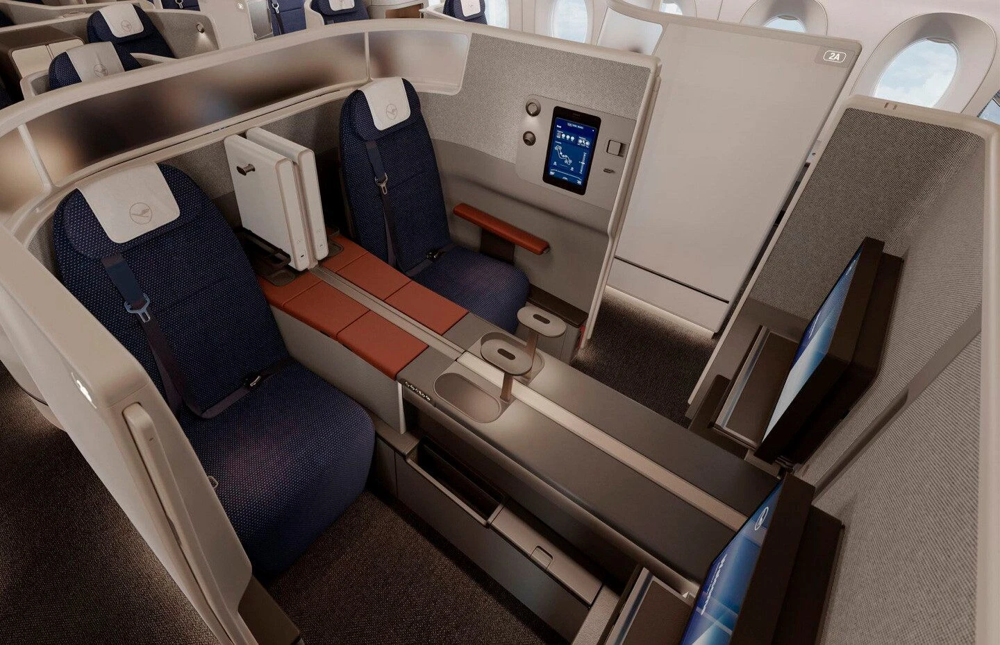
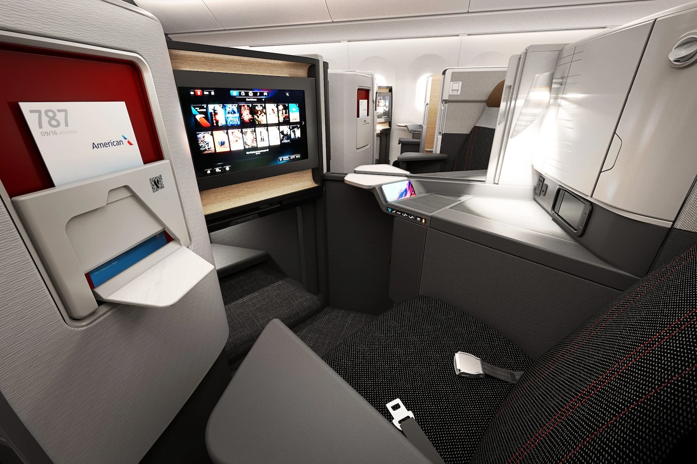
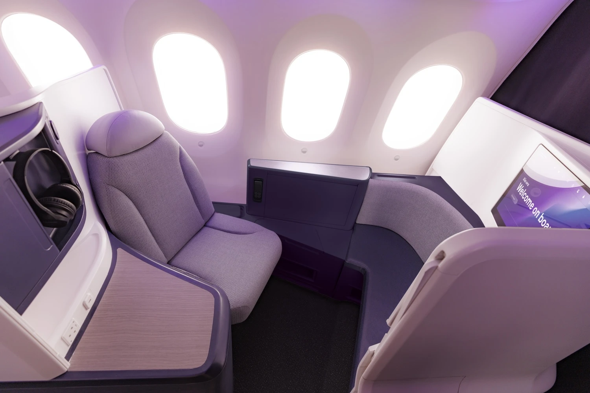
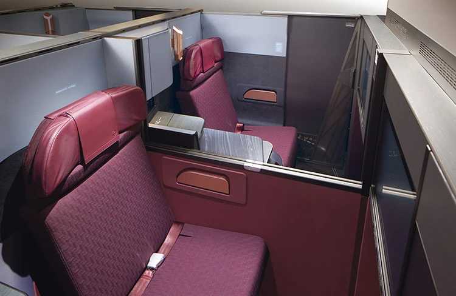
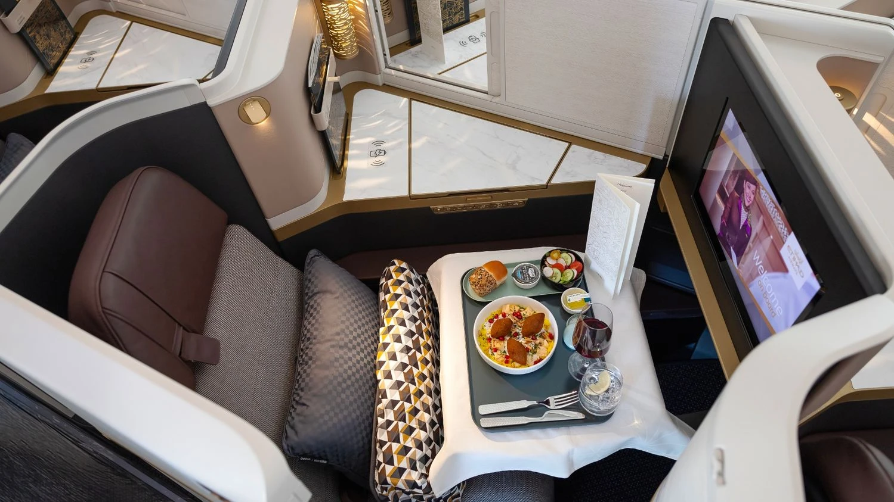

For frequent flyers and luxury travelers, 2024 promises to be a year of exciting innovations in premium cabins. Airlines are unveiling new designs that focus on increased comfort, privacy, and personalization, taking the in-flight experience to new heights. Here's a look at some of the ones that caught our attention.

Remember that you can use AwardFares in combination with your favorite frequent flyer program [to search for availability](https://awardfares.com/search) in these new seats and cabins, or [set up alerts](https://blog.awardfares.com/alerts/) to get notified when award seats get released and book right away.

## Premium Cabins Taking Flight: What to Expect in 2024

### 1. Cathay Pacific Aria Suites

Cathay Pacific is set to introduce the Aria Suites, a new business class seat for its Boeing 777-300ER aircraft. These suites will feature a golden-brown color scheme, wood-like surfaces, a folding tray for storage, wireless charging, and a 4K IFE screen. The launch is expected in the second quarter of 2024​​.

### 2. Lufthansa Allegris

Lufthansa's Allegris takes center stage. The highly anticipated Allegris cabins, encompassing both business class and a first-class option with the "Swiss Senses" branding, offer a complete revamp for Lufthansa. Passengers can expect spacious seats with direct aisle access, industry-leading privacy features like fully closing doors in business class, and larger entertainment screens. The Allegris premium economy boasts increased legroom, thoughtfully designed reclining seats, and thoughtful amenities.

Read more on [Lufthansa Allegris and how to book it with points here](https://blog.awardfares.com/lufthansa-allegris-first-flight/).

### 3. American Airlines Flagship Suites

American Airlines is enhancing its long-haul fleet with the introduction of Flagship Suite seats and a new Premium Economy class. The Flagship Suite seats will offer a private premium experience with more personal space and lie-flat seating options. These enhancements will be featured on new Boeing 787-9 aircraft and retrofitted Airbus A321XLRs, with the roll-out beginning in 2024.

Read more on [American's new onboard experience here](https://blog.awardfares.com/american-new-onboard-experience/).

### 4. Air New Zealand's New Business Premier Class

Air New Zealand's Dreamliner Gets a Sky Upgrade. The innovative airline known for its quirky safety videos is introducing the revolutionary Skynest bunk system on its new Boeing 787-9 fleet. Imagine compact, pod-like capsules designed for napping or relaxation during long journeys. While details on pricing and availability are still emerging, the Skynest promises a unique way to stretch out and recharge on extended flights.

### 5. Japan Airlines

JAL doubles down on comfort. Both Business Class and Premium Economy on Japan Airlines' new offerings will focus on enhanced comfort. Expect wider seats with improved ergonomics in business class, while premium economy boasts extra legroom and personal amenities designed for relaxation.

In particular, look for flights operated by [the A350-1000](https://blog.awardfares.com/jal-a350-premium-economy-review/), which have the new Flagship Business Class. Check our [review in Premium Economy here](https://blog.awardfares.com/jal-a350-premium-economy-review/).

### 6. Emirates and Etihad

Emirates and Etihad Airways are also joining the fray, with Emirates planning to retrofit its Boeing 777-300ERs to include new business class cabins, and Etihad expected to debut its new Business Class seats on the Boeing 787-9 Dreamliners.

## Want More Award Travel Intel?

You can [try AwardFares for free](https://awardfares.com/). We are rolling out new features and improvements regularly, so [sign up for our monthly newsletter](https://awardfares.com/newsletter) to stay on top of the latest news, announcements, and pro tips.

With our [Gold and Diamond tiers](https://awardfares.com/pricing), you can access premium features such as unlimited daily searches, alerts, seat maps, flight schedules, and more!

## Read More

Our guides have all the information you need to be a pro travel hacker and explore the world on points. Here are some related posts you might enjoy:

- [How To Find Cheap Award Flights And Identify Good Redemptions (Step-by-step)](https://blog.awardfares.com/how-to-find-cheap-award-flights/)
- [JAL A350-1000 Premium Economy: New York To Tokyo](https://blog.awardfares.com/jal-a350-premium-economy-review/)
- [Lufthansa Allegris Takes Flight on May 1st (Book with Points)](https://blog.awardfares.com/lufthansa-allegris-first-flight/)
- [American Airlines Launches New Onboard Experience: Revamped Amenities, Bedding, and Dining](https://blog.awardfares.com/american-new-onboard-experience/)