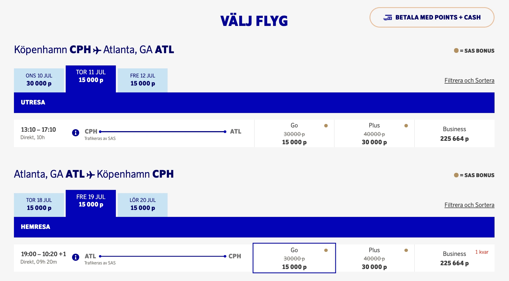
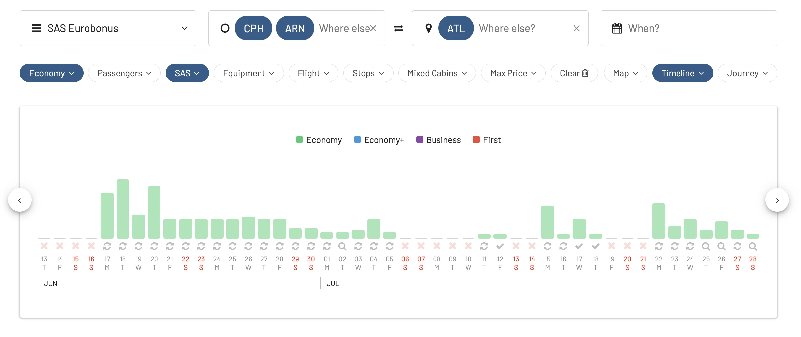
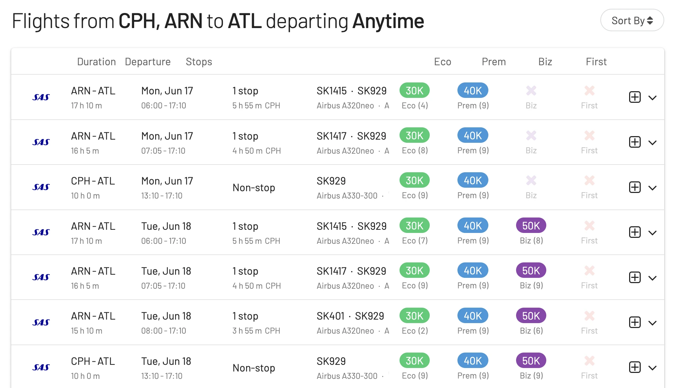
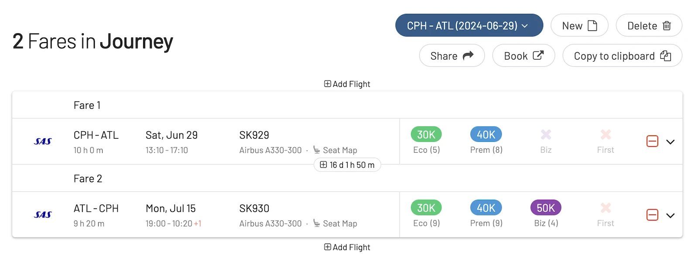
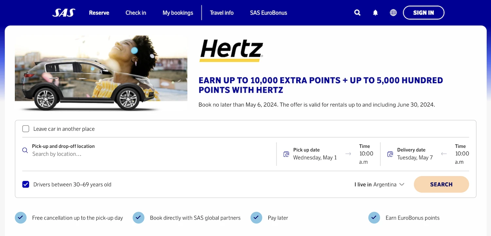
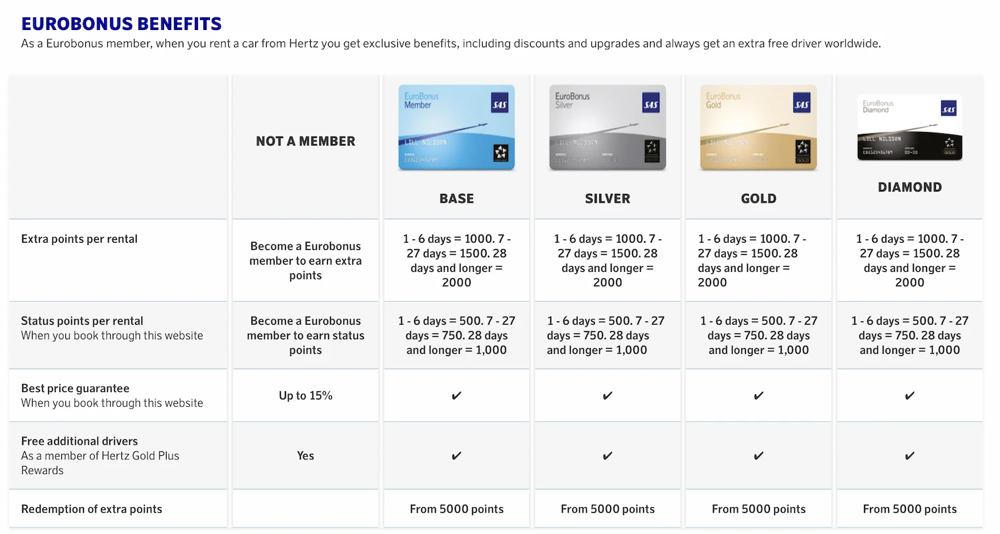
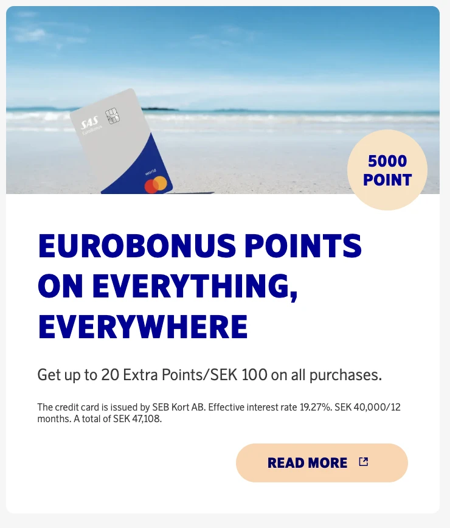

## 50% Discount on EuroBonus Award Trips to Atlanta

SAS is banging hard on the new rout to Atlanta and is now offering a 50% points discount on bonus trips!

The offer applies to **round trips in SAS Go Bonus** (Economy). And as usual, children 2-11 years old get 50% of the point price, even on the already discounted price.

* **Book by**: May 6, 2024
* **Travel period**: 17 June – 31 August 2024
* **Discount**: 50% in SAS Go Bonus

Here's an example of how the discount gets applied during the booking process:

### Find seats to Atlanta using AwardFares

AwardFares is the fastest and easiest way to find available seats using EuroBonus points, as you can search across multiple dates at the same time, applying filters with just a few clicks.

Here's how to search for available seats on the route to Atlanta, to take advantage of the discount:

1. Go to [AwardFares](https://awardfares.com/search) and log-in.
2. Set **EuroBonus** as the *Frequent Flyer Program*.
3. Select the *Route*, for example, **Copenhagen (CPH) or Stockholm (ARN)** to **Atlanta (ATL)**
4. Under *Airline* set **SAS only**. This way you only get flights operated by SAS (instead of the whole Star Alliance).
5. Tap on the *Cabin* pill and set **Economy**. The discount only applies to Economy tickets.
6. Select a date or multiple dates using the Timeline View.

That's it! You'll see the availability displayed in the Timeline

And the full result list below. Tap anywhere on the flight to expand and see more details such as prices. Note that the discounted price will be shown on the SAS booking website during the booking (not on AwardFares).

Keep in mind that you can use our [**Journey Planner**](https://blog.awardfares.com/journey-planner/) feature to find and plan round trips.

## Up to 5000 Status Points with Hertz Car Rental

In addition to point discount, there's yet another campaign ending on May 6 to earn additional extra points and status points on your next Hertz rental.

Here's the breakdown:

* Book a Hertz rental car between now and May 6, 2024, for rentals up to June 30, 2024.
* Earn extra EuroBonus points on your rental, plus an additional 50% of those points as status points.
* The number of points earned increases with the length of your rental (see details below).

**Points Breakdown**

* Rent 1 day: 1,500 extra points + 750 status points
* Rent 2-5 days: 3,000 points + 1,500 status points
* Rent 6-10 days: 5,000 points + 2,500 status points
* Rent 10-14 days: 8,000 points + 4,000 status points
* Rent 15-21 days: 10,000 points + 5,000 status points

**Benefits**

* Extra EuroBonus points: These points can be used towards exciting travel rewards, such as flights with SAS.
* Status point boost: Status points contribute to reaching higher EuroBonus membership tiers, which unlock benefits like lounge access and priority boarding.
* Valid on all Hertz rentals: This offer applies to all car classes at Hertz, including electric vehicles.

Hertz offers a wide variety of rental cars covering a wide range of needs. SAS customers can also enjoy special benefits from Hertz, such as discounted rental rates, depending on their status:

## SAS EuroBonus Mastercard: Increased Sign-up Bonus

SEB is still offering 5000 EuroBonus points as a welcome bonus to new customers applying for the SAS EuroBonus Mastercard. The offer is valid in Sweden and Norway. Previously the bonus was 3000 points, but the bank has increased it as they also raised the maintenance fees.

## Become a EuroBonus Pro

You can [try AwardFares for free](https://awardfares.com/). We are rolling out new features and improvements regularly, so [sign up for our monthly newsletter](https://awardfares.com/newsletter) to stay on top of the latest news, announcements, and pro tips.

With our [Gold and Diamond tiers](https://awardfares.com/pricing), you can access premium features such as unlimited daily searches, alerts, seat maps, flight schedules, and more!

## Read More

Our guides have all the information you need to be a pro travel hacker and explore the world on points. Here are some related posts you might enjoy:

- [Should You Match Your EuroBonus Status with a Different Airline? (Yes)](https://blog.awardfares.com/eurobonus-status-match/)
- [From Star Alliance to SkyTeam: The SAS Transition (Official Info)](https://blog.awardfares.com/sas-transition-to-skyteam/)
- [Guide To Using SAS EuroBonus Points (Before & After They Join SkyTeam)](https://blog.awardfares.com/eurobonus-guide/)
- [Updates For SAS EuroBonus Members (March 2024)](https://blog.awardfares.com/eurobonus-updates-mar-2024/)
- [Try These EuroBonus Award Flights Before SAS Leaves Star Alliance](https://blog.awardfares.com/eurobonus-star-alliance-awards/)