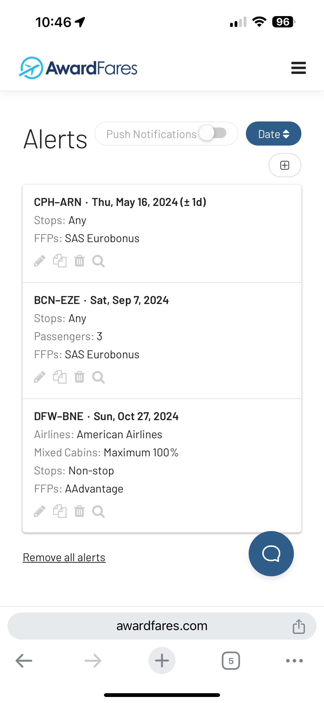
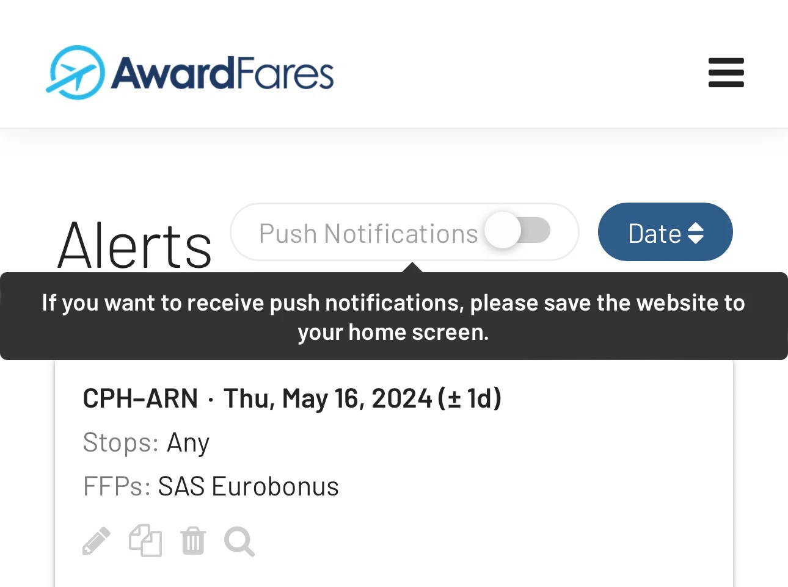
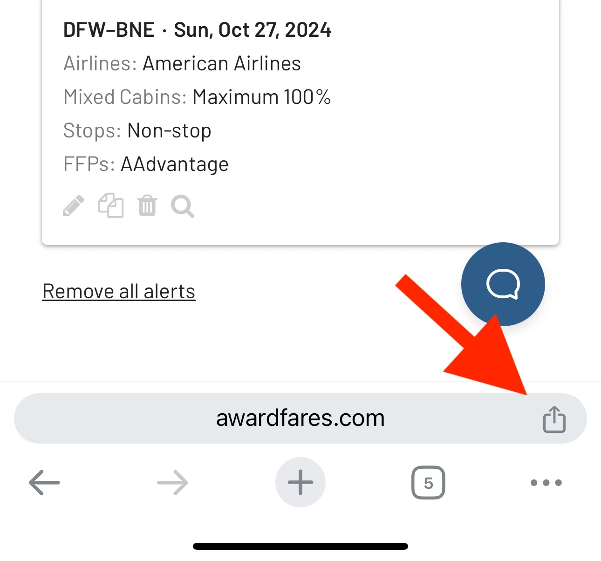
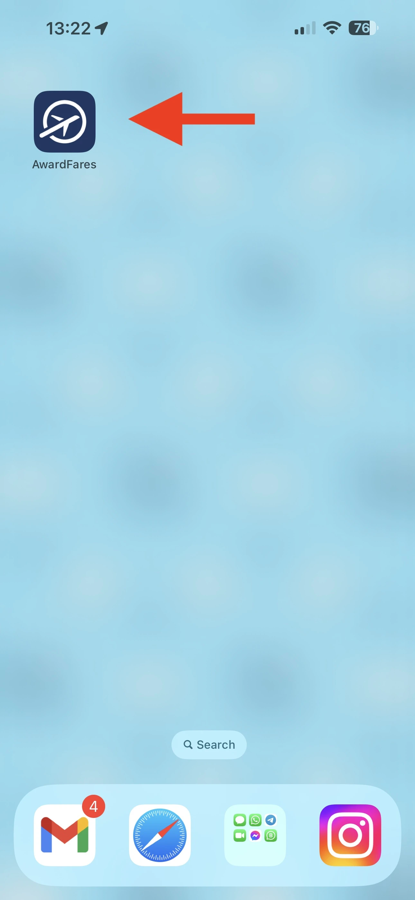
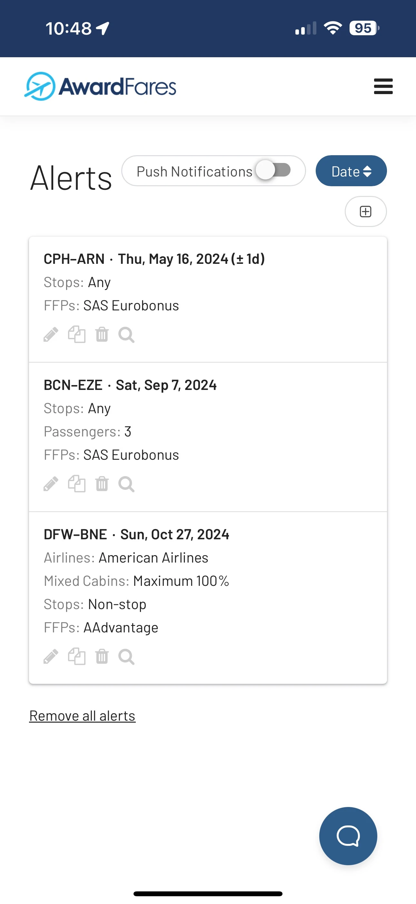
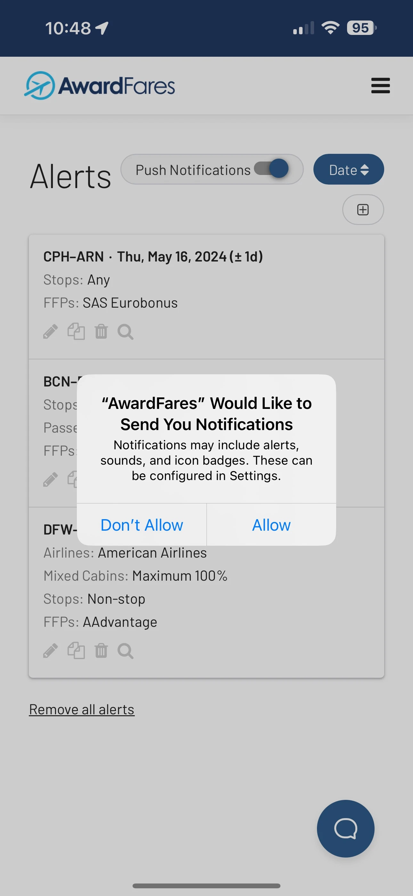
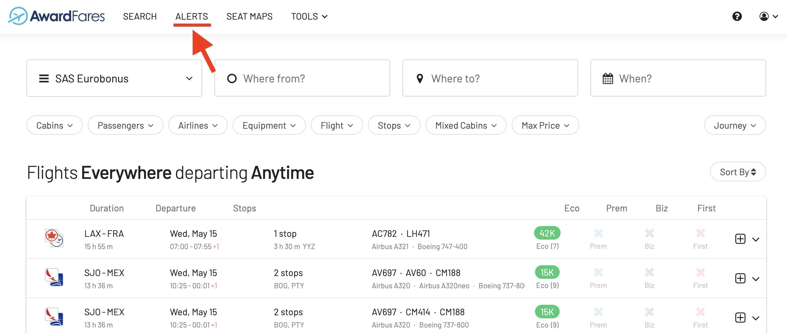
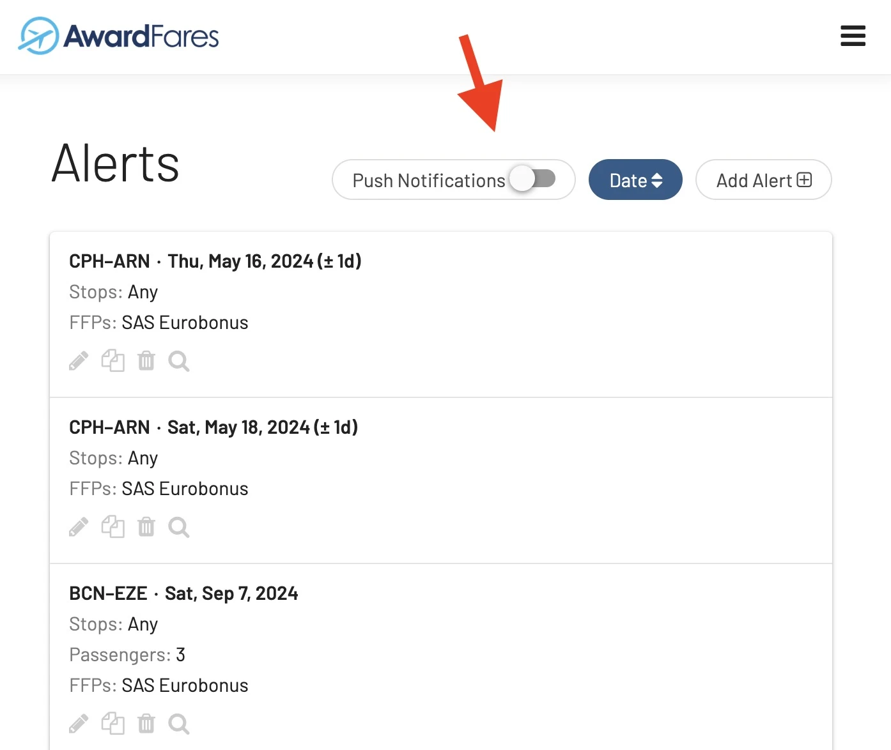
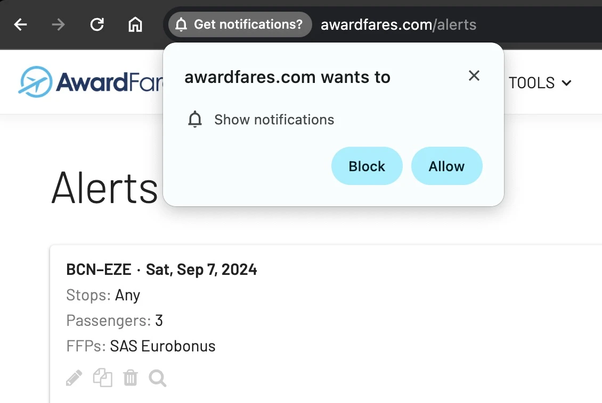
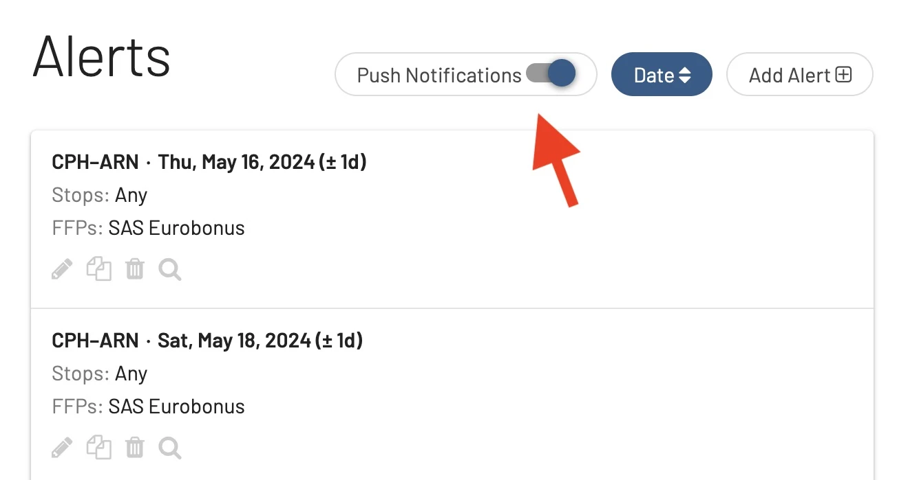

If you're using AwardFares to stay updated on award travel deals and seat availability, enabling push notifications on both your desktop and mobile devices can greatly enhance your experience, letting you know as soon as your dream award seat becomes available. In this guide, we'll show you how to set them up step-by-step.

## How to Enable Push Notifications for Alerts

### On Mobile

### 1. Log in to AwardFares and tap on **Alerts**

On mobile, push notifications require AwardFares to be installed on your home screen. If not, a warning will pop-up.

To do so, tap on the **Share** icon

Then, select **Add to Home Screen**. You'll see the AwardFares app as a new icon in your library

## 2. Tap on the **Push Notifications** toggle

### 3. Select Allow Notifications

### On Desktop

### 1. Log in to AwardFares and tap on **Alerts**

### 2. Tap on the **Push Notifications** toggle

### 3. Enable Push Notifications on your Browser

### 4. Confirm that the toggle is On

## Want More Award Travel Intel?

You can [try AwardFares for free](https://awardfares.com/). We are rolling out new features and improvements regularly, so [sign up for our monthly newsletter](https://awardfares.com/newsletter) to stay on top of the latest news, announcements, and pro tips.

With our [Gold and Diamond tiers](https://awardfares.com/pricing), you can access premium features such as unlimited daily searches, alerts, seat maps, flight schedules, and more!

## Read More

Our guides have all the information you need to be a pro travel hacker and explore the world on points. Here are some related posts you might enjoy:

- [Alerts: Never Miss a Deal Again](https://blog.awardfares.com/alerts/)
- [How To Find Cheap Award Flights And Identify Good Redemptions (Step-by-step)](https://blog.awardfares.com/how-to-find-cheap-award-flights/)
- [Journey Planner: Building Perfect Award Trips To Difficult Destinations](https://blog.awardfares.com/journey-planner/)
- [Seat Maps: Getting The Perfect Seat Even Before Booking](https://blog.awardfares.com/seatmaps-guide/)
- [Metro Area Searches: Full Guide](https://blog.awardfares.com/metro-area-search-guide/)
