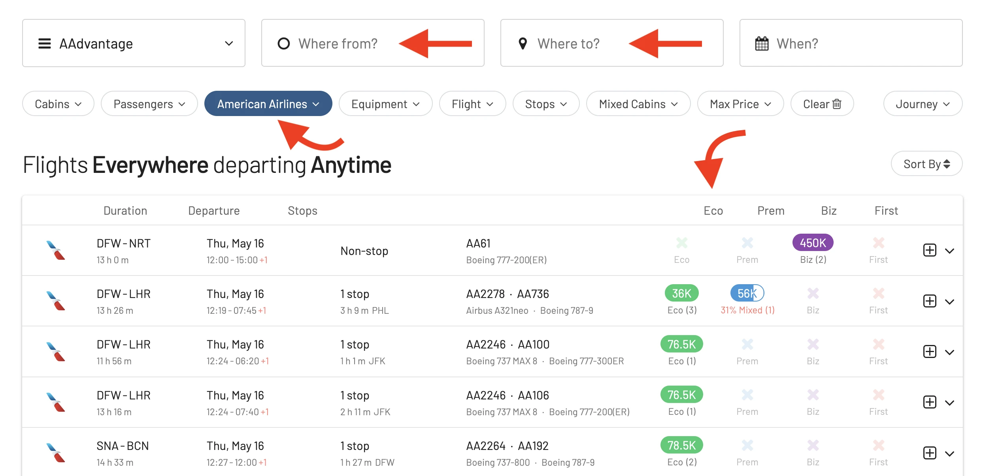

American Airlines just announced their biggest-ever winter schedule for the Caribbean and Latin America, offering more flights and destinations than any other U.S. carrier. ✈️

## American Airlines Winter Schedule 2025: What You Need To Konw

* **More Dominican Republic**: American will be the airline with the most flights to the Dominican Republic, thanks to their new service to **La Romana (LRM)** starting in December. 🇩🇴
* **Seven New Routes**: They're also adding seven new routes connecting [**Charlotte (CLT)**](https://awardfares.com/search?CLT..;a:AA;z:aadvantage), [**New York (JFK)**](https://awardfares.com/search?JFK..;a:AA;z:aadvantage), and [**Philadelphia (PHL)**](https://awardfares.com/search?PHL..;a:AA;z:aadvantage) to exciting destinations in Latin America and the Caribbean.
* **Industry Leader**: This winter, American will operate over 2,350 peak weekly flights to more than 95 destinations in the region, solidifying their position as the top U.S. airline for tropical getaways.
* American will be the only major U.S. airline serving St. Vincent and the Grenadines (SVD). They'll also be the only U.S. carrier with nonstop flights to La Romana, Dominican Republic (LRM).

## Find AAdvantage Sweet Spots with AwardFares

This announcement also means more options for nonstop flights and potentially easier award travel redemption! To quickly find the best available flights on American, and the best ways to use your AAdvantage miles, follow these steps:

1. Go to AwardFares.
2. Select **AAdvantage** under *Loyalty Program*.
3. Select **American Airlines only** under Airline
4. Choose a desired route and date.
5. Voilà! AwardFares will do its magic and show you the available flights in the list below, including details such as the prices per cabin, number of stops, total travel time, aircraft used, and more!

Tickets go on sale May 20th on American Airlines or their mobile app. **Remember** that since May 2024, [American changed the accrual rules for AAdvantage members](https://blog.awardfares.com/american-updates-feb-2024/), and only flights issued through certain portals are elegible to earn miles and qualify for status.

## New Routes

| Departure Airport        | Arrival Airport                     | Service Notes                               | Aircraft Type |
|--------------------------|-------------------------------------|--------------------------------------------|---------------|
| Charlotte (CLT)          | St. Vincent and the Grenadines (SVD)| New Saturday-only service starting Dec. 7  | Boeing 737    |
| Miami (MIA)              | La Romana, Dominican Republic (LRM) | New daily service starting Dec. 5          | Airbus A319   |
| New York (JFK)           | Bridgetown, Barbados (BGI)          | New daily service starting Nov. 5          | Boeing 737    |
| JFK                      | St. Lucia (UVF)                     | New Saturday-only service starting Dec. 7  | Boeing 737    |
| JFK                      | St. Maarten (SXM)                   | New Saturday-only service starting Dec. 7  | Airbus A319   |
| JFK                      | SVD                                 | New Saturday-only service starting Dec. 7  | Boeing 737    |
| Philadelphia (PHL)       | BGI                                 | New Saturday-only service starting Nov. 9  | Airbus A321   |
| PHL                      | Liberia, Costa Rica (LIR)           | New Saturday-only service starting Dec. 7  | Boeing 737    |

## Increased Frequencies

| Departure Airport      | Arrival Airport                           | Service Notes                                               | Aircraft Type               |
|------------------------|-------------------------------------------|-------------------------------------------------------------|-----------------------------|
| CLT                    | Antigua (ANU)                             | Increasing to daily service starting Dec. 5                 | Boeing 737                  |
| Chicago (ORD)          | Los Cabos, Mexico (SJD)                   | Increasing to twice-daily service between Dec. 19 and Jan. 6, 2025 | Boeing 737       |
| ORD                    | Nassau, Bahamas (NAS)                     | Increasing to daily service starting Dec. 5                 | Boeing 737                  |
| Dallas-Fort Worth (DFW)| Comayagua, Honduras (XPL)                 | Increasing to two weekly flights starting Dec. 5            | Boeing 737                  |
| DFW                    | Grand Cayman, Cayman Islands (GCM)        | Increasing to daily service starting Dec. 5                 | Boeing 737                  |
| DFW                    | Huatulco, Mexico (HUX)                    | Increasing to daily service starting Dec. 5                 | Embraer E175                |
| DFW                    | NAS                                       | Increasing to daily service starting Dec. 5                 | Boeing 737                  |
| DFW                    | Oaxaca, Mexico (OAX)                      | Increasing to twice-daily service starting Nov. 5           | Airbus A320 and A319        |
| DFW                    | Zihuatanejo, Mexico (ZIH)                 | Increasing to daily service starting Dec. 5                 | Embraer E175                |
| Los Angeles (LAX)      | SJD                                       | Increasing to twice-daily service between Dec. 19 and Jan. 6, 2025 | Airbus A321     |
| MIA                    | Bonaire (BON)                             | Increasing to daily service starting Dec. 5                 | Boeing 737                  |
| MIA                    | Cancun, Mexico (CUN)                      | Increasing to six daily flights between Dec. 19 and Jan. 6, 2025 | Boeing 737      |
| MIA                    | Ocho Rios, Jamaica (OCJ)                  | Increasing to daily service starting Dec. 5                 | Embraer E175                |
| MIA                    | Tortola, British Virgin Islands (EIS)     | Increasing to five peak-day flights starting Dec. 7         | Embraer E175                |
| Phoenix (PHX)          | CUN                                       | Increasing to two daily flights starting Nov. 5             | Airbus A321 and Boeing 737  |
| PHX                    | Puerto Vallarta, Mexico (PVR)             | Increasing to three daily flights starting Nov. 5           | Boeing 737                  |

## Become an AAdvantage Pro

You can [try AwardFares for free](https://awardfares.com/). We are rolling out new features and improvements regularly, so [sign up for our monthly newsletter](https://awardfares.com/newsletter) to stay on top of the latest news, announcements, and pro tips.

With our [Gold and Diamond tiers](https://awardfares.com/pricing), you can access premium features such as unlimited daily searches, alerts, seat maps, flight schedules, and more!

## Learn More

Our guides have all the information you need to be a pro travel hacker and explore the world on points. Here are some related posts you might enjoy:

- [How To Find AAdvantage Awards In 2024](https://blog.awardfares.com/aadvantage-guide/)
- [Changes to AAdvantage Coming in 2024](https://blog.awardfares.com/aadvantage-program-updates-2024/)
- [American Airlines Announces Winter Schedule For 2024: New Route to Brisbane with Flagship Suites & More](https://blog.awardfares.com/american-winter-routes-2024/)
- [American Airlines Makes Changes to Bag Fees, Loyalty Program, and It's Not All Roses](https://blog.awardfares.com/american-updates-feb-2024/)