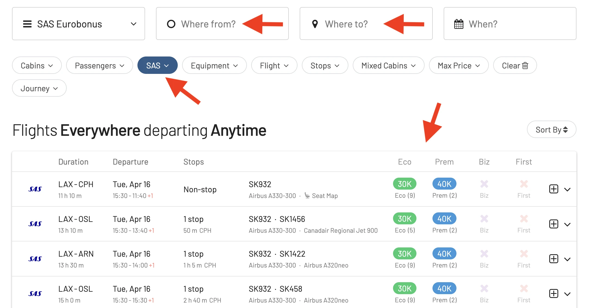

Grab your winter gear because SAS just dropped some exciting news, perfect for anyone itching to explore the remote northern frontiers! SAS has announced updates to its winter schedule, including new routes and increased frequencies to various destinations.

## SAS Winter Schedule for 2024/2025

### New Routes

* [**Tromsø, Norway**](https://awardfares.com/search?CPH,LHR.TOS.;x:0;z:sas) (from Copenhagen, London)
* [**Kiruna, Sweden**](https://awardfares.com/search?CPH.KRN.;x:0;z:sas) (from Copenhagen)
* [**Rovaniemi, Finland**](https://awardfares.com/search?CPH.RVN.;x:0;z:sas) (from Copenhagen)
* [**Sälen-Trysil, Sweden**](https://awardfares.com/search?AAR,area:LON.SCR.;x:0;z:sas) (from Aarhus, London)

### Increased Frequencies

* [**Tromsø, Norway**](https://awardfares.com/search?.TOS.;a:SK;z:sas) (from Copenhagen, Oslo, Stockholm)
* [**Longyearbyen/Svalbard, Norway**](https://awardfares.com/search?.LYR.;a:SK;z:sas) (from Copenhagen, Oslo, Stockholm)
* [**Luleå, Sweden**](https://awardfares.com/search?.LLA.;a:SK;z:sas) (from Copenhagen, Oslo, Stockholm)
* [**Åre-Östersund, Sweden**](https://awardfares.com/search?.OSD.;a:SK;z:sas) (from Copenhagen, Oslo, Stockholm)
* [**Gran Canaria, Spain**](https://awardfares.com/search?.LPA.;a:SK;z:sas) (from Scandinavia)
* [**Tenerife, Spain**](https://awardfares.com/search?.TCI.;a:SK;z:sas) (from Scandinavia)
* [**Agadir, Morocco**](https://awardfares.com/search?.AGA.;a:SK;z:sas) (from Scandinavia)
* [**Bangkok, Thailand**](https://awardfares.com/search?.BKK.;a:SK;z:sas) (from Copenhagen)
* [**Los Angeles, USA**](https://awardfares.com/search?.LAX.;a:SK;z:sas) (from Copenhagen)
* [**Boston, USA**](https://awardfares.com/search?.BOS.;a:SK;z:sas) (from Copenhagen)
* [**New York (JFK & Newark), USA**](https://awardfares.com/search?.NYC.;a:SK;z:sas) (from Copenhagen)
* [**Atlanta, USA**](https://awardfares.com/search?.ATL.;a:SK;z:sas) (from Copenhagen)

### Classic Ski Destinations

* [**Zurich, Switzerland**](https://awardfares.com/search?.ZRH.;a:SK;z:sas)
* [**Geneva, Switzerland**](https://awardfares.com/search?.GVA.;a:SK;z:sas)
* [**Salzburg, Austria**](https://awardfares.com/search?.SZG.;a:SK;z:sas)
* [**Innsbruck, Austria**](https://awardfares.com/search?.INN.;a:SK;z:sas)
* [**Milan, Italy**](https://awardfares.com/search?.MXP.;a:SK;z:sas)
* [**Munich, Germany**](https://awardfares.com/search?.MUC.;a:SK;z:sas)

## Find EuroBonus Award Flights with AwardFares

To quickly find the best available flights on SAS, and the best ways to use your EuroBonus points, follow these steps:

1. Go to [AwardFares](https://awardfares.com/search?..;z:sas).
2. Select **EuroBonus** under *Loyalty Program*.
3. Select **SAS only** under Airline
4. Choose a desired route and date.
5. Voilà! AwardFares will do its magic and show you the available flights in the list below, including details such as the prices per cabin, number of stops, total travel time, aircraft used, and more!

## Become a EuroBonus Pro

You can [try AwardFares for free](https://awardfares.com/). We are rolling out new features and improvements regularly, so [sign up for our monthly newsletter](https://awardfares.com/newsletter) to stay on top of the latest news, announcements, and pro tips.

With our [Gold and Diamond tiers](https://awardfares.com/pricing), you can access premium features such as unlimited daily searches, alerts, seat maps, flight schedules, and more!

## Read More

Our guides have all the information you need to be a pro travel hacker and explore the world on points. Here are some related posts you might enjoy:

* [From Star Alliance to SkyTeam: The SAS Transition (Official Info)](https://blog.awardfares.com/sas-transition-to-skyteam/)
* [Guide To Using SAS EuroBonus Points (Before & After They Join SkyTeam)](https://blog.awardfares.com/eurobonus-guide/)
* [Updates For SAS EuroBonus Members (March 2024)](https://blog.awardfares.com/eurobonus-updates-mar-2024/)
* [Try These EuroBonus Award Flights Before SAS Leaves Star Alliance](https://blog.awardfares.com/eurobonus-star-alliance-awards/)
* [SAS Will Leave Star Alliance! Here’s What To Do Next](https://blog.awardfares.com/sas-acquisition/)
* [7 Benefits Of SAS Joining SkyTeam (The Bright Side)](https://blog.awardfares.com/sas-and-skyteam/)