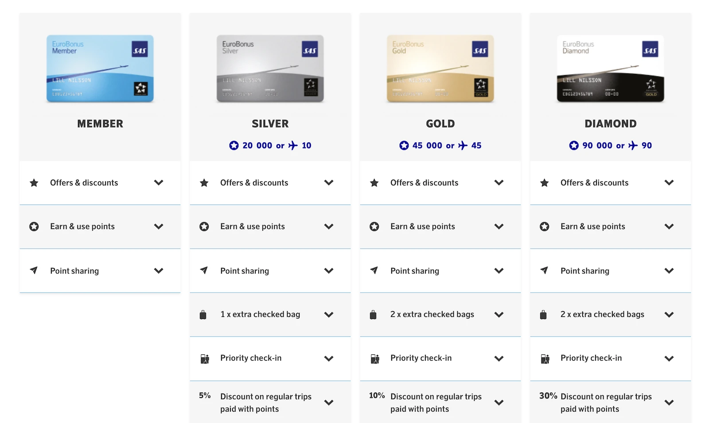
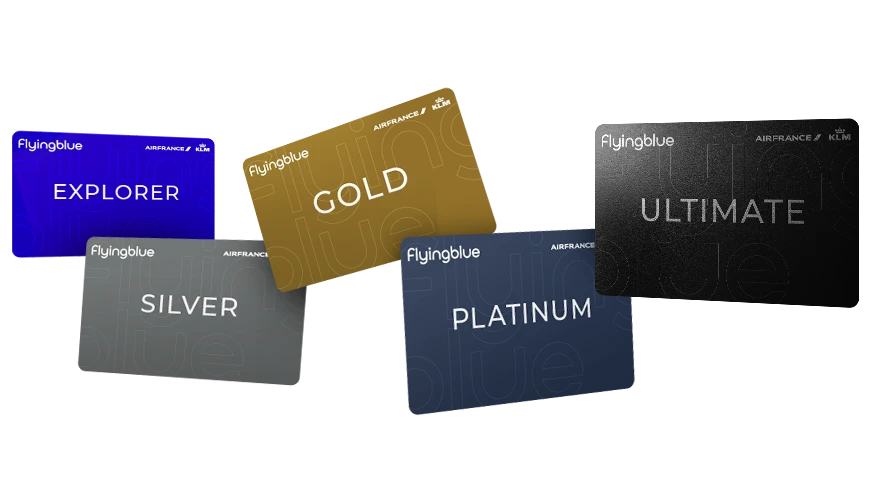

The recent announcement of [Air France-KLM’s acquisition of SAS](https://blog.awardfares.com/sas-acquisition/) has raised many questions for current EuroBonus members. As the loyalty landscapes merge, many (including us at AwardFares) are re-evaluating whether to remain with **EuroBonus** or transition to **Flying Blue**.

In this post, we aim to provide a detailed comparison between the two programs, highlighting key differences and considerations that could influence your decision in this new era of airline alliances.

## Overview of EuroBonus: Understanding the New Context

[**EuroBonus**](https://www.sas.se/eurobonus/home/), traditionally the loyalty program of Scandinavian Airlines, now falls under a broader umbrella due to the Air France-KLM acquisition, and the transition to SkyTeam. This development could potentially expand EuroBonus’s horizons with different integrated services and benefits.

**Key Features:**

- **Airline Partners**: Part of Star Alliance until September 1st, 2024.
- **Point Earning**: Members earn points based on the fare and the flight length.
- **Point Redemption**: Points can be used for booking new flights, upgrading seats, or shopping in the EuroBonus shop.
- **Unique Perks (compared to Flying Blue)**: Amex 2 for 1 vouchers, MasterCard Fly Premium Benefit, Free WI-FI onboard for Gold+ members, Family Pooling, Pay Cash Tickets with Points, Gold for Life, EuroBonus Pandion.

## Overview of Flying Blue

[**Flying Blue**](https://www.flyingblue.com/) serves as the official frequent flyer program for Air France, KLM, and several other subsidiary airlines. It is known for its flexibility in earning and spending miles and its range of elite status benefits. Flying Blue also collaborates with SkyTeam alliance members, broadening the scope for accumulation and redemption of miles.

**Key Features:**

- **Airline Partners**: Includes all SkyTeam members, offering a comprehensive network of global destinations.
- **Mile Earning**: Miles are earned based on the amount spent on tickets rather than the distance flown.
- **Mile Redemption**: Miles can be redeemed for flights, upgrades, hotel stays, car rentals, and even shopping.
- **Unique Perks (compared to Eurobonus)**: Promo Rewards, Platinum For Life, Magazine Subscriptions, up to 8 Lounge Guests, upgrade vouchers on Ultimate.

## Key Differences Between EuroBonus and Flying Blue

| Feature                    | SAS EuroBonus                                             | Flying Blue                                                  |
|----------------------------|-----------------------------------------------------------|--------------------------------------------------------------|
| **Airlines**               | SAS and Star Alliance partners                            | Air France, KLM, and SkyTeam partners                        |
| **Earning Points**         | Points earned based on fare and flight distance           | Miles earned based on amount spent and flight distance       |
| **Redemption Options**     | Flights, upgrades, car rentals, hotels, shopping          | Flights, upgrades, car rentals, hotels, experiences          |
| **Points Expiry**          | Points expire after 5 years                               | Miles expire if there is no account activity for 24 months   |
| **Status Levels**    | Silver, Gold, Diamond, Pandion                            | Silver, Gold, Platinum, Ultimate                                   |
| **Status Qualification**   | Based on flights taken and/or points earned               | Based on XP (Experience Points) earned from flights, which is based on amount spent          |
| **Status Benefits**        | Priority check-in, extra baggage, lounge access, fast track | Priority services, extra baggage, lounge access, guaranteed seating |
| **Family Account**         | Yes, pooling of points within family members               | Yes, pooling of miles with family and friends                |
| **Co-branded Credit Cards**| Available in Sweden, Norway, Denmark and Finland                             | Available in France, Netherlands, United States, Germany, Italy and Belgium                              |
| **Partners**               | Airlines, hotels, car rental, retail, etc.                | Broad range of partners including airlines, hotels, car rental, retail, etc. |
| **Special Programs**       | Youth tickets, EuroBonus Shop                             | Promo Rewards, Flying Blue Store, special promotions for members            |

## Which Program is Best?

We get it, there's no answer set in stone. The most rewarding program (for you) will depend on a number of factors such as how often you fly, where, how much do you spend on those flights, and other opportunities for earning/redeeming miles and points. In this section, we will compare both programs from several angles to shed more light and hopefully help with the comparison.

### Based on Money Spent and Distance Flown

Below is a table that outlines which frequent flyer program might be more advantageous for accumulating points/miles based on the combination of money spent on airline tickets (from cheaper economy to more expensive premium or business class fares) and the distances flown (from short to long-haul flights).

The point of this assesment is to compare the different types of award charts for different type of travels: Flying Blue's chart is dynamic and centered on money spent on the ticket, while SAS EuroBonus considers both distance and fare class.

|                         | **Ultra-low Fares**          | **Medium/Regular Fares**   | **Business Class/Premium Fares** |
|-------------------------|----------------------------|----------------------------|------------------------------|
| **Short-Haul**          | Flying Blue                | Flying Blue                | SAS EuroBonus                |
| **Medium-Haul**         | Flying Blue                | SAS EuroBonus              | SAS EuroBonus                |
| **Long-Haul**           | SAS EuroBonus              | SAS EuroBonus              | SAS EuroBonus                |

**Some Thoughts**

For ultra-low fares (Basic Economy and Deals):

- Short-Haul: Flying Blue might be better as even low spending can accumulate meaningful miles.
- Medium-Haul and Long-Haul: Flying Blue is more beneficial on medium-haul due to spending-based accumulation, but for long-haul flights, the increased distance makes SAS EuroBonus slightly better due to its distance-based earning, which becomes significant over long distances.

For standard fares (spending average prices)

- Short-Haul: Flying Blue continues to perform well here due to its spending-based rewards.
- Medium-Haul and Long-Haul: As ticket prices and distances increase, SAS EuroBonus becomes more advantageous because its combination of distance and fare class potentially yields more points.

For Premium Fares

- Short-Haul: SAS EuroBonus tends to offer better value as the high fare class combined with even short distances earns a substantial number of points.
- Medium-Haul and Long-Haul: SAS EuroBonus strongly outperforms in these categories due to higher multipliers for more expensive fare classes and longer distances flown.

### Based on Home Country and Destinations

Now, let's compare both programs based on the members' home countries and their travel destinations. In we consider various factors like the availability of co-branded credit cards, regional promotions, and the value of mile/point redemption in specific regions. This comparison aims to determine which program might offer more value depending on geographical preferences.

| **Home Country/Destination** | **Flying Blue**                                         | **SAS EuroBonus**                                       |
|------------------------------|---------------------------------------------------------|---------------------------------------------------------|
| **Scandinavia (Home)**       | Good for flights to/from Europe; limited credit cards   | Best option; extensive credit card options, optimal for regional travel within Scandinavia |
| **Europe (Home)**            | Best option; numerous credit card options, excellent for intra-European flights | Good, especially for travel to/from Scandinavia         |
| **Europe to Asia**           | Excellent; strong network via partners, beneficial for flights to Asia | Good; benefits from Star Alliance network               |
| **Europe to Americas**       | Excellent; offers robust rewards for transatlantic flights, especially via Air France and KLM | Good; Star Alliance benefits but fewer direct options than Flying Blue |
| **North America (Home)**     | Best; extensive partner airlines, multiple credit card options | Limited; less advantageous due to fewer direct flights and partners |
| **Asia (Home)**              | Good; strong partnerships with Asian airlines, good redemption options | Limited; fewer direct connections compared to Flying Blue |

**Key Points**

- **Scandinavia as Home Country**: SAS EuroBonus undoubtedly wins here. It is tailored to the needs of Scandinavian travelers, offering extensive local benefits, credit card options, and promotions. Redemption options within Scandinavia and Europe are particularly valuable.
- **Europe as Home Country**: Flying Blue generally offers greater flexibility and benefits for European members, with a wide range of airline and non-airline partners across the continent.
- **Long-Distance Flights (Europe to Asia/Americas)**: Flying Blue tends to be more advantageous due to its strong connections with Air France and KLM, which have extensive networks in these regions. Additionally, Flying Blue often runs promotions that enhance mile earning and redemption on these routes.
- **North America and Asia as Home Countries**: Flying Blue offers more benefits due to its extensive network of partner airlines and more frequent direct flights to various destinations in Europe. Additionally, the availability of co-branded credit cards in these regions makes accruing and redeeming miles more accessible and lucrative.

### Based on Status

Both EuroBonus and Flying Blue offer several tiers for frequent flyers, with different progression and qualification requirements. Flying Blue emphasizes more on amount spent on the tickets, while EuroBonus is a combination of amount spent/(fare class) and distance flown. In both programs, moving into higher tiers not only gives members access to more benefits and perks, but also accelerates miles earnigs by adding a multiplier.

**SAS EuroBonus**

| Tier    | Benefits                                                                                                     | Earn Points Multiplier         |
|---------|--------------------------------------------------------------------------------------------------------------|--------------------------------|
| Member  | Earn points on SAS flights                                                                                   | 1x                             |
| Silver  | Lounge access on SAS flights, Priority check-in                                                              | 1.10x                          |
| Gold (until August 2024)    | Lounge access on SAS & Star Alliance partners, Priority boarding, Extra baggage allowance               | 1.25x |
| Diamond | Priority boarding, extra baggage allowance, complimentary upgrades, Lounge access on SAS & Star Alliance partners (until August 2024). 30% Discount on regular trips paid with points. | 1.25x |

**Flying Blue**

| Tier     | Benefits                                                            | Earn Miles Multiplier |
|----------|---------------------------------------------------------------------|-----------------------|
| Member   | Earn miles on Air France, KLM & partners                            | 1x                    |
| Explorer | Priority boarding & baggage allowance                               | 1.25x                 |
| Silver   | Lounge access on Air France, KLM & SkyTeam partners, Priority boarding, Extra baggage allowance | 1.5x  |
| Gold     | Priority boarding, extra baggage allowance, complimentary upgrades on short/medium haul flights | 1.8x  |
| Platinum | Priority boarding, extra baggage allowance, complimentary upgrades on all flights. Stay Platinum for 10 years in a row by reaching the required threshold and qualify for Platinum for life. | 2x |
| Ultimate | Dedicated Ultimate Assistant available 24/7. Complimentary access to Air France and KLM lounges for you and up to eight guests. Extra check-in baggage allowance on Air France, KLM, and SkyTeam flights. Ultimate and/or SkyPriority airport services for you and up to eight travel companions. Four one-cabin upgrade vouchers per membership year. One partner Flying Blue Platinum card | 2.25x  |

## Become a Pro Travel Hacker

You can [try AwardFares for free](https://awardfares.com/). We are rolling out new features and improvements regularly, so [sign up for our monthly newsletter](https://awardfares.com/newsletter) to stay on top of the latest news, announcements, and pro tips.

With our [Gold and Diamond tiers](https://awardfares.com/pricing), you can access premium features such as unlimited daily searches, alerts, seat maps, flight schedules, and more!

## Read More

Our guides have all the information you need to be a pro travel hacker and explore the world on points. Here are some related posts you might enjoy:

* [Guide To Using SAS EuroBonus Points (Before & After They Join SkyTeam)](https://blog.awardfares.com/eurobonus-guide/)
* [From Star Alliance to SkyTeam: The SAS Transition (Official Info)](https://blog.awardfares.com/sas-transition-to-skyteam/)
* [Lufthansa Allegris Takes Flight on May 1st (Book with Points)](https://blog.awardfares.com/lufthansa-allegris-first-flight/)
* [Try These EuroBonus Award Flights Before SAS Leaves Star Alliance (Megapost)](https://blog.awardfares.com/eurobonus-star-alliance-awards/)