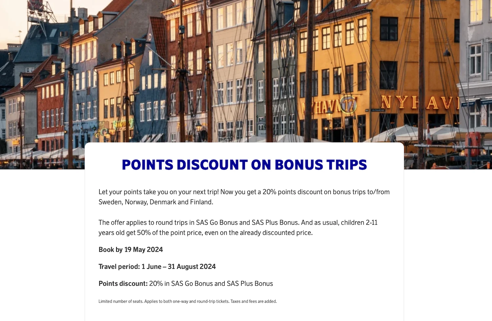
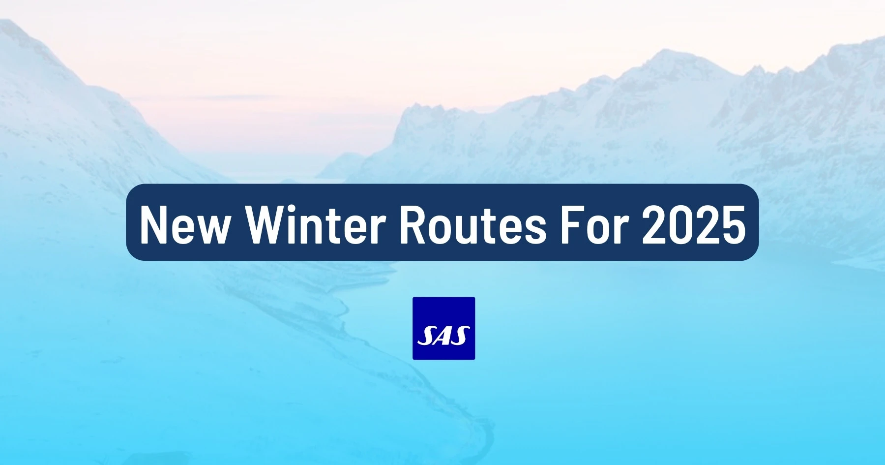
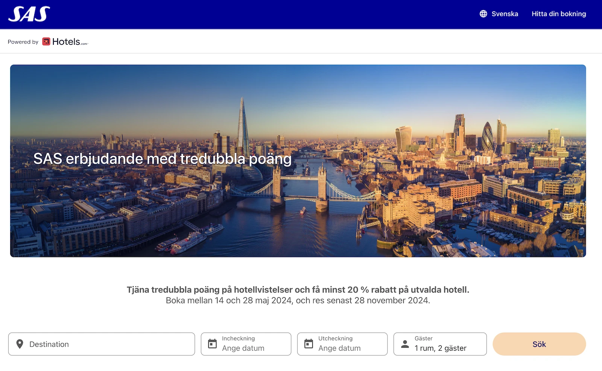
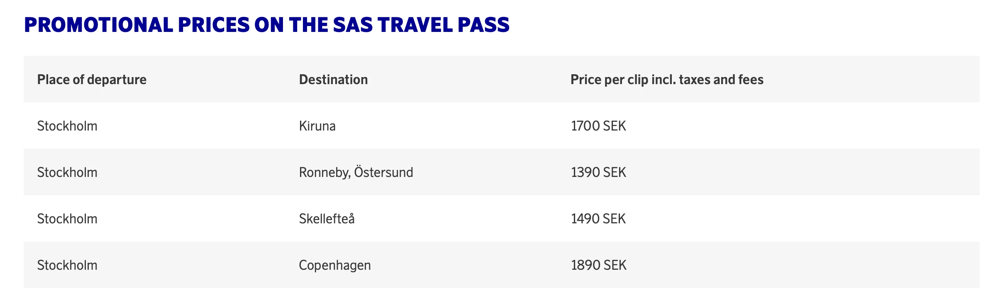
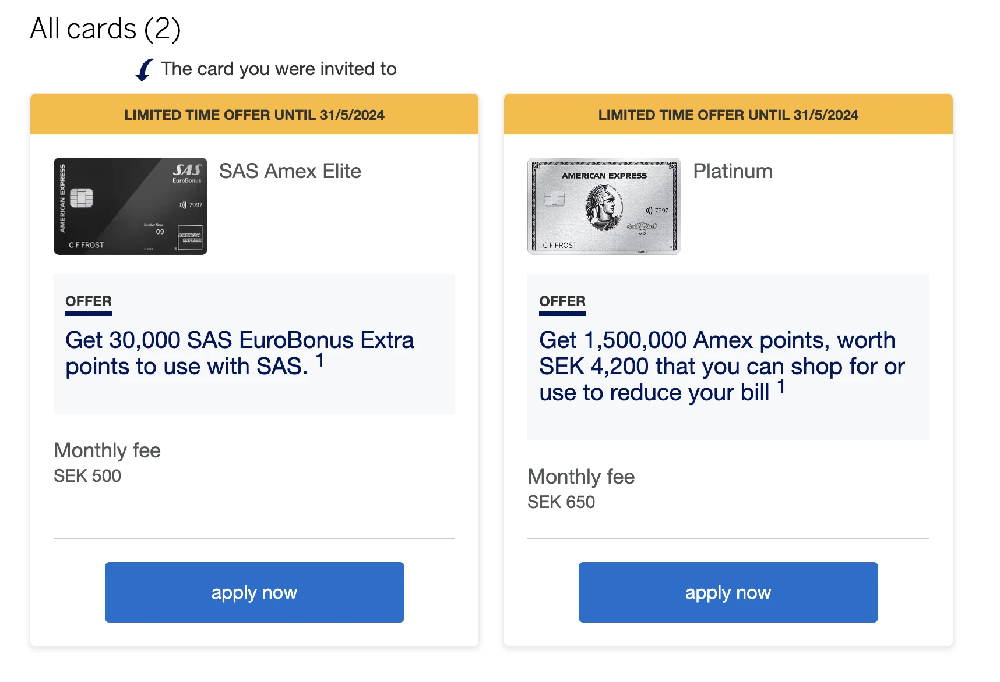

As spring winds down, the EuroBonus program keeps things interesting. As usual, we love catching you up on all the latest news and updates to help you maximize your points, especially during these turbulent times. Here is our monthly summary of the hottest EuroBonus topics!

## SAS EuroBonus Updates (May 2024)

### 1. 20% Discount On EuroBonus Awards To Scandinavia (Until May 19th)

SAS announced a discounted offer for EuroBonus members: [20% discount on award flights to/from Sweden, Norway, Denmark, and Finland](https://blog.awardfares.com/eurobonus-discount-may-2024/). This promotion is applicable to flights on SAS Go Bonus, and SAS Plus Bonus.

One thing to highlight is the possibility to combine the discount with the FlyPremium benefit (for holders of the SAS Mastercard).

* **Travel Period**: June 1, 2024 - August 31, 2024.
* **Book by**: May 19, 2024

### 2. SAS Announces Winter Schedule Updates For The 2025 Season

SAS has announced updates to its winter schedule, including new routes and increased frequencies to several destinations. Get ready to explore the magic of the north! Read all the details [in this post](https://blog.awardfares.com/sas-winter-schedule-2025/).

### 3. Triple Bonus Points and 20% Discount on Selected Hotels

Score triple EuroBonus points and save at least 20% on your hotel stay! Book your stay between May 14th and 28th, 2024, and travel anytime up to November 28th, 2024.

**Important:** make sure you [book through the SAS EuroBonus portal](https://www.hotelsbysas.com/lp/b/eurobonus?MDPCID=SAS-SE.DPS.SAS.SASxx-May3x.HOTEL) to get the points.

### 4. Business Trips at Promotional Prices

SAS is offering deals for business travel too. Save on select destinations within Scandinavia when you pay with your Travel Pass clip cards until May 10th. Plus, plan your summer or fall business trip to Atlanta and save 15% by booking before June 10th for travel departing anytime before October 31st.

### 5. Increased AMEX Referral Bonus

American Express is offering a limited-time referral bonus of up to 30,000 EuroBonus points for new SAS Amex Elite (also Amex Platinum) cardholders in Sweden and Norway. The promotion ends on May 31st.  Make sure to check the terms and conditions to see what the spending requirements are to qualify for the bonus points.

## Become a EuroBonus Pro

You can [try AwardFares for free](https://awardfares.com/). We are rolling out new features and improvements regularly, so [sign up for our monthly newsletter](https://awardfares.com/newsletter) to stay on top of the latest news, announcements, and pro tips.

With our [Gold and Diamond tiers](https://awardfares.com/pricing), you can access premium features such as unlimited daily searches, alerts, seat maps, flight schedules, and more!

Our guides have all the information you need to be a pro travel hacker and explore the world on points. Here are some related posts you might enjoy:

* [Guide To Using SAS EuroBonus Points (Before & After They Join SkyTeam)](https://blog.awardfares.com/eurobonus-guide/)
* [From Star Alliance to SkyTeam: The SAS Transition (Official Info)](https://blog.awardfares.com/sas-transition-to-skyteam/)
* [Lufthansa Allegris Takes Flight on May 1st (Book with Points)](https://blog.awardfares.com/lufthansa-allegris-first-flight/)
* [Try These EuroBonus Award Flights Before SAS Leaves Star Alliance (Megapost)](https://blog.awardfares.com/eurobonus-star-alliance-awards/)