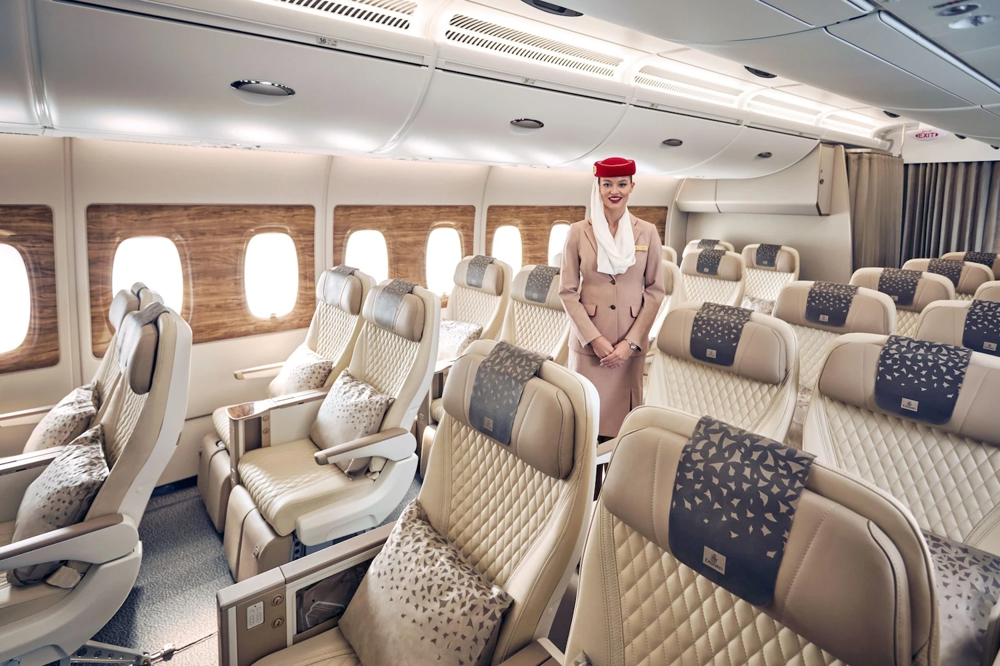
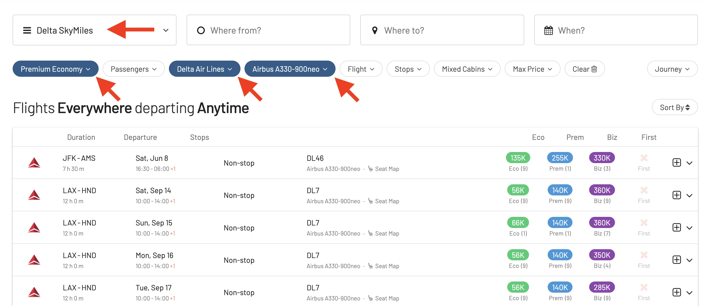

Premium economy cabins continue to grow in popularity: cabins are getting better every year, and prices are becoming more attractive than Business and First Class. This year, several airlines launched or will launch new offerings, introducing new seats and elevating the premium economy experience. Here's a look at our favorites, some of them picked from [Skytrax](https://skytraxratings.com/). Plus, we share some tips on how to book them using points or miles. Let's get started!

## Best Premium Economy Cabins in 2024

### 1. EVA Air

EVA Air has long been a pioneer in the premium economy space, claiming the title of the world’s first premium economy class back in 1992. The airline has consistently enhanced its offering, and in 2023, it announced plans to introduce premium economy on its new 787-9s by mid-2024. The Taiwanese carrier is known for its spacious seats, excellent in-flight meals, and upgraded onboard amenities.

* **Available on**: Boeing 777-300ER, 787-9, 787-10
* **Book awards with**: EVA Air Infinity MileageLands, [United MileagePlus](https://awardfares.com/search?..;z:united), [Air Canada Aeroplan](https://awardfares.com/search?..;z:aeroplan), Singapore Airlines KrisFlyer

### 2. Japan Airlines

Japan Airlines took premium economy to new heights in 2024 with the launch of its innovative [new shells on the A350-1000 (our review here)](https://blog.awardfares.com/jal-a350-premium-economy-review/). This state-of-the-art cabin prioritizes passenger comfort and features next-generation amenities. JAL Premium Economy has wider seats, with industry-leading legroom and impressive recline. The soft product offers curated multi-course meals with regionally-inspired options, and a thoughtful selection of amenities that keeps passengers refreshed throughout the flight. Passengers in JAL Premium Economy also enjoy exclusive perks like priority check-in, increased baggage allowance, and access to airport lounges on select routes.

* **Available on**: Airbus A350-1000
* **Book awards with**: [American AAdvantage](https://awardfares.com/search?..;z:aadvantage), Qantas Frequent Flyer, British Airways Avios

### 3. Delta Air Lines

Delta Air Lines was the first US carrier to introduce premium economy, branded as Delta Premium Select. This cabin offers a mix of luxury and practicality with larger seats, elevated dining experiences, and premium amenities. Delta continues to roll out its Premium Select cabin on all transpacific and most transatlantic flights.

* **Available on**: Airbus A330, A330neo, A350, Boeing 767-300ER, 767-400ER
* **Book awards with**: [Delta SkyMiles](https://awardfares.com/search?..;z:delta), [Virgin Atlantic Flying Club](https://awardfares.com/search?..;z:flyingclub), [Air France-KLM Flying Blue](https://awardfares.com/search?..;z:flyingblue)

### 4. Virgin Atlantic

Virgin Atlantic’s premium cabin, rebranded as Premium in 2018, offers a variety of standout features, including ‘The Wander Wall’ on its 787-9s, which provides a social space for passengers. The cabin is also equipped with large entertainment screens, enhanced dining services, and seats with ample pitch and recline.

* **Available on**: Airbus A330, A330neo, A350, Boeing 787-9
* **Book awards with**: [Virgin Atlantic Flying Club](https://awardfares.com/search?..;z:flyingclub), [Delta SkyMiles](https://awardfares.com/search?..;z:delta), [Air France-KLM Flying Blue](https://awardfares.com/search?..;z:flyingblue)

### 5. Emirates

Emirates, a relative newcomer to the premium economy scene, has quickly made a significant impact. Introduced in May 2022, Emirates’ premium economy features luxurious seats with generous recline, a state-of-the-art entertainment system, and high-quality dining options. The airline has invested over $2 billion to refurbish its fleet, ensuring passengers have access to top-notch amenities.

* **Available on**: Airbus A380, Boeing 777-300ER (retrofitting in progress)
* **Book awards with**: Emirates Skywards, [Alaska Airlines Mileage Plan](https://awardfares.com/search?..;z:alaska), Japan Airlines Mileage Bank

### 6. Singapore Airlines

Singapore Airlines introduced its premium economy in 2015 and has since refined the product to offer exceptional comfort and a range of exclusive privileges. The cabin is equipped with larger seats, more recline, and enhanced dining options. Passengers can also enjoy a selection of additional perks, such as priority boarding and increased baggage allowance.

* **Available on**: Airbus A350, A380, Boeing 777-300ER
* **Book awards with**: [United MileagePlus](https://awardfares.com/search?..;z:united), [Air Canada Aeroplan](https://awardfares.com/search?..;z:aeroplan), Turkish Airlines Miles&Smiles, Singapore Airlines KrisFlyer

## How to Find Award Flights in Premium Economy with AwardFares

AwardFares is your best friend to quickly find the best available award flights in these cabins. Simply follow these steps:

1. Go to [AwardFares](https://awardfares.com/search).
2. Select your favorite **Loyalty Program** (e.g, Alaska Mileage Pan).
3. Select the airline **Airline** (e.g., Emirates).
4. Add **Premium Economy** in the *Cabin* filter.
5. Add the aircraft type under *Equipment* (e.g. Airbus A380-800)
6. Choose a desired route and date.
7. Voilà! AwardFares will do its magic and show you the available flights in the list below, including details such as the prices per cabin, number of stops, total travel time, aircraft used, and more!

## Want More Award Travel Intel?

You can [try AwardFares for free](https://awardfares.com/). We are rolling out new features and improvements regularly, so [sign up for our monthly newsletter](https://awardfares.com/newsletter) to stay on top of the latest news, announcements, and pro tips.

With our [Gold and Diamond tiers](https://awardfares.com/pricing), you can access premium features such as unlimited daily searches, alerts, seat maps, flight schedules, and more!

## Read More

Our guides have all the information you need to be a pro travel hacker and explore the world on points. Here are some related posts you might enjoy:

* [How To Find Flying Blue Award Flights (+ Sweet Spots)](https://blog.awardfares.com/flying-blue-guide/)
* [Introducing Virgin Atlantic Flying Club Awards](https://blog.awardfares.com/introducing-flying-club/)
* [JAL A350-1000 Premium Economy: New York To Tokyo](https://blog.awardfares.com/jal-a350-premium-economy-review/)
* [How To Book The New JAL Flagship A350 With Miles Or Points](https://blog.awardfares.com/jal-flagship-a350/)
* [What To Do With 100k Delta SkyMiles? A 2024 Guide To Finding SkyMiles Sweet Spots](https://blog.awardfares.com/100k-skymiles/)