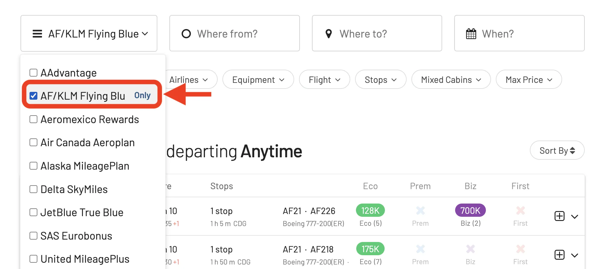
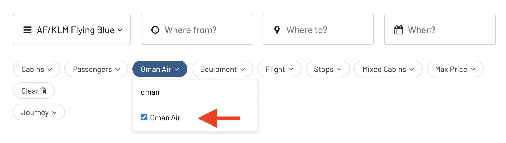
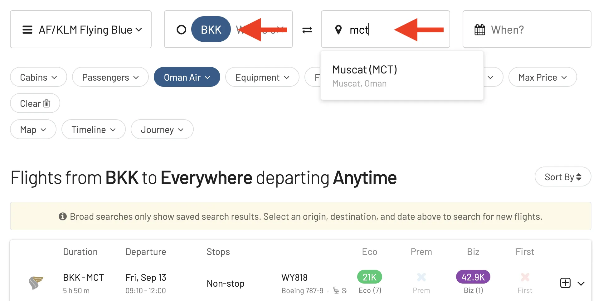
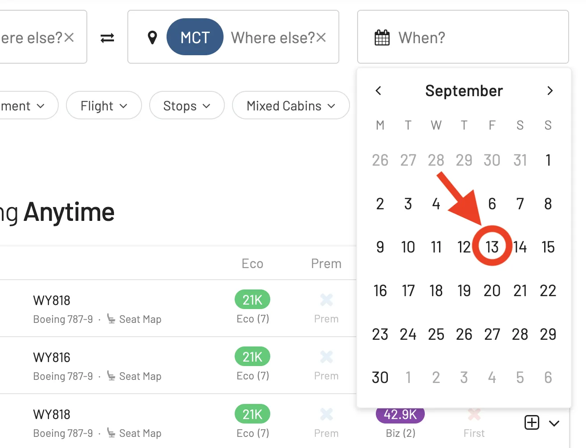
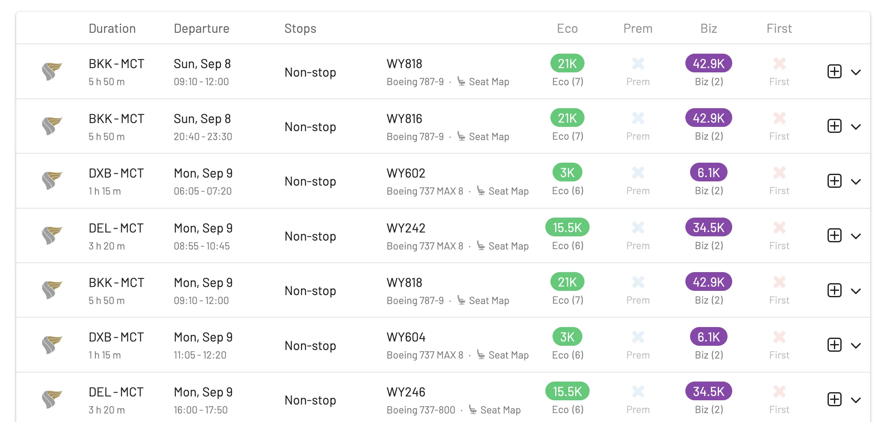
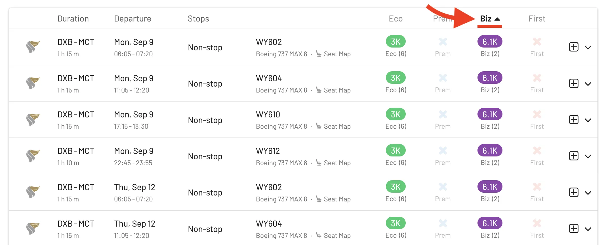
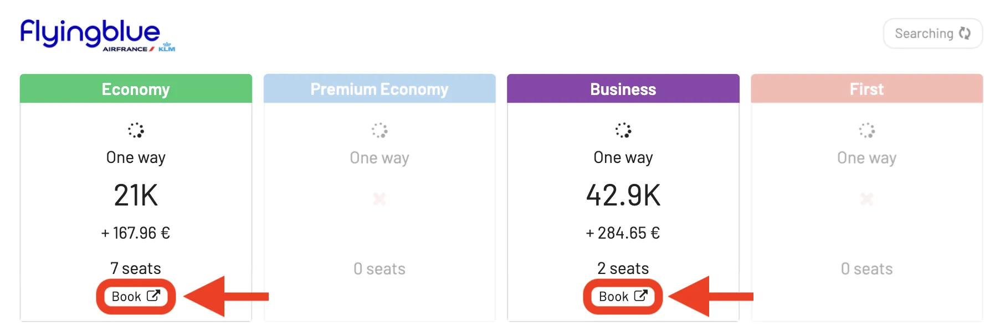

Flying Blue [just announced an exciting new partnership with **Oman Air**](https://www.flyingblue.com/en/earn/partners/airline-oman-air), expanding your travel options and mileage potential.

[Oman Air](https://www.omanair.com/) offers exceptional service and comfortable cabins, connecting Muscat to various global destinations. Whether you’re interested in vibrant cities or serene beaches, Oman Air’s network caters to all preferences.

### In This Post

- [Earn and Use Miles](#earn-and-use-miles)
- [Business Class Experience Like First Class](#business-class-experience-like-first-class)
- [How to book award flights on Oman Air](#how-to-book-award-flights-on-oman-air)
- [Become a Flying Blue Pro](#become-a-flying-blue-pro)
- [Read More](#read-more)

## Earn and Use Miles

The new partnership enables you to earn Flying Blue Miles on all Oman Air flights, regardless of the cabin class. Whether you fly First Class, Business Class, or Economy, you’ll accumulate miles according to the table below. Additionally, you can redeem your Flying Blue Miles for award flights on Oman Air.

## Business Class Experience Like First Class

Oman Air's Business Class is known for including features that rival some airline's First Class offerings. Here's what makes it feel so luxurious:

- **Spacious Seats**: On their Boeing 787 Dreamliners, they feature  "Apex Suites" in a 2-2-2 configuration. However, the window seats have a special privacy shield that creates a very separated feel, almost like a mini-pod. There's ample legroom, and when the seat reclines fully flat, it offers a comfortable sleeping surface with generous footroom – unlike some business class seats with cramped footwells.
- **Top-notch Amenities**: They provide plush cushions, blankets, and a mattress pad, making for a very comfortable sleeping experience.  The amenity kit includes luxurious touches like Amouage fragrance and Oman Air-branded water. Noise-canceling headphones and a personal touch screen entertainment system add to the premium feel.
- **Personalized Service**: Oman Air is known for its attentive cabin crew who provide turndown service for your seat and cater to your needs throughout the flight. The airline also offers a [VVIP experience (provided by Jetex)](https://www.omanair.com/en/tashreef-service-by-jetex) including a deluxe meet and greet, fast-track airport services, luxury car with chauffer, and lounge facilities.

<figure>

</figure>

## How to book award flights on Oman Air

### 1. Go to [AwardFares](https://awardfares.com/signup?utm_source=oman-air-flying-blue&utm_medium=blog&utm_content=AwardFares)

Creating an account is optional, but it’s also free, and it gives you access to more features. Make sure to sign up for one here.

### 2. Select the Frequent Flyer Program

Choose **Flying Blue** in the **Frequent Flyer Program** picker.

### 3. Select 'Oman Air' only in the *Airline* filter

### 4. Add a Route(s)

Add airports to the **From** and **To** fields. In this example, we search for flights between [**Bangkok** (BKK) and **Muscat** (MCT)](https://awardfares.com/search?BKK.MCT.;a:WY;z:flyingblue).

### 5. Explore Availability

If you have a particular date in mind, add it by tapping on the Calendar field.

Then, AwardFares will search for available flights on that day, showing the results in a list below.

In addition, you can use the **Timeline View** to explore the availability for multiple days simultaneously if you don't have a set travel date. The bars show different classes in different colors.

### 5. Sort by Price

AwardFares lets you easily sort results by price and find the best deals in just a few clicks. On the result list, tap on the different header columns to sort the results by price. Use the **Eco**, **Prem**, **Biz**, and **First** class tags to find cheap awards across multiple dates, itineraries, and airlines.

### 6. Book with Air France or KLM

Once you find your desired flight, click the Book button.

AwardFares will redirect you to Air France’s website to complete your booking without the need to re-enter your search criteria, as it will be pre-populated. Note that Flying Blue does not have a centralized booking portal, so you'll need to book through either Air France or KLM website.

## Become a Flying Blue Pro

You can [try AwardFares for free](https://awardfares.com/). We are rolling out new features and improvements regularly, so [sign up for our monthly newsletter](https://awardfares.com/newsletter) to stay on top of the latest news, announcements, and pro tips.

With our [Gold and Diamond tiers](https://awardfares.com/pricing), you can access premium features such as unlimited daily searches, alerts, seat maps, flight schedules, and more!

## Read More

Our guides have all the information you need to be a pro travel hacker and explore the world on points. Here are some related posts you might enjoy:

- [How To Find Flying Blue Award Flights (+ Sweet Spots)](https://blog.awardfares.com/flying-blue-guide/)
- [Sky's (Almost) The Limit: Conquering First Class With Flying Blue](https://blog.awardfares.com/flying-blue-skyteam-first-class/)
- [EuroBonus vs. Flying Blue: Stay or Switch?](https://blog.awardfares.com/eurobonus-vs-flying-blue/)