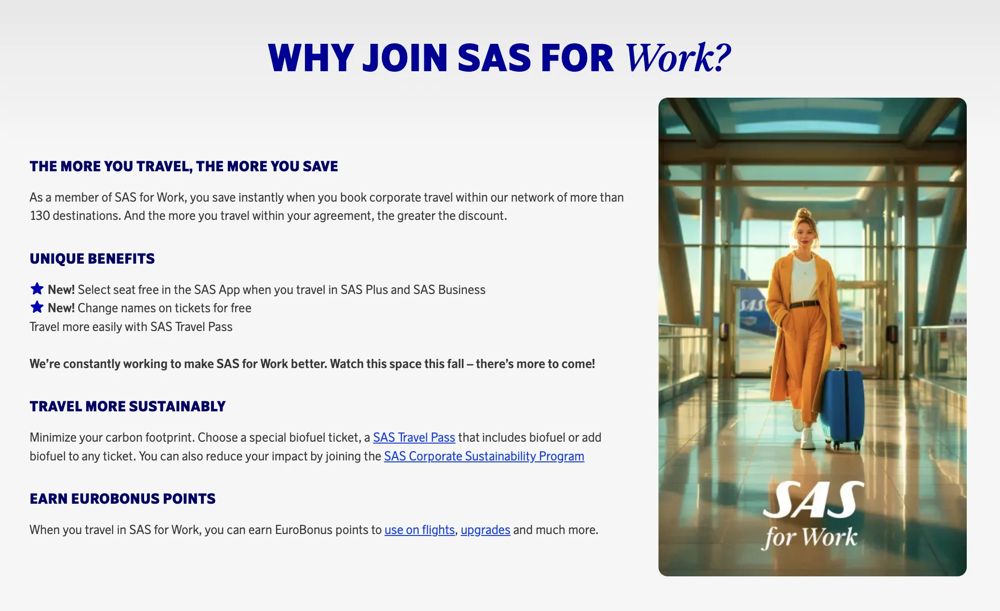
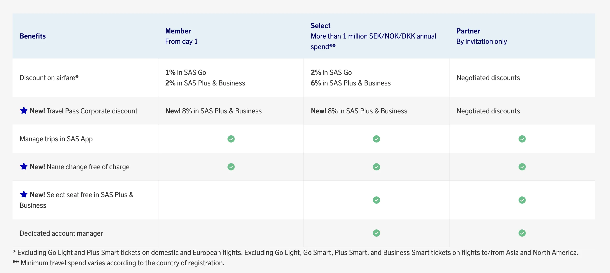
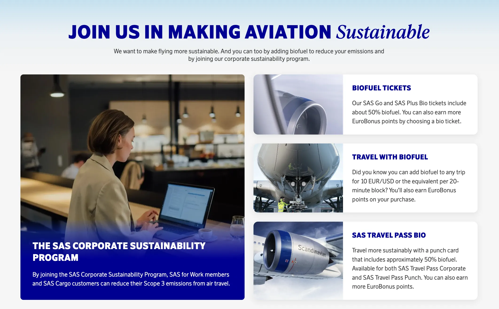

Scandinavian Airlines System (SAS) is revamping its business travel program, SAS for Business, with a new name and a focus on making business trips smoother for both employees and companies. The program will now be known as **SAS for Work**, and it launches with a myriad of new benefits starting June 11th.

## Enhanced Travel Experience for Business Travelers

Business travelers enrolled in SAS for Work will enjoy a more convenient travel experience. The program now includes free name changes and free seat selection in SAS Business and SAS Plus cabins. This allows for greater flexibility and control over bookings.

"We understand the importance of face-to-face meetings for business success," says Paul Verhagen, Chief Commercial Officer at SAS. "Our goal with SAS for Work is to make the travel experience easier and more seamless for both the traveler and the company."

## More Upgrades and Sustainability Initiatives Coming Soon

SAS plans to introduce even more benefits for business travelers in the coming months. This includes the Travel Pass Corporate product, offering additional discounts in SAS Plus class. The program will also focus on sustainability, with options to reduce travellers' carbon footprint through biofuel tickets and expanded corporate sustainability programs.

## Can you earn EuroBonus points with SAS for Work?

Yes. When you travel in a SAS for Work ticket, you can earn EuroBonus points to use on flights, upgrades and much more.

## Become a EuroBonus Pro

You can [try AwardFares for free](https://awardfares.com/). We are rolling out new features and improvements regularly, so [sign up for our monthly newsletter](https://awardfares.com/newsletter) to stay on top of the latest news, announcements, and pro tips.

With our [Gold and Diamond tiers](https://awardfares.com/pricing), you can access premium features such as unlimited daily searches, alerts, seat maps, flight schedules, and more!

## Read More

Our guides have all the information you need to be a pro travel hacker and explore the world on points. Here are some related posts you might enjoy:

- [From Star Alliance to SkyTeam: The SAS Transition (Official Info)](https://blog.awardfares.com/sas-transition-to-skyteam/)
- [Guide To Using SAS EuroBonus Points (Before & After They Join SkyTeam)](https://blog.awardfares.com/eurobonus-guide/)
- [Updates For SAS EuroBonus Members (June 2024)](https://blog.awardfares.com/eurobonus-updates-june-2024/)
- [Try These EuroBonus Award Flights Before SAS Leaves Star Alliance](https://blog.awardfares.com/eurobonus-star-alliance-awards/)