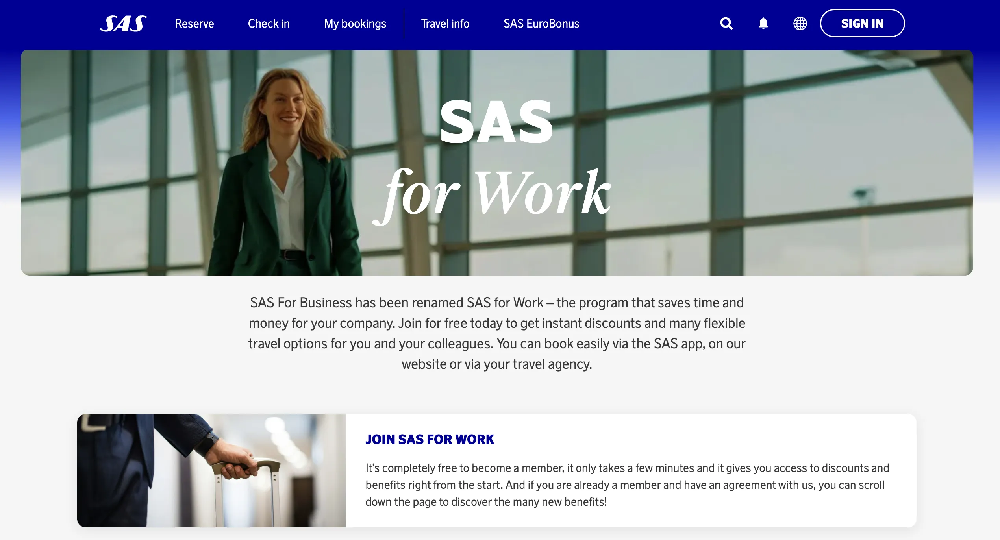
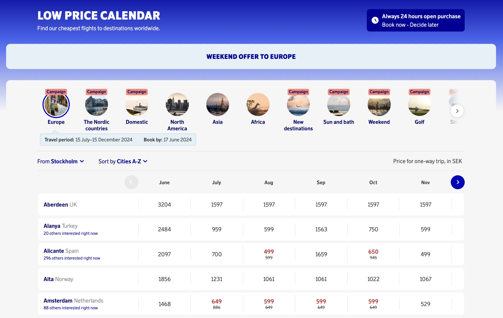
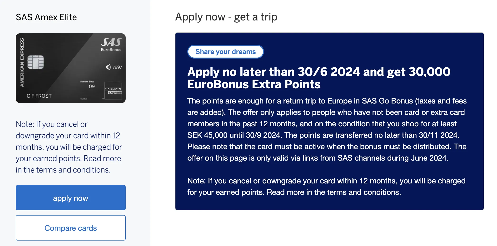
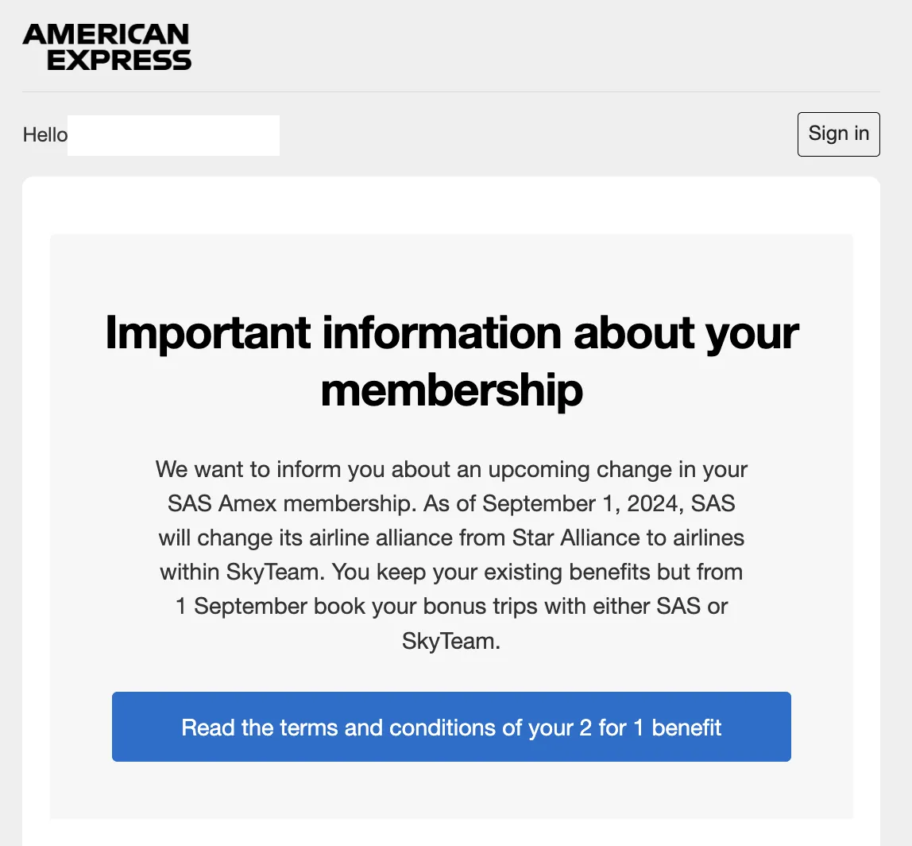
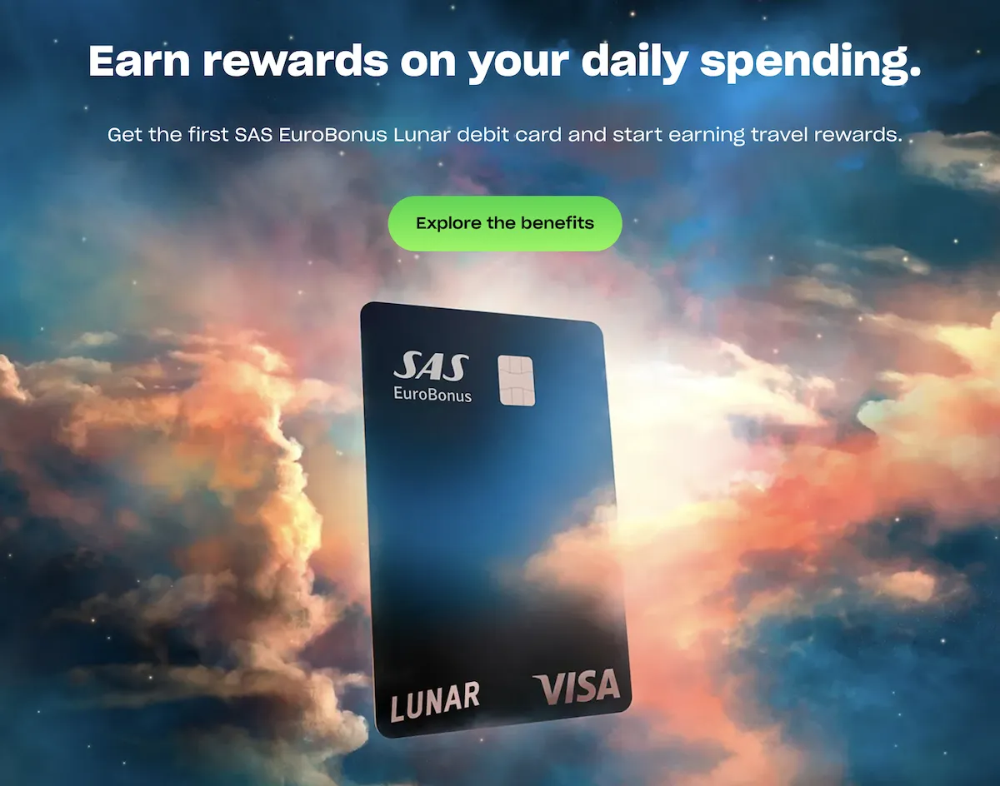
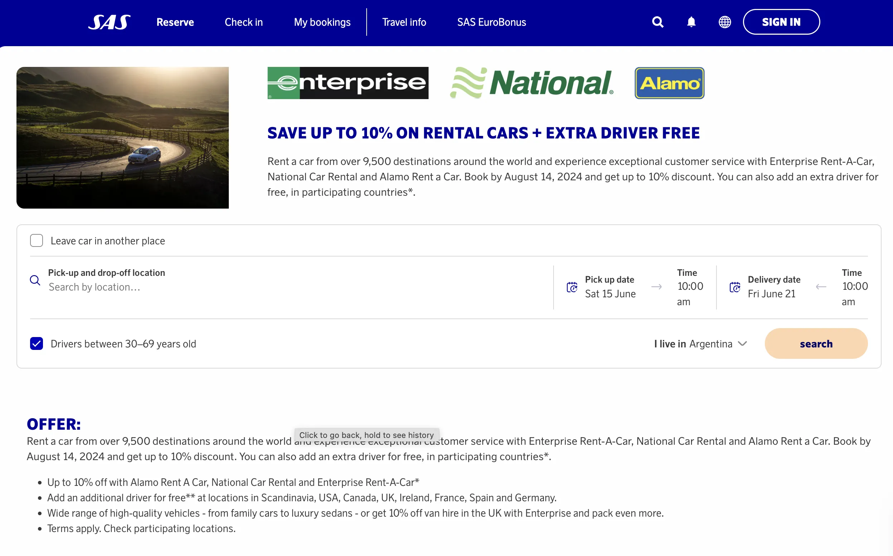

As summer kicks off, the EuroBonus program is still buzzing with updates to enhance your travel experience. We love to keep you informed about the latest developments and opportunities to make the most of your points. From new service transformations to enticing promotions, here’s a summary of what's happening this June.

## SAS EuroBonus Updates (June 2024)

### 1. SAS Announces *SAS for Work*

Beginning on June 11, *SAS for Business* will undergo a transformation and be rebranded as [**SAS for Work**](https://blog.awardfares.com/sas-for-work). This new service will introduce several enhancements aimed at improving the experience of business travel for both individual passengers and companies.

SAS for Work is bringing some great perks for business travelers. You’ll get free name changes for more flexibility, plus free seating in SAS Business and SAS Plus for a comfier and easier trip. The airline claims that these updates show how committed SAS is to giving top-notch service and value to its business customers, making business trips smoother and more hassle-free.

Read more [in this post](https://blog.awardfares.com/sas-for-work).

### 2. Discounts on flights to Europe with SAS (Book by June 17)

SAS is running heavily discounted prices on revenue tickets, valid for bookings until June 17. Their well known *low price calendar* shows prices starting at 499 kr.

This is a great opportunity not only to get cheap flights to interesting destinations, but also to accrue extra EuroBonus points or challenge for a higher status if you are running short during your qualification period.

* **Travel Period**: July 15, 2024 - December 15, 2024.
* **Book by**: June 17, 2024

  TIME LEFT TO BOOK

### 2. Get up to 30.000 EuroBonus Points with Amex Elite (By June 30th)

American Express and SAS offer a new promotion with an increased welcome bonus when applying to the SAS Amex Elite (their highest tier) credit card. This time they offer **30.000 EuroBonus points** (both valid in Sweden and Norway). The points are enough for a return trip to Europe in SAS Go Bonus (taxes and fees are added).

**Keep in mind**: The offer is only valid via links from SAS channels during June 2024.

  TIME LEFT TO APPLY

Here are the conditions:

- The offer is only valid [via the link on the SAS website and channels during March 2024](https://www.americanexpress.com/se/kreditkort/sas-eurobonus-elite/?ieep=05MC2993&cpid=100537334).
- The offer only applies to people who have not been card **or extra card members** in the past 12 months.
- To get the bonus, you must spend at least SEK 45,000 until September 30, 2024.
- The points are transferred by November 30, 2024.
- The card must be active when the bonus is distributed.
- **Important**: If you cancel or downgrade the card within 12 months of being granted, your account will be debited with the value of your received welcome bonus. This prevents people from applying, getting the bonus, and canceling before the entire year.

### 3. Announcement on 2 for 1 Vouchers / Companion Tickets

American Express has now officially informed about the upcoming changes to the 2 for 1 benefit once SAS transitions from Star Alliance to SkyTeam.

- **For booking bonus trips until 31 August 2024**: Until 31 August 2024, as a EuroBonus member you can still book bonus travel with airlines within the Star Alliance, even if the departure date is after 31 August 2024.
- **For booking bonus trips from 1 September 2024**: As of September 1, 2024, as a EuroBonus member, you book all your new bonus trips with airlines within SkyTeam.
Read more about [SAS' transition to SkyTeam here](https://blog.awardfares.com/sas-transition-to-skyteam/).

### 5. Lunar announces first debit card with SAS EuroBonus points

Lunar and SAS have launched Scandinavia’s first debit card that allows users to earn EuroBonus points on everyday purchases without using credit. This partnership merges Lunar’s user-friendly banking app with SAS’ popular EuroBonus program, offering Scandinavians the ability to earn points on routine expenditures, from groceries to dining, both domestically and abroad. The card, available from June 18, 2024, can be ordered via Lunar’s app and offers significant incentives, including welcome points for new users.

### 6. Enterprise & Alamo: Save up to 10% on Rental Cars, Get Free Extra Driver

Rent a car from over 9,500 destinations around the world and experience exceptional customer service with Enterprise Rent-A-Car, National Car Rental and Alamo Rent a Car. [**Book by August 14, 2024**](https://www.sas.se/boka/hyrbil/?ptid=125.16) and get up to 10% discount. You can also add an extra driver for free, in participating countries.

- Up to 10% off with Alamo Rent A Car, National Car Rental and Enterprise Rent-A-Car.
- Add an additional driver for free** at locations in Scandinavia, USA, Canada, UK, Ireland, France, Spain and Germany.
- Wide range of high-quality vehicles - from family cars to luxury sedans - or get 10% off van hire in the UK with Enterprise and pack even more.

## Become a EuroBonus Pro

You can [try AwardFares for free](https://awardfares.com/). We are rolling out new features and improvements regularly, so [sign up for our monthly newsletter](https://awardfares.com/newsletter) to stay on top of the latest news, announcements, and pro tips.

With our [Gold and Diamond tiers](https://awardfares.com/pricing), you can access premium features such as unlimited daily searches, alerts, seat maps, flight schedules, and more!

Our guides have all the information you need to be a pro travel hacker and explore the world on points. Here are some related posts you might enjoy:

- [Should You Match Your EuroBonus Status with a Different Airline? (Yes)](https://blog.awardfares.com/eurobonus-status-match/)
- [Guide To Using SAS EuroBonus Points (Before & After They Join SkyTeam)](https://blog.awardfares.com/eurobonus-guide/)
- [From Star Alliance to SkyTeam: The SAS Transition (Official Info)](https://blog.awardfares.com/sas-transition-to-skyteam/)
- [Try These EuroBonus Award Flights Before SAS Leaves Star Alliance (Megapost)](https://blog.awardfares.com/eurobonus-star-alliance-awards/)

