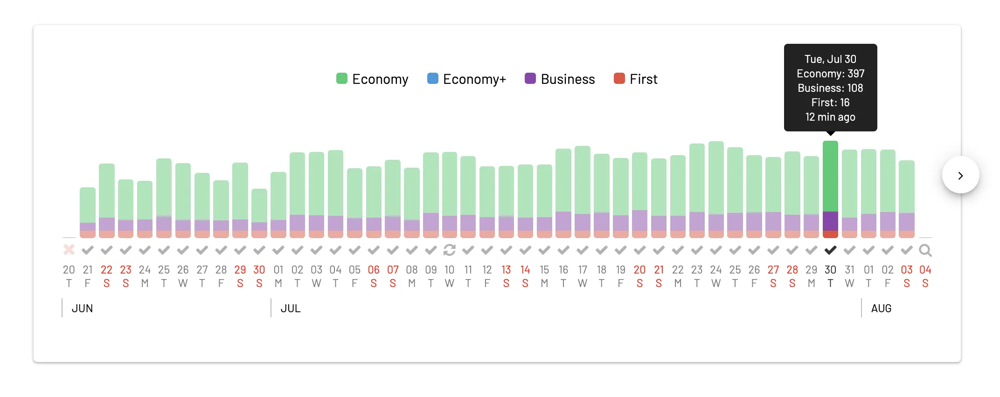
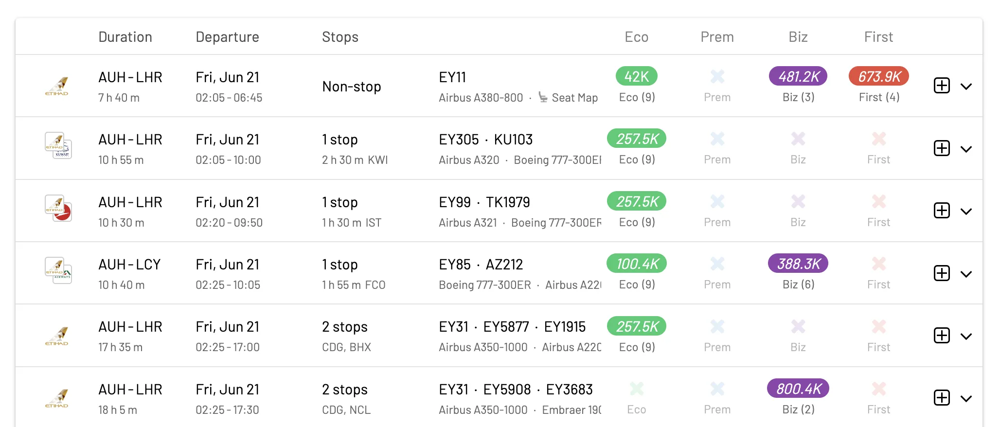
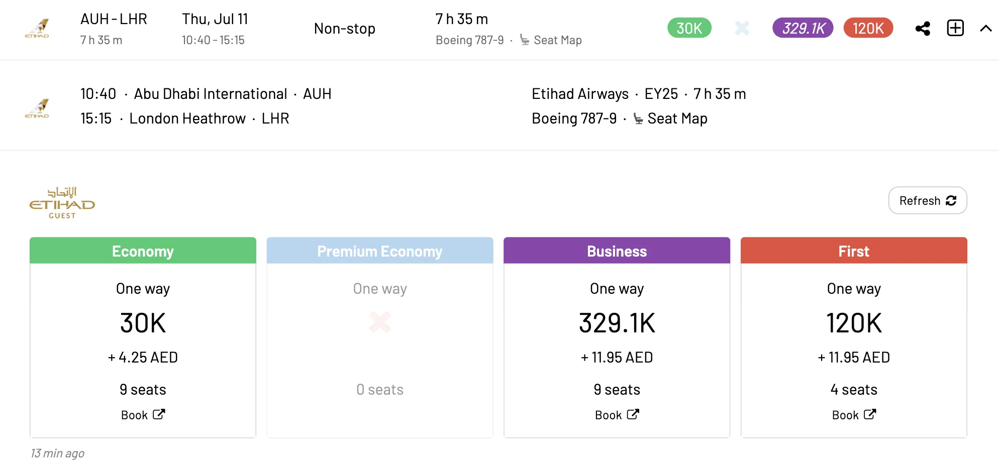
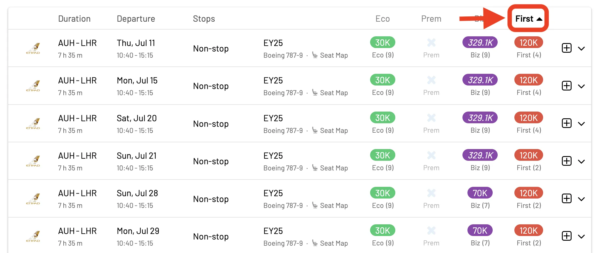
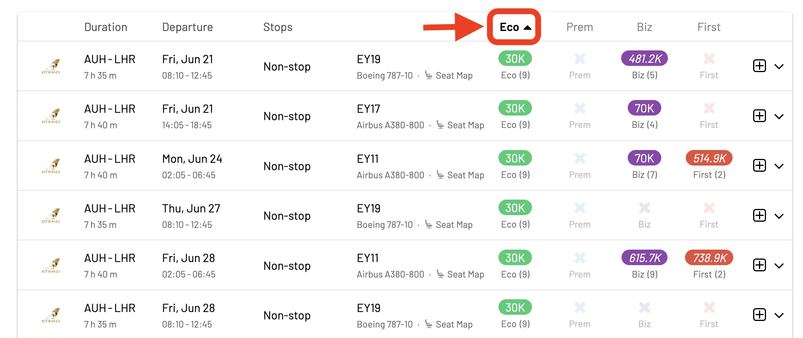
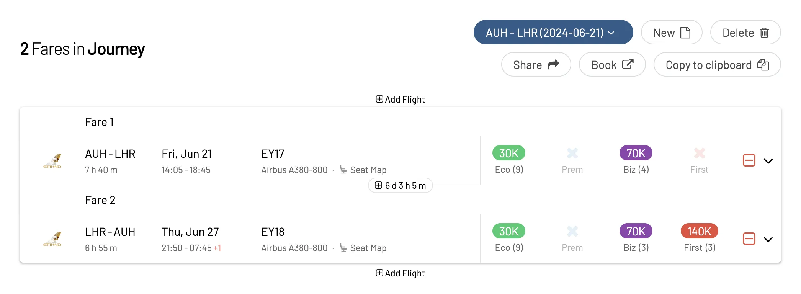
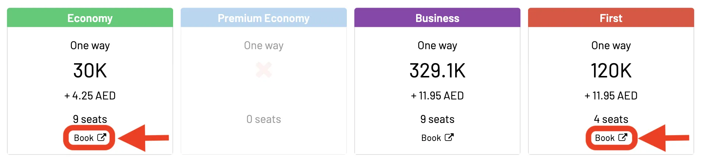

Etihad Guest, the renowned frequent flyer program of Etihad Airways, now integrates seamlessly with AwardFares, bringing you even more opportunities to maximize your travel rewards. What sets Etihad Guest apart is its flexible earning and redemption options, along with generous stopover programs in Abu Dhabi and frequent special promotions. Additionally, its innovative features like Milesbooster and Family Membership make it easier and faster to accumulate and redeem miles.

Join us as we unveil how AwardFares can help you navigate the dynamic world of Etihad Guest, ensuring you get the best value from your miles. Let's start!

### What's New?

- [Why Etihad Guest?](#why-etihad-guest)
- [Top Things You Need To Know About Etihad Guest in 2024](#top-things-you-need-to-know-about-etihad-guest-in-2024)
- [What AwardFares Offers to Etihad Guest Members](#what-awardfares-offers-to-etihad-guest-members)
- [Understanding Etihad Guest Award Chart](#understanding-etihad-guest-award-chart)
- [Finding Etihad Guest Award Flights with AwardFares](#finding-etihad-guest-award-flights-with-awardfares)
- [Top Etihad Guest Routes](#top-etihad-guest-routes)
- [Become an Etihad Guest Pro](#become-an-etihad-guest-pro)
- [Learn More](#learn-more)

## Why Etihad Guest?

[**Etihad Guest**](https://www.etihadguest.com/), the frequent flyer program of Etihad Airways, stands out for its flexible earning and redemption options, plus a great overall availability. With generous stopover programs in Abu Dhabi, frequent special promotions, and a strong focus on customer service, Etihad Guest provides a premium and rewarding experience for frequent travelers, particularly those traveling to or through the Middle East.

Etihad's extensive partner network also enables earning and redeeming miles on numerous airlines globally. Some key innovative features of the program are **Milesbooster**, **Cash+Miles**, and **Family Membership** (pooling) for quicker mile accumulation and easier redemptions.

## Top Things You Need To Know About Etihad Guest in 2024

- **Major Revamp in June 2024**: The program underwent a significant relaunch in 2024, introducing new ways to earn and redeem miles.
- **Earning Miles**: Tier Segments are gone! You now earn Etihad Guest Tier Miles only. Miles can be earned through flying Etihad or partner airlines, as well as non-flying activities like credit card spending (depending on the card). To qualify for elite status, you need to meet a minimum threshold of flying miles alongside total Tier Miles.
- **Redeeming Miles**: Award redemptions on some popular routes for economy and business class have seen a decrease. You can choose from different perk packages at each elite tier (Core, Custom, and Beyond). More custom perks come with higher tiers.
- **Other Changes**: Miles can no longer be extended through inactivity. Flights are the only way to extend them now. Award cancellation now incurs fees ranging from 25% to 75% of redeemed miles.

## What AwardFares Offers to Etihad Guest Members

- **Real-time Etihad Award Seat Availability**: Find the latest award seat availability for Etihad Airways flights directly through AwardFares.
- **Flexible Date Search**: Search for specific travel dates or use AwardFares' Timeline View to explore award options across a wider date range.
- **Compare Programs, Find the Best Deal**: Compare Etihad Guest award options with other loyalty programs (like other Etihad Guest partners or programs like Qatar Airways Privilege Club) to ensure you're getting the best value for your miles. This is particularly helpful when you have point transfer partners such as credit card loyalty programs with transferrable points.
- **Maximize Etihad Guest Miles**: AwardFares helps you find the most cost-effective ways to redeem your Etihad Guest Miles, allowing you to stretch your points further.

## Understanding Etihad Guest Award Chart

In the past, Etihad Guest offered a traditional award chart outlining the exact number of miles needed for flights based on distance and cabin class. However, as of 2024, Etihad Guest switched to a dynamic award system. This means there's no longer a published chart, and the miles required for a specific flight can vary depending on factors like demand, seasonality, and availability.

While this might seem less transparent, Etihad Guest offers a Miles Calculator on their [website](https://www.etihadguest.com/en/spend-miles/flying.html). This tool allows you to easily search for the miles needed on your desired route and travel dates.

Here's what to keep in mind:

- GuestSeat Awards: These are fixed-mileage redemptions for Etihad Airways flights, offering the best value when available.
- Miles & Cash: This option allows you to combine miles with a cash payment for more flexibility in booking flights.

## Finding Etihad Guest Award Flights with AwardFares

*AwardFares never asks for login credentials for your frequent flyer program.*

### 1. Visit [AwardFares](https://awardfares.com/signup)

Creating an account is optional, but registration is free and unlocks additional features. [Sign up here to get started.](https://awardfares.com/signup)

### 2. Choose Etihad Guest in the *Loyalty Program* Field

Select **Etihad Guest** from the dropdown menu to search for your award flight.

### 3. Enter a Route

Add your origin and destination airports, and AwardFares will search for available award flights, including those with stops. Filters for non-stop flights are also available.

In this example, we search for flights [between Abu Dhabi (AUH) to London (LON)](https://awardfares.com/search?AUH.LHR.;z:etihad).

### 4. Select Dates

Either input specific dates or use the Timeline View to explore availability over different periods. This view helps you easily compare the availability and class of service across various days.

You'll see the result list right below:

In addition, you can tap anywhere on the flight to display more details in an expanded view, such as aircraft type, and even [get the current seat maps](https://blog.awardfares.com/seatmaps-guide/) to see which seats are free or occupied.

### 5. Sort by Price

Whether you are exploring dates using the Timeline View or have selected a specific day, AwardFares will show you the available seats (with real-time data) within seconds in the result list below.

You can tap on the different header columns to sort the results by price. Use the **Eco**, **Prem**, **Biz**, and **First** class tags to find cheap awards across multiple dates, itineraries, and airlines.

Here's an example of the cheapest redemptions in First Class:

And here's an example of the cheapest redemptions in Economy Class:

### 6. Build Round Trips

Use our **Journey Planner** feature to add flights to your journey and build round trip itineraries! Learn more [about the Journey Planner in this full guide](https://blog.awardfares.com/journey-planner/).

### 7. Book via Etihad's Website

Once you find your desired flight, click the **Book** button.

AwardFares will redirect you to Etihad's website to complete your booking without re-entering your search criteria, as it will be pre-populated.

## Top Etihad Guest Routes

These are our favorite ways to use Etihad Guest miles, and where you can get the most value out of them.

- **Short-haul flights in Zone 1**: This includes destinations within the Middle East like [Riyadh](https://awardfares.com/search?AUH.RUH.;z:etihad), [Jeddah](https://awardfares.com/search?AUH.JED.;z:etihad), and [Bahrain](https://awardfares.com/search?AUH.country:BH.;z:etihad). You can find GuestSeat award prices starting at just 5,000 miles for economy and 15,000 miles for business class.
- [**Muscat, Oman**](https://awardfares.com/search?AUH.MCT.;z:etihad): This short flight from Abu Dhabi is a great way to experience Etihad’s Business Class for a low award cost, starting at 12,000 miles.
- [**Abu Dhabi to London (First Class)**](https://awardfares.com/search?AUH.area:LON.;z:etihad): Experience Etihad’s luxurious “Apartment” First Class Suite on the A380 aircraft. This award flight starts at 140,000 miles.
- *** Business Class to Various Destinations**: Etihad offers excellent Business Class service across its network. Some popular routes include [Abu Dhabi to Melbourne](https://awardfares.com/search?AUH.MEL.;z:etihad), [Sydney](https://awardfares.com/search?AUH.SYD.;z:etihad), or [New York](https://awardfares.com/search?AUH.area:NYC.;z:etihad), all starting around 70,000 miles in Business Class.

## Become an Etihad Guest Pro

You can [try AwardFares for free](https://awardfares.com/). We regularly roll out new features and improvements, so [sign up for our monthly newsletter](https://awardfares.com/newsletter) to stay on top of the latest news, announcements, and pro tips.

With our [Gold and Diamond tiers](https://awardfares.com/pricing), you can access premium features such as unlimited daily searches, alerts, seat maps, flight schedules, and more!

## Learn More

Our guides have all the information you need to be a pro travel hacker and explore the world on points. Here are some related posts you might enjoy:

- [Etihad Guest Key Facts](https://awardfares.com/programs/etihad-guest-miles)
- [How To Find Cheap Award Flights And Identify Good Redemptions (Step-by-step)](https://blog.awardfares.com/how-to-find-cheap-award-flights/)
- [Demystifying Award Charts: All You Need To Know (2023)](https://blog.awardfares.com/demystifying-award-charts/)
- [Top Frequent Flyer Programs To Consider In 2024 (Our Picks)](https://blog.awardfares.com/frequent-flyer-programs-2024/)
- [Best Premium Economy Cabins in 2024 (And How To Book Them With Points)](https://blog.awardfares.com/best-premium-economy-cabins-2024/)