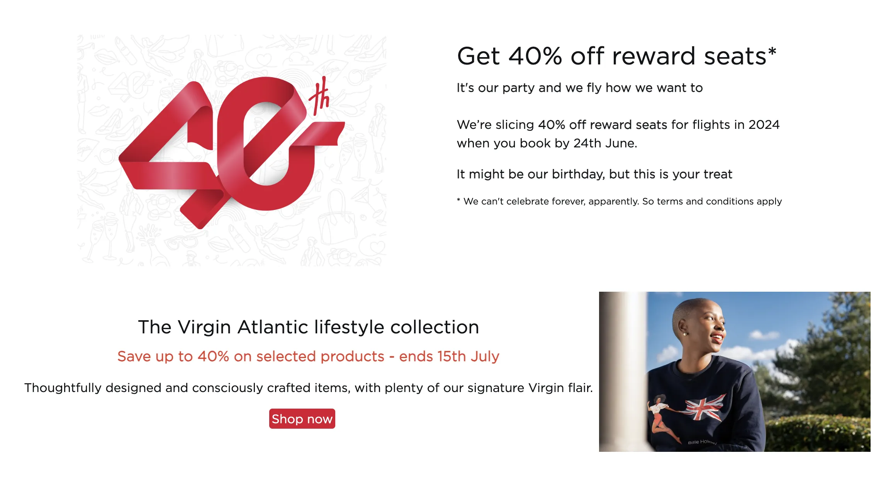
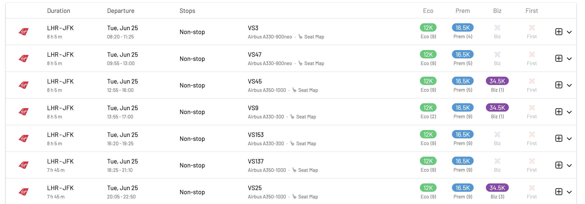

Virgin Atlantic is offering a whopping 40% discount on all award redemptions for travel in 2024. This offer applies to all routes, cabins, and classes, so you can save big on your dream vacation.

## What's The Deal?

* **Discount**: 40% discount on reward flights and points upgrades on all Virgin-operated flights (including Virgin Atlantic and Virgin Red)
* Book between June 21st and June 24th, 2024
* Travel through December 31st, 2024

  TIME LEFT TO BOOK

## Terms and Conditions

* Offer valid for new reward flights, upgrades and companion bookings booked using Virgin Points between 00:01 GMT 21st June 2024 and 23:59 GMT 24th June 2024. All flight departures, including returns, must be on or before 31st December 2024.
* A 40% reduction will be applied at the time of booking to the standard Virgin Points price of all flights booked between 21st June 2024 – 24th June 2024.
* This offer is for Virgin Atlantic reward flights, upgrades, and companion bookings (including those earned on Virgin Atlantic Credit Cards) for one-way or return flights in Economy, Premium and Upper Class. Bookings in Economy will be for travel in the Economy Classic category.
* Discount is not valid on Gold Reward flights (reward flights booked with double points) or Points Plus Money bookings.
* Valid on Virgin Atlantic designated flights that are Virgin Atlantic marketed and operated routes only (flight number starts with VS).
* Partner airline and codeshare flights are not eligible.
* The discount only applies to Virgin Points, not any cash element (taxes, fees, and carrier-imposed surcharges) of the flight price.
* Standard tier points will be awarded. Passengers are not entitled to earn Virgin Points.
* Existing bookings changed within the promotional booking period will be eligible for this offer and any reduction in the points price will be credited back to the member’s account. Changes are subject to the usual change fees and any increase in taxes, fees, and carrier-imposed surcharges.

## How To Find Etihad Guest GuestSeats Awards with AwardFares

1. Go to [AwardFares](https://awardfares.com/signup).
2. Under *Frequent Flyer Program*, choose **Virgin Atlantic Flying Club**.
3. Tap on *Airline* and select **Virgin Atlantic only**.
4. Under *Departure* city, select an origin airport, e.g., **London (LHR)**.
5. Similarly, enter a *Destination*, e.g., **New York (JFK)**
6. Choose a date, or use the Timeline view to explore flights for different dates.

That's it! AwardFares will show you the available seats/flights on the list below.

## Top Virgin Atlantic Routes

* [London (LHR) to Atlanta International Airport (ATL)](https://awardfares.com/search?LHR.ATL.;a:VS;z:flyingclub)
* [London (LHR) to Boston Logan International Airport (BOS)](https://awardfares.com/search?LHR.BOS.;a:VS;z:flyingclub)
* [London (LHR) to Los Angeles International Airport (LAX)](https://awardfares.com/search?LHR.LAX.;a:VS;z:flyingclub)
* [London (LHR) to Miami International Airport (MIA)](https://awardfares.com/search?LHR.MIA.;a:VS;z:flyingclub)
* [London (LHR) to New York's John F. Kennedy International Airport (JFK)](https://awardfares.com/search?LHR.JFK.;a:VS;z:flyingclub)
* [London (LHR) to Las Vegas' Harry Reid International Airport (LAS)](https://awardfares.com/search?LHR.LAS.;a:VS;z:flyingclub)
* [London (LHR) to Orlando International Airport (MCO)](https://awardfares.com/search?LHR.MCO.;a:VS;z:flyingclub)
* [London (LHR) to San Francisco International Airport (SFO)](https://awardfares.com/search?LHR.SFO.;a:VS;z:flyingclub)
* [London (LHR) to Seattle-Tacoma International Airport (SEA)](https://awardfares.com/search?LHR.SEA.;a:VS;z:flyingclub)
* [London (LHR) to Tampa International Airport (TPA)](https://awardfares.com/search?LHR.TPA.;a:VS;z:flyingclub)
* [London (LHR) to Washington, D.C.'s Dulles International Airport (IAD)](https://awardfares.com/search?LHR.IAD.;a:VS;z:flyingclub)

## Want More Award Travel Intel?

You can [try AwardFares for free](https://awardfares.com/). We are rolling out new features and improvements regularly, so [sign up for our monthly newsletter](https://awardfares.com/newsletter) to stay on top of the latest news, announcements, and pro tips.

With our [Gold and Diamond tiers](https://awardfares.com/pricing), you can access premium features such as unlimited daily searches, alerts, seat maps, flight schedules, and more!

## Read More

Our guides have all the information you need to be a pro travel hacker and explore the world on points. Here are some related posts you might enjoy:

* [Introducing Virgin Atlantic Flying Club Awards](https://blog.awardfares.com/introducing-flying-club/)
* [How To Find Cheap Award Flights And Identify Good Redemptions (Step-by-step)](https://blog.awardfares.com/how-to-find-cheap-award-flights/)
* [Seat Maps: Getting The Perfect Seat Even Before Booking](https://blog.awardfares.com/seatmaps-guide/)
* [Best Premium Economy Cabins in 2024 (And How To Book Them With Points)](https://blog.awardfares.com/best-premium-economy-cabins-2024/)

