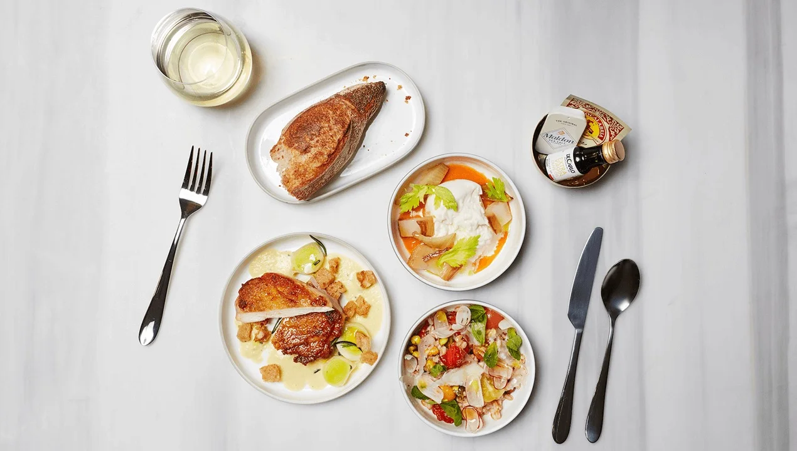
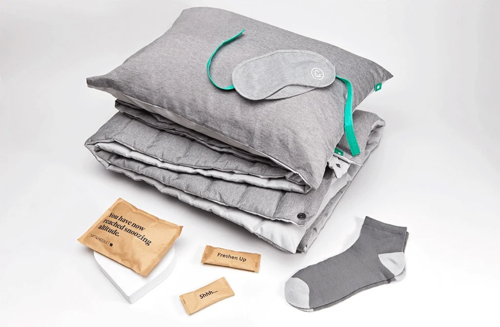
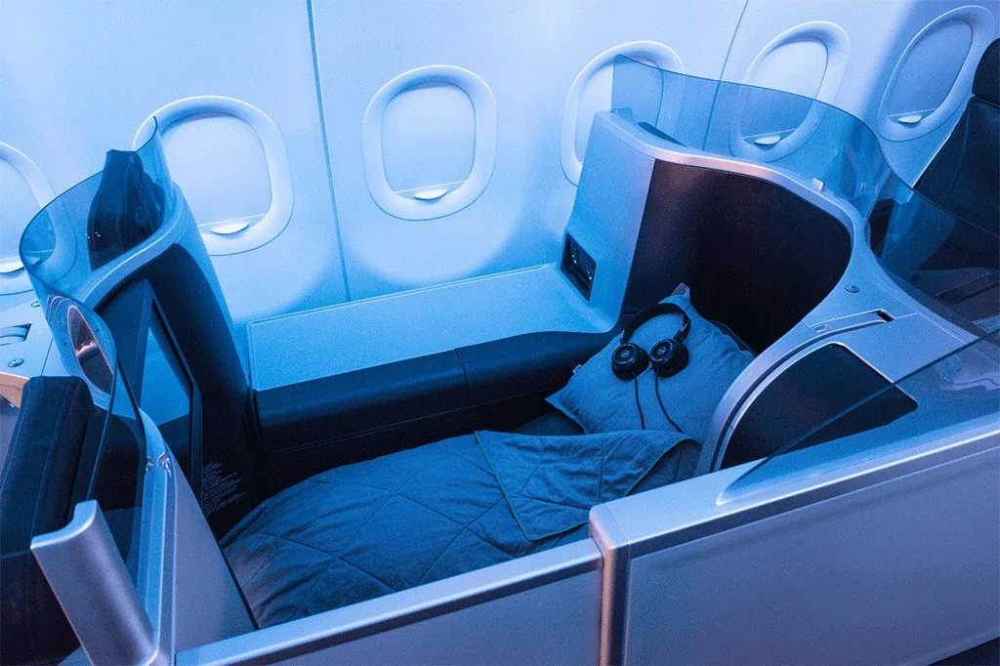
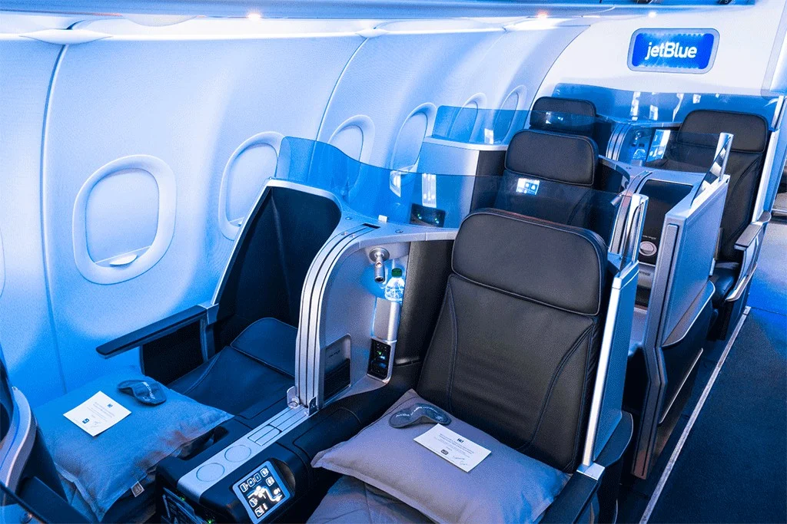
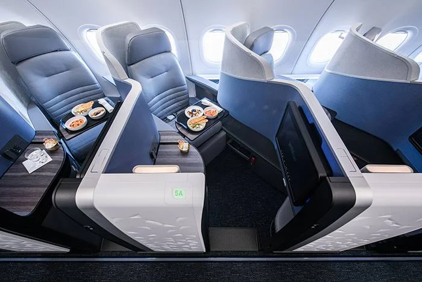
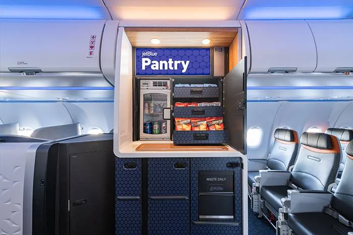
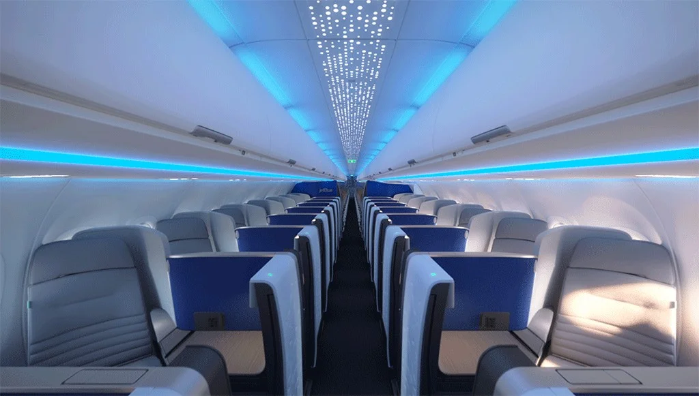
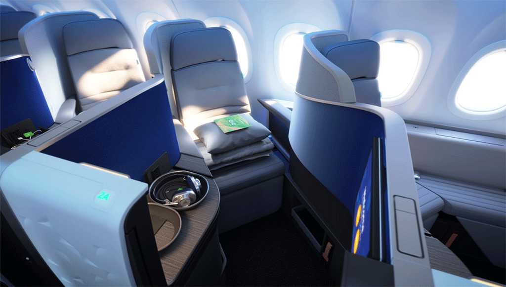
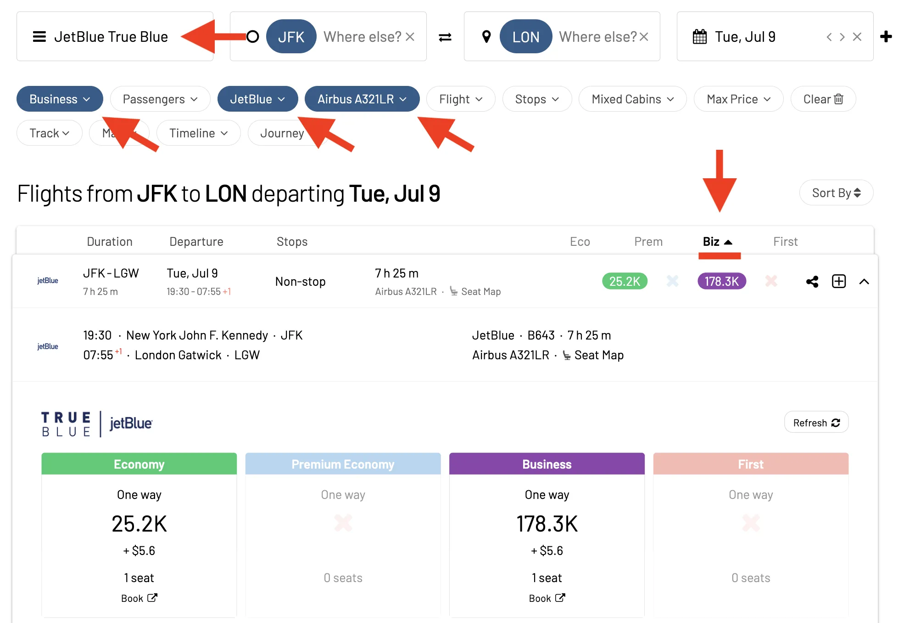

[**JetBlue Mint**](https://www.jetblue.com/flying-with-us/mint), the carrier's domestic long-haul business class product continues to be a Delta One killer. Yes, TrueBlue (JetBlues owned frequent flyer program) is an obvious way to book Mint, but there are other ways too. Plus, it's not always clear what product you'll end up getting, as there are multiple flavors of Mint depending on the aircraft type.

In this post, we explore the latest status on JetBlue Mint, top current and upcoming routes, and how to book this cabin using points. Let's get started!

### In This Post
- [What is JetBlue Mint?](#what-is-jetblue-mint)
- [Top JetBlue Mint Routes](#top-jetblue-mint-routes)
- [Find and Book JetBlue Mint Awards with TrueBlue Points](#find-and-book-jetblue-mint-awards-with-trueblue-points)
- [Other ways to book JetBlue Mint with Points](#other-ways-to-book-jetblue-mint-with-points)
- [Become a TrueBlue Pro](#become-a-trueblue-pro)
- [Read More](#read-more)

## What is JetBlue Mint?

Of all the travel classes of JetBlue, JetBlue Mint stands out as the most premium. At first Mint was created and aimed to grant greater comfort and service than the usual economy class.

What you can expect:

- **Private Suites & Lie-Flat Seats**: JetBlue Mint offers a private suite with lie-flat seats, ensuring you have the best in comfort and privacy during your flight. The seats are meant to feel like a bed in such travel as long-haul flights.
- **Next-Level Privacy.** Each suite has a sliding door incorporated that gives every passenger their own separate and unique area. With this feature, JetBlue creates one of the best-in-class calm and secluded atmosphere.
- **Upgraded In-Flight Entertainment (IFE) and Onboard Dining.** State of the Art Larger Screens with More Choices in Movies, TV Shows Music and Games The newest articles have also been carefully designed and added to the entertainment system as well, with a user-friendly interface.
- **Premium Dining Experience.** A personalized dining menu composed of a selection of finefare food prepared by renowned chefs is available on JetBlue Mint. The menu changes seasonally and regionally. Passengers may partake in a range of courses and fine wines, as well other beverages.
- **Airport Benefits.** Mint passengers have priority at screening, check-in and even on landing. In addition, JetBlue has opened more than a dozen lounges to provide a calm place where their premium travelers can take some rest before the flight. The lounges offer free food and drinks, Wi-Fi, and comfortable seating.
- **Luxury Amenity Kits.** All passengers will receive amenity kits filled with premium skincare products, a sleep mask and more to keep them comfortable while flying.

<figure>

</figure>

### Where is it available?

JetBlue Mint is available on the following aircraft types:

#### Airbus A321 Classic

The standard A321 aircraft features 16 Mint seats, arranged in a 2-1-2-1-2 configuration. This includes 12 Mint seats in double rows and four individual suites with privacy doors. These seats offer features like lie-flat capability, adjustable firmness, and massage functions.

<figure>

</figure>

#### Airbus A321neo

The A321neo also has 16 Mint seats, but with a slightly different layout. This includes 14 individual Mint Suite seats with privacy doors and two Mint Studio spaces at the front, offering additional space and amenities. The seats in this aircraft also feature 6’8” of lie-flat space, adjustable firmness, and massage functions, along with a 17.1” screen.

<figure>

</figure>

#### Airbus A321LR

The long-range A321LR aircraft has 24 Mint seats. This includes 22 individual Mint Suite seats and two Mint Studio spaces. These seats share the same features as the A321neo, ensuring enhanced comfort and privacy for long-haul flights.

<figure>

</figure>

## Top JetBlue Mint Routes

JetBlue Mint is available on several top routes for domestic and international travelers. Here are some of the ones we love at AwardFares. You can tap on them to trigger a new search with real-time results.

**Domestic Routes**

| Route                                     |                                        |
|--------------------------------------|--------------------------------------|
| [New York (JFK) to Los Angeles (LAX)](https://awardfares.com/search?JFK.LAX.;c:business;z:jetblue)| [Los Angeles (LAX) to Miami (MIA)](https://awardfares.com/search?LAX.MIA.;c:business;z:jetblue)         |
| [Boston (BOS) to San Francisco (SFO)](https://awardfares.com/search?BOS.SFO.;c:business;z:jetblue)| [Los Angeles (LAX) to New York (JFK)](https://awardfares.com/search?LAX.JFK.;c:business;z:jetblue)      |
| [Boston (BOS) to Las Vegas (LAS)](https://awardfares.com/search?BOS.LAS.;c:business;z:jetblue)    | [San Diego (SAN) to Boston (BOS)](https://awardfares.com/search?SAN.BOS.;c:business;z:jetblue)          |
| [New York (JFK) to San Juan (SJU)](https://awardfares.com/search?JFK.SJU.;c:business;z:jetblue)   | [San Diego (SAN) to New York (JFK)](https://awardfares.com/search?SAN.JFK.;c:business;z:jetblue)        |
| [Boston (BOS) to Palm Springs (PSP)](https://awardfares.com/search?BOS.PSP.;c:business;z:jetblue) | [San Francisco (SFO) to Boston (BOS)](https://awardfares.com/search?SFO.BOS.;c:business;z:jetblue)      |
| [Las Vegas (LAS) to Boston (BOS)](https://awardfares.com/search?LAS.BOS.;c:business;z:jetblue)     | [San Francisco (SFO) to Fort Lauderdale (FLL)](https://awardfares.com/search?SFO.FLL.;c:business;z:jetblue)|
| [Las Vegas (LAS) to New York (JFK)](https://awardfares.com/search?LAS.JFK.;c:business;z:jetblue)   | [San Francisco (SFO) to Miami (MIA)](https://awardfares.com/search?SFO.MIA.;c:business;z:jetblue)       |
| [Los Angeles (LAX) to Boston (BOS)](https://awardfares.com/search?LAX.BOS.;c:business;z:jetblue)   | [San Francisco (SFO) to New York (JFK)](https://awardfares.com/search?SFO.JFK.;c:business;z:jetblue)    |
| [Los Angeles (LAX) to Fort Lauderdale (FLL)](https://awardfares.com/search?LAX.FLL.;c:business;z:jetblue)| [Seattle (SEA) to Boston (BOS)](https://awardfares.com/search?SEA.BOS.;c:business;z:jetblue)     |
| [Seattle (SEA) to New York (JFK)](https://awardfares.com/search?SEA.JFK.;c:business;z:jetblue)     |                                         |

**International Routes**

| Route                                      |                                      |
|--------------------------------------|--------------------------------------|
| [Boston (BOS) to Bridgetown (BGI)](https://awardfares.com/search?BOS.BGI.;c:business;z:jetblue)      | [Boston (BOS) to Granada (GND)](https://awardfares.com/search?BOS.BGI.;c:business;z:jetblue)         |
| [Boston (BOS) to Liberia (LIR)](https://awardfares.com/search?BOS.LIR.;c:business;z:jetblue)         | [Boston (BOS) to Saint Thomas (STT)](https://awardfares.com/search?BOS.STT.;c:business;z:jetblue)    |
| [Boston (BOS) to Saint Lucia (UVF)](https://awardfares.com/search?BOS.UVF.;c:business;z:jetblue)     | [Boston (BOS) to Sint Maarten (SXM)](https://awardfares.com/search?BOS.SXM.;c:business;z:jetblue)    |
| [Los Angeles (LAX) to Liberia (LIR)](https://awardfares.com/search?LAX.LIR.;c:business;z:jetblue)    | [New York (JFK) to Aruba (AUA)](https://awardfares.com/search?JFK.AUA.;c:business;z:jetblue)         |
| [New York (JFK) to Bridgetown (BGI)](https://awardfares.com/search?JFK.BGI.;c:business;z:jetblue)    | [New York (JFK) to Granada (GND)](https://awardfares.com/search?JFK.GND.;c:business;z:jetblue)       |
| [New York (JFK) to Liberia (LIR)](https://awardfares.com/search?JFK.LIR.;c:business;z:jetblue)       | [New York (JFK) to London Heathrow (LHR)](https://awardfares.com/search?JFK.LHR.;c:business;z:jetblue)|
| [New York (JFK) to London-Gatwick (LGW)](https://awardfares.com/search?JFK.LGW.;c:business;z:jetblue)| [New York (JFK) to Saint Thomas (STT)](https://awardfares.com/search?JFK.STT.;c:business;z:jetblue)  |
| [New York (JFK) to Saint Lucia (UVF)](https://awardfares.com/search?JFK.UVF.;c:business;z:jetblue)   | [New York (JFK) to Sint Maarten (SXM)](https://awardfares.com/search?JFK.SXM.;c:business;z:jetblue)  |
| [Newark (EWR) to Aruba (AUA)](https://awardfares.com/search?EWR.AUA.;c:business;z:jetblue)           | [Newark (EWR) to Bridgetown (BGI)](https://awardfares.com/search?EWR.BGI.;c:business;z:jetblue)      |
| [Newark (EWR) to Liberia (LIR)](https://awardfares.com/search?EWR.LIR.;c:business;z:jetblue)         | [Newark (EWR) to Saint Thomas (STT)](https://awardfares.com/search?EWR.STT.;c:business;z:jetblue)    |
| [Newark (EWR) to Saint Lucia (UVF)](https://awardfares.com/search?EWR.UVF.;c:business;z:jetblue)     | [Newark (EWR) to Sint Maarten (SXM)](https://awardfares.com/search?EWR.SXM.;c:business;z:jetblue)    |

**Upcoming Routes (2024)**

| Route                               | Starting Date            |
|-------------------------------------|--------------------------|
| [New York (JFK) to Vancouver](https://awardfares.com/search?JFK.YVR.;c:business;z:jetblue)         | starting July 21, 2024   |
| [New York (JFK) to San Juan](https://awardfares.com/search?JFK.SJU.;c:business;z:jetblue)          | starting July 22, 2024   |
| [Boston and New York to Phoenix](https://awardfares.com/search?BOS,area:NYC.PHX.;a:B6;o:business;so:a;z:jetblue)      | starting late October 2024|
| [Fort Lauderdale to Phoenix](https://awardfares.com/search?FLL.PHX.;a:B6;o:business;so:a;z:jetblue)          | starting winter 2024     |

## Find and Book JetBlue Mint Awards with TrueBlue Points

AwardFares is your best ally to quickly find Mint awards using TrueBlue points. If you want to [read the full guide, check here](https://blog.awardfares.com/introducing-trueblue/).

In short, simply follow these steps:

1. Go to [AwardFares](https://awardfares.com/search).
2. Under *Loyalty Program*, choose ***JetBlue TrueBlue***.
3. Select **JetBlue Only** under *Airline*.
4. Add *Business* in the ***Cabin*** filter.
5. Check and add the aircraft type under ***Equipment***. For instance, use *A320* for Mint Classic, *A321neo* or *A321LR*.
6. Choose a desired route and date.
7. Voilà! AwardFares will do its magic and show you the available flights in the list below, including details such as the prices per cabin, number of stops, total travel time, aircraft used, and more!

## Other ways to book JetBlue Mint with Points

In the past, you could redeem JetBlue flights with American AAdvantage and Emirates Skywards, but both have been discontinued. However, since 2023, it's now possible to book Qatar Airways Avios on JetBlue flights. While redemptions on don’t follow the standard Qatar Airways Privilege Club partner award chart, here's [a guide you can check](https://onemileatatime.com/insights/redeem-qatar-airways-avios-jetblue/) on how to do it.

## Become a TrueBlue Pro

You can [try AwardFares for free](https://awardfares.com/). We are rolling out new features and improvements regularly, so [sign up for our monthly newsletter](https://awardfares.com/newsletter) to stay on top of the latest news, announcements, and pro tips.

With our [Gold and Diamond tiers](https://awardfares.com/pricing), you can access premium features such as unlimited daily searches, alerts, seat maps, flight schedules, and more!

## Read More

Our guides have all the information you need to be a pro travel hacker and explore the world on points. Here are some related posts you might enjoy:

- [Introducing JetBlue TrueBlue Awards: Your Ticket to Affordable Adventures](https://blog.awardfares.com/introducing-trueblue/)
- [Best Premium Economy Cabins in 2024 (And How To Book Them With Points)](https://blog.awardfares.com/best-premium-economy-cabins-2024/)
- [How To Find Cheap Award Flights And Identify Good Redemptions (Step-by-step)](https://blog.awardfares.com/how-to-find-cheap-award-flights/)