When looking into redeeming your points or miles for free flights, it's common to end up searching for one-way flights only: most portals aren't straightforward or don't allow building round-trip award tickets. Plus, it's not clear if there are any benefits to it. But it's also a hassle to book two one-way flights, even if those flights are virtually *for free*.

However, booking round-trips is possible! In this guide, we'll go through some of the tradeoffs and benefits of booking these type of tickets, which programs support it, and how to build a perfect itinerary using AwardFares.

### In This Post
- [One-way vs. Round-Trip: Which One is Better?](#one-way-vs-round-trip-which-one-is-better)
- [How to Plan and Book Round-Trip Awards Easily (Step-by-step)](#how-to-plan-and-book-round-trip-awards-easily-step-by-step)
- [FAQ](#faq)
- [Become a Pro Travel Hacker](#become-a-pro-travel-hacker)
- [Read More](#read-more)

## One-way vs. Round-Trip: Which One is Better?

The most common scenario when you log in to a frequent flyer program is that the search portal defaults to one-way flights only. But did you know that several programs offer the possibility to also book round-trip awards? Sometimes it can be even more cost-efficient to do so, although one-way bookings almost always offer more flexibility when it comes to cancellations and rebookings.

### Benefits of Round-Trip Award Tickets

- **Fewer Miles Required**: A number of airlines and programs offer a reduced mileage rate for round-trip award bookings when compared to the total price of two one-way awards (e.g., United MileagePlus, SAS EuroBonus, etc.)
- **Reduced Fees**: Sometimes when issuing the tickets, some programs might waive or reduce certain fees (e.g., close-in booking fees, change fees) for round-trip bookings. This can drastically reduce the cost of your flight and travel plans, especially when there are hefty
- **Simplified Booking Process**: Booking a round-trip award flight is generally a simpler process than booking two separate one-way awards. You only need to search for availability once and make a single reservation.
- **Guaranteed Return Flight**: When you book a round-trip award, you also guarantee your return flight is secured, both in availability and not subject to price increases or mileage devaluations.
- **Stopover Options**: On roundtrip award tickets, some airlines offer free stopovers where you can visit two different places for the price of one. That way, for instance, you might have a free layover in Seoul (South Korea) on your return from New York to Tokyo.

### Examples

**Scenario 1**: Flying from Los Angeles (LAX) to Chicago (ORD) on United Airlines costs 25,000 miles when booking a round-trip award ticket, while two one-way awards would cost 30,000 miles. **You save 5,000 miles**.

**Scenario 2**: You booked a round-trip award flight from San Francisco (SFO) to London (LHR) on British Airways and need to change your return date. Since you booked a round-trip ticket, you only pay one change fee instead of two.

**Scenario 3**: You're flying from New York (JFK) to Bangkok (BKK) on Singapore Airlines using SAS EuroBonus points. By booking a round-trip award ticket, you can enjoy a free stopover in Singapore, exploring the city before continuing your journey to Bangkok. Plus, the total cost of the trip is 20% cheaper for a round-trip award compared to two one-way tickets, as EuroBonus has that policy on Star Alliance. On the other hand, you cannot change the return leg once the trip has started.

## How to Plan and Book Round-Trip Awards Easily (Step-by-step)

Luckily, we equipped AwardFares with a handy and powerful tool called [**Journey Planner**](https://blog.awardfares.com/journey-planner/). It's perfect for building round-trips, as it lets you search for available seats in realtime, accurately estimate the cost of each leg, and find potential returning flights in a fraction of the time compared to using the airlines' search engine.

### 1. Go to [AwardFares](https://awardfares.com/signup?utm_source=round-trip-award-flights&utm_medium=blog&utm_content=AwardFares)

Creating an account is optional, but it’s also free, and it gives you access to more features. Make sure to sign up for one.

### 2. Select your favorite Frequent Flyer Program

In this example, we'll choose **SAS EuroBonus** in the **Loyalty Program** picker.

In SAS EuroBonus, you can book one-way award tickets on Star Alliance partners for **60% of the points required for a round-trip award ticket**. This means that booking two one-way tickets is much more expensive. This condition is only applicable to Star Alliance flights, not on SAS flights.

Therefore, let's try to build an itinerary on a Star Alliance airline to see the price difference.

### 3. Choose a Route

We'll pick flights from [**Stockholm (ARN) to Bangkok (BKK) with Thai Airways**](https://awardfares.com/search?ARN.BKK.;a:TG;z:sas). One-way Economy Class awards start at 54k points, and 99k points for Business Class tickets.

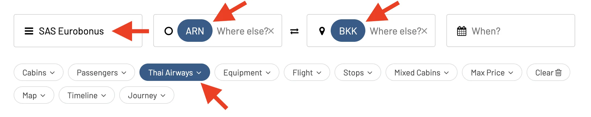

### 4. Add a leg to the Journey Planner

AwardFares will show you the available seats and flights in the list below. Once you've identified a good option, simply tap on the **[+]** icon to start planning a new *Journey*.

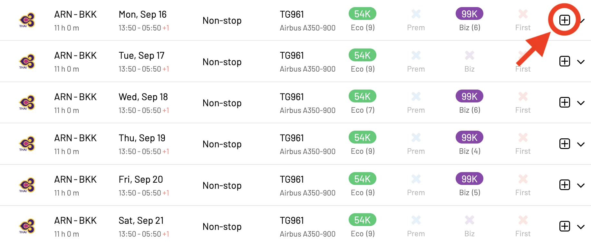

You'll see the new journey created when tapping on the **Journey** pill, right above the results. Note that this feature allows for creating and saving multiple journeys at the same time, and you can switch between them from the dropdown menu.

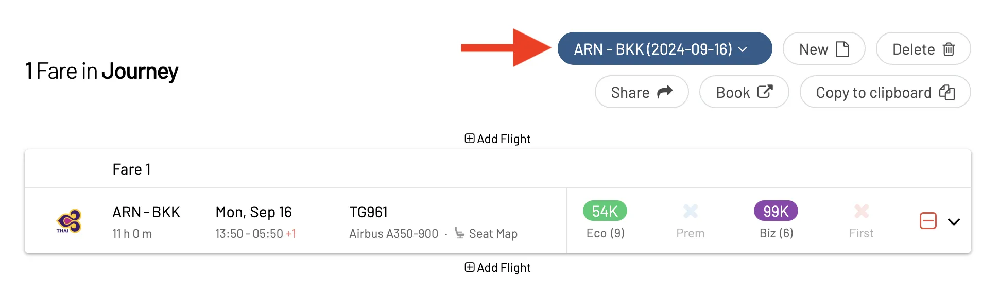

### 5. Search for a return leg

After you've added the outbound leg, tap on **Add Flight** to start searching for a return flight. AwardFares will automatically populate your origin city.

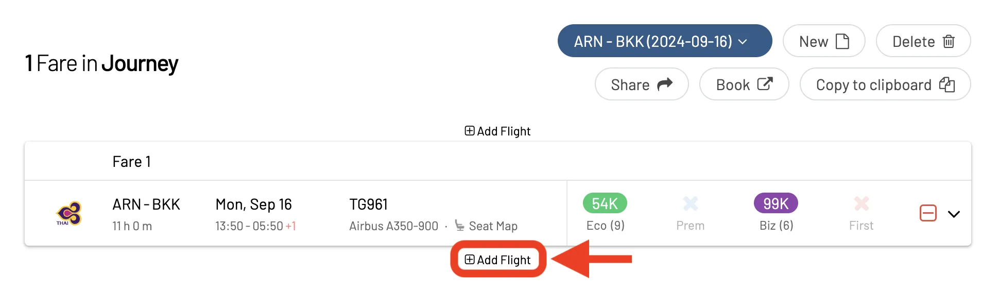

Add your destination by typing in the field, and a potential return date. In this case, we are flying back to Stockholm (ARN), and we'd like to spend at least a week in Bangkok.

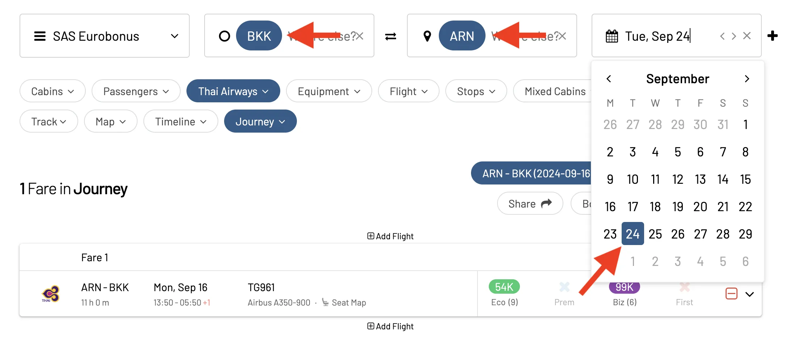

The tool will search for available flights *after the one added to your journey*. To be extra clear, we display this information in the header of the search results. Once more, tap on the **[+]** icon to add the return leg to the Journey Planner.

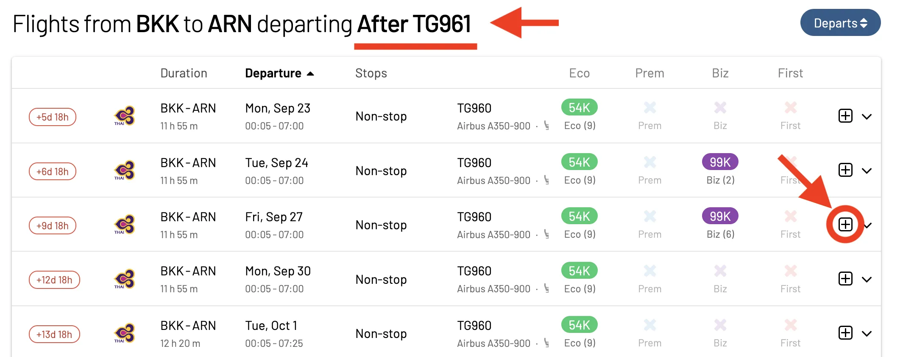

### 6. Check your plans and book

After adding all your segments, you will be able to see the entire itinerary in the Journey section, and find more helpful options. Our tool displays, among other things, the time gap between flights (in days and hours). Plus, you can easily delete segments or continue adding more before or after.

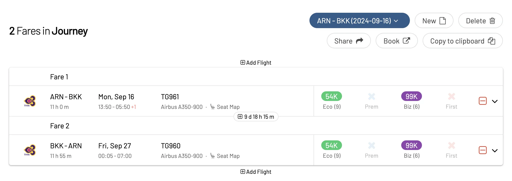

If you are ready to make your reservation, simply tap on the **Book** button and AwardFares will redirect you to the airline's website, pre-filling your options.

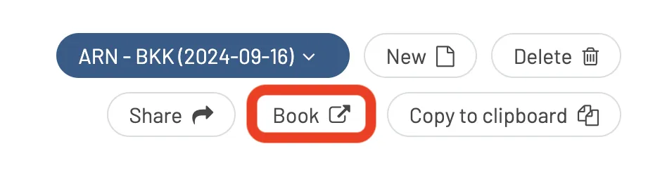

As you can check below in our example, we confirm that the reduced price is applied: 165k points for a round-trip compared to 198k points for booking two one-way tickets.

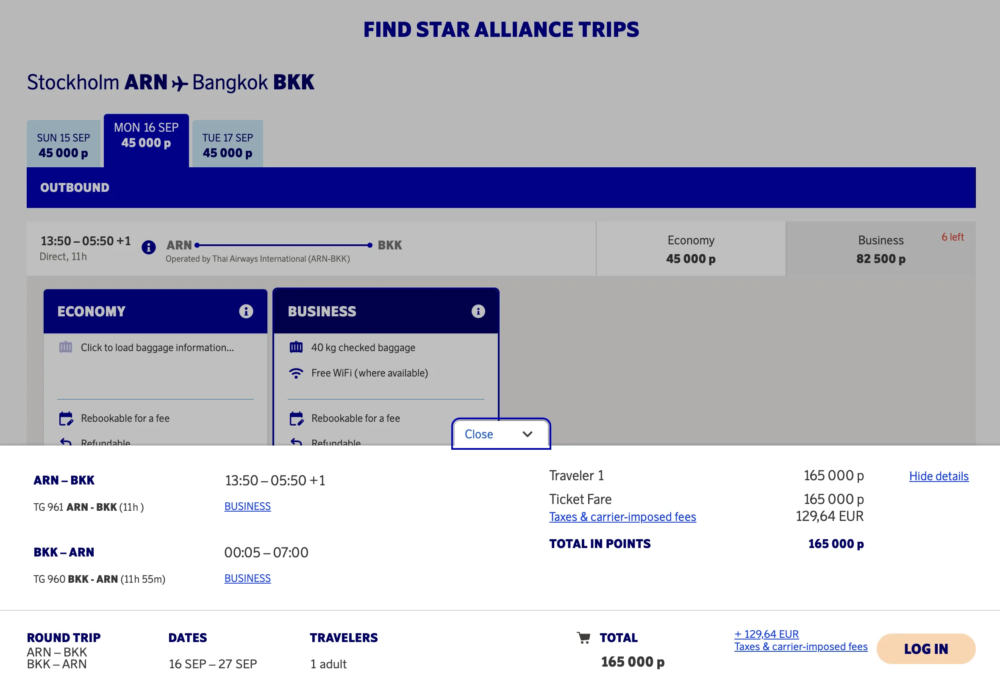

### More Features

Another handy feature is the option to copy the itinerary to the clipboard. This way you can paste it into your notes in case you have to, for example, contact the call center and book via phone.

**Copy to Clipboard**

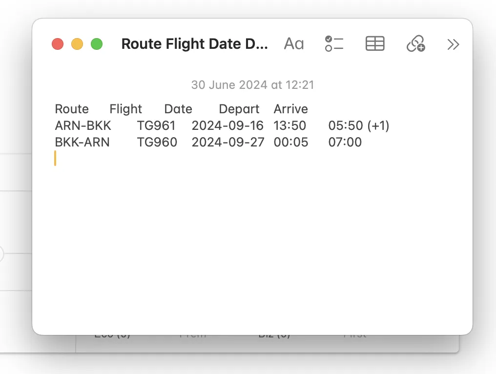

**Share Journey**

On top of that is the possibility to share the journey with friends or family members. use the **Share** button, and you'll get a unique URL that you can copy and send over.

When opening the URL, you'll see the full itinerary, plus a map with the route.

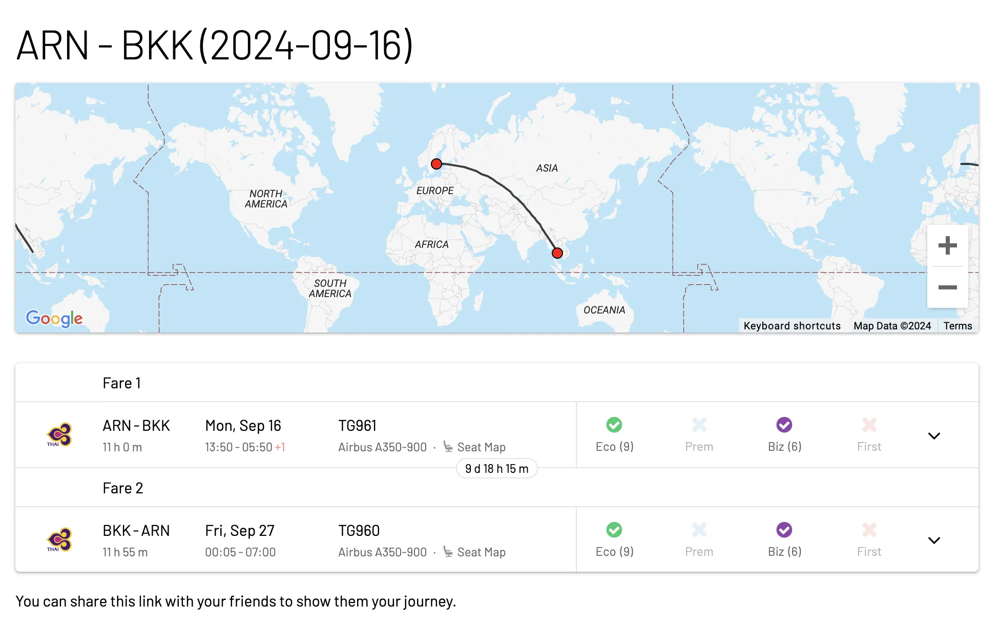

In addition, you can create new trips, delete existing ones, unshare them, and more! Start exploring these features today with a [Gold or Diamond account](https://awardfares.com/pricing).

### A Few Things to Keep in Mind

- AwardFares is perfect for [helping you build complex itineraries](https://blog.awardfares.com/journey-planner/), even beyond round-trips. As of today, as the rules of each frequent flyer program are different, our tool does not account for the different discounts when showing the prices. This means that **you will always see the price as if booking one-way**. For the final calculation, you can hit the *Book* button and perform the final simulation on the program's page.
- You can use this tool to build round-trip itineraries even for programs that only allow one-way tickets.
- It's also possible to use the Journey Planner to plan for Stopovers or Round-The-World tickets (RTW).

## FAQ

### In which airlines or frequent flyer programs is more cost-efficient to book a round-trip award ticket?

The following table has some airlines and programs where it is more cost-efficient to book a round-trip ticket compared to two one-way award flights.

| Frequent Flyer Program         | Airlines with benefits            |
|--------------------------------|-----------------------------------|
| SAS EuroBonus                  | Star Alliance Partners            |
| United MileagePlus             | United Airlines                   |
| Air France-KLM Flying Blue     | Air France, KLM (e.g., Promo Rewards) |
| British Airways Executive Club | British Airways, oneworld partners |
| Lufthansa Miles & More         | Lufthansa, Star Alliance partners  |
| Emirates Skywards              | Emirates                          |
| ANA Mileage Club               | All Nippon Airways (ANA)          |
| Singapore Airlines KrisFlyer   | Singapore Airlines, Star Alliance partners |
| Qatar Airways Privilege Club   | Qatar Airways, oneworld partners  |
| Turkish Airlines Miles&Smiles  | Turkish Airlines, Star Alliance partners |

### How do I book a round trip award flight?

You can book a round trip award flight through the frequent flyer program of the airline you have miles or points with. For some of them, you will need to search for the individual one-way segments or awards and write them down, then contact their customer service. Alternatively, [use our Journey Planner to craft your perfect itinerary](#how-to-plan-and-book-round-trip-awards-easily-step-by-step) and have them ready as notes before calling an agent.

### Can I mix airlines on a round trip award flight?

Yes, many frequent flyer programs allow you to mix airlines, especially if they are part of an airline alliance. This can give you more flexibility in planning your trip.

### Can I change or cancel my round trip award flight?

Change and cancellation policies for round trip award flights vary depending on the airline and fare class. Some airlines may offer free changes or cancellations within a certain timeframe, while others may charge a fee or require you to forfeit your miles or points.

### How far in advance should I book a round trip award flight?

For more info on this topic, check our [Ultimate Guide to Award Release Dates](https://blog.awardfares.com/ultimate-guide-to-award-release-dates). Generally, we recommend booking as early as possible, as award availability is limited. Some airlines open their award calendars 330 days in advance, so planning early can increase your chances of finding the flights you want. On the other hand, some seats are released closer to departure date (e.g., Lufthansa), or you might find better prices due to promotions (e.g., Flying Blue Promo Awards)

### What happens if there is no award availability on my preferred dates?

If there is no award availability, you might need to be flexible with your travel dates, routes, or consider booking a one-way award flight and purchasing a one-way ticket for the return journey. Some programs also offer waitlisting for award seats.

### Are there blackout dates for round trip award flights?

Some frequent flyer programs may have blackout dates where award flights are not available. These dates usually coincide with peak travel times, such as holidays and major events.

### What should I do if I need assistance with booking my round trip award flight?

If you need help, contact the customer service department of the airline’s frequent flyer program. They can provide assistance with booking, availability, and any other questions you might have.

### Can I book round trip award flights for someone else?

Yes, most frequent flyer programs allow you to book award flights for other people. You will need to provide the traveler’s information during the booking process.

## Become a Pro Travel Hacker

You can [try AwardFares for free](https://awardfares.com/). We are rolling out new features and improvements regularly, so [sign up for our monthly newsletter](https://awardfares.com/newsletter) to stay on top of the latest news, announcements, and pro tips.

With our [Gold and Diamond tiers](https://awardfares.com/pricing), you can access premium features such as unlimited daily searches, alerts, seat maps, flight schedules, and more!

## Read More

Our guides have all the information you need to be a pro travel hacker and explore the world on points. Here are some related posts you might enjoy:

- [Journey Planner: Building Perfect Award Trips To Difficult Destinations](https://blog.awardfares.com/journey-planner/)
- [How To Find Cheap Award Flights And Identify Good Redemptions (Step-by-step)](https://blog.awardfares.com/how-to-find-cheap-award-flights/)
- [Ultimate Guide to Award Release Dates](https://blog.awardfares.com/ultimate-guide-to-award-release-dates/)
