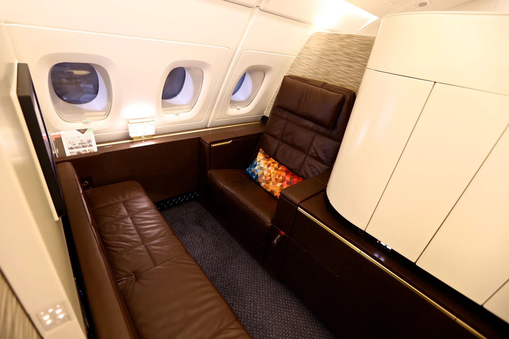
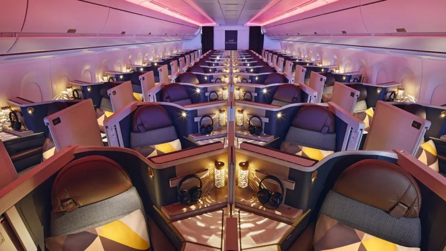
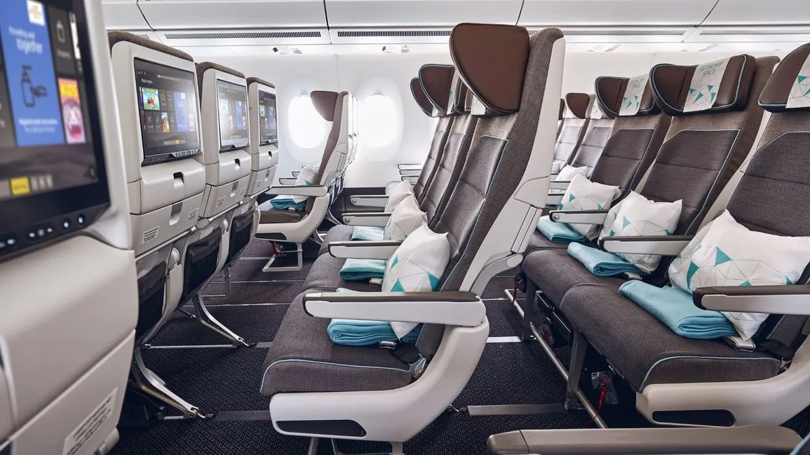

Etihad Airways, the national airline of the United Arab Emirates, is renowned for its luxurious travel experiences and world-class service. One of the most appealing aspects of flying with Etihad is the ability to use Etihad Guest Miles to book award flights in various cabins.

In this guide, we help you navigate the best cabins to book with your Etihad Guest miles, detailing different airplane types, popular routes, cost in miles, and even how to find availability using AwardFares.

## Etihad Cabins: The Basics

### The Residence: A Class of Its Own

The Residence is the epitome of luxury in the skies, featuring a private three-room suite with a living room, bedroom, and ensuite shower. This unique offering is available exclusively on the Airbus A380. It’s perfect for those looking to experience the ultimate in-flight luxury.

* **Aircraft**: Airbus A380
* **Routes**:
  * Abu Dhabi (AUH) to London (LHR)
  * Abu Dhabi (AUH) to New York (JFK)
  * Abu Dhabi (AUH) to Paris (CDG)
* **Price Range**: 1,200,000 - 1,500,000 Miles (one-way)

*Image source: Etihad*

### First Apartments: Unmatched Privacy and Comfort

The First Apartments on the Airbus A380 offer unparalleled privacy and comfort, featuring a large leather armchair, an ottoman that converts into a separate 6’10” bed, and access to a luxurious shower spa. This cabin is a favorite for long-haul travelers seeking a blend of privacy and top-notch service.

* **Airplane Type**: Airbus A380
* **Routes**:
  * Abu Dhabi (AUH) to Sydney (SYD)
  * Abu Dhabi (AUH) to London (LHR)
  * Abu Dhabi (AUH) to New York (JFK)
* Price Range: 200,000 - 250,000 Miles (one-way)

*Image source: Flickr.*

### Business Studio (Business Class)

Etihad’s Business Studio offers a sophisticated and stylish environment for business travelers. With a fully-flat bed, direct aisle access, and personal space, it’s an excellent choice for those looking to work or relax in comfort. The Business Studio is available on both the Airbus A380 and Boeing 787.

* **Aircraft**: Airbus A380, Boeing 787
* **Routes**:
  * Abu Dhabi (AUH) to Melbourne (MEL)
  * Abu Dhabi (AUH) to Frankfurt (FRA)
  * Abu Dhabi (AUH) to Tokyo (NRT)
* **Price Range**: 80,000 - 120,000 Miles (one-way)

<figure>

</figure>

*Image source: [Business Traveller](https://www.businesstraveller.com/tried-and-tested/flight-review-etihad-a350-1000-business-class/), [The Australian](https://www.theaustralian.com.au/travel/review-etihad-airways-business-class/news-story/af0a6976b198806184310c9791ed4d14).*

### Economy Space: More Room to Relax

For travelers looking for a more comfortable economy experience, Etihad’s Economy Space offers extra legroom and ergonomic seating. This is a great option for those looking to stretch out a bit more without breaking the mileage bank. Economy Space is available on a variety of aircraft, making it accessible for many routes.

* **Aircraft**: Airbus A350, Airbus A380, Boeing 787, Boeing 777
* **Example Routes**:
  * Abu Dhabi (AUH) to London (LHR)
  * Abu Dhabi (AUH) to Bangkok (BKK)
  * Abu Dhabi (AUH) to Cairo (CAI)
* **Price Range**: 25,000 - 35,000 Miles (one-way)

*Image source: [Executive Traveller](https://www.executivetraveller.com/news/etihad-airways-a350-premium-economy-economy-space-seats)*

### Economy Standard

Etihad’s Economy Standard provides a reliable and comfortable flying experience at an affordable mileage cost. With a focus on service and comfort, it’s an excellent choice for travelers who want to maximize their mileage value.

* **Aircraft**: Airbus A350, Airbus A320, Airbus A380, Boeing 787, Boeing 777
* **Example Routes**:
  * Abu Dhabi (AUH) to Istanbul (IST)
  * Abu Dhabi (AUH) to Mumbai (BOM)
  * Abu Dhabi (AUH) to Athens (ATH)
* **Price Range**: 20,000 - 30,000 Miles (one-way)

*Image source: [Etihad](https://www.etihad.com/es/fly-etihad/our-fleet/airbus-a350)*

## The New Etihad Guest Award Types: GuestSeats vs OpenSeats

As an Etihad Guest member, you can use your miles to buy *GuestSeats* and *OpenSeats*. And since early 2024, for the first time, you can now use your miles to experience ultimate luxury in The Residence.

### GuestSeats: The Value Champion

GuestSeats are a hidden gem for Etihad Guest members. These exclusive seats offer the best value for your miles, with fixed, reduced fares across all Etihad flights (up to 30% off). Availability is limited, so be quick!

[AwardFares Alerts](https://blog.awardfares.com/alerts/) can be of great advantage for finding GuestSeats. Simply search for a route, and use the *Max Price* filter to get notified when a seat is available at a lower price!

Here's a taste of what you can expect:

* **Economy GuestSeat**: Perfect for budget-conscious travelers. Expect routes like Abu Dhabi (AUH) to Bangkok (BKK) starting around 20,000 miles (round trip).
* **Business GuestSeat**: Take your comfort to the next level with lie-flat seats. Popular routes like AUH to London (LHR) can start around 45,000 miles (round trip).

### OpenSeats: Flexibility with a Price

OpenSeats offer more flexibility for booking flights with your miles, but the cost reflects market prices. Here's a general range:

* **Economy OpenSeat**: Prices can vary depending on the route and season. Expect a range of 25,000 to 70,000 miles (round trip) for routes like AUH to Frankfurt (FRA).
* **Business OpenSeat**: Enjoy lie-flat comfort with fares ranging from 50,000 to 100,000 miles (round trip) on routes like AUH to New York (JFK).

## Become an Etihad Guest Pro

You can [try AwardFares for free](https://awardfares.com/). We are rolling out new features and improvements regularly, so [sign up for our monthly newsletter](https://awardfares.com/newsletter) to stay on top of the latest news, announcements, and pro tips.

With our [Gold and Diamond tiers](https://awardfares.com/pricing), you can access premium features such as unlimited daily searches, alerts, seat maps, flight schedules, and more!

## Read More

Our guides have all the information you need to be a pro travel hacker and explore the world on points. Here are some related posts you might enjoy:

- [Navigate Etihad Guest Like a Pro with AwardFares](https://blog.awardfares.com/introducing-etihad-guest/)
- [Demystifying Award Charts: All You Need To Know (2024)](https://blog.awardfares.com/demystifying-award-charts/)
