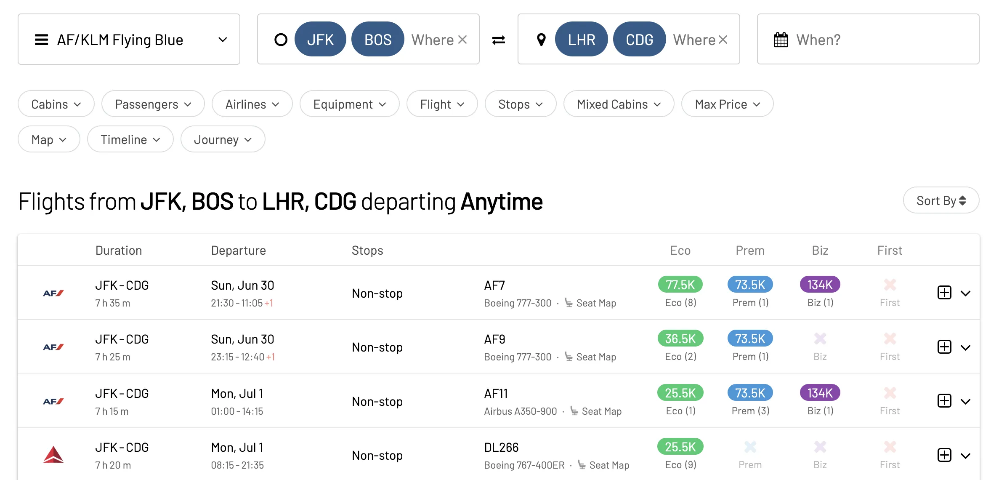
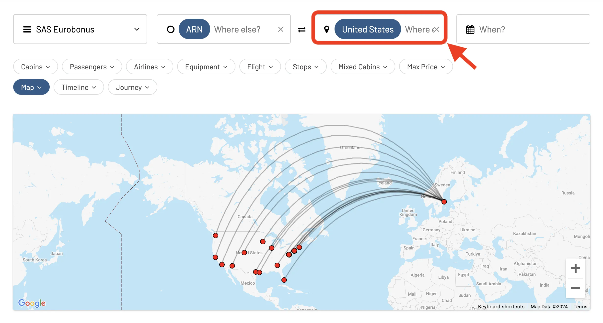
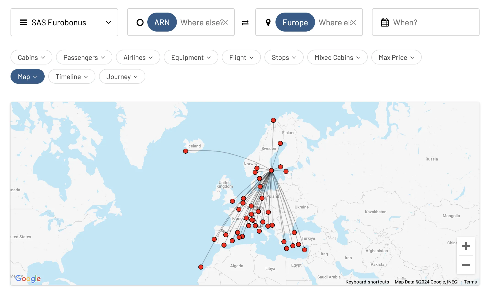
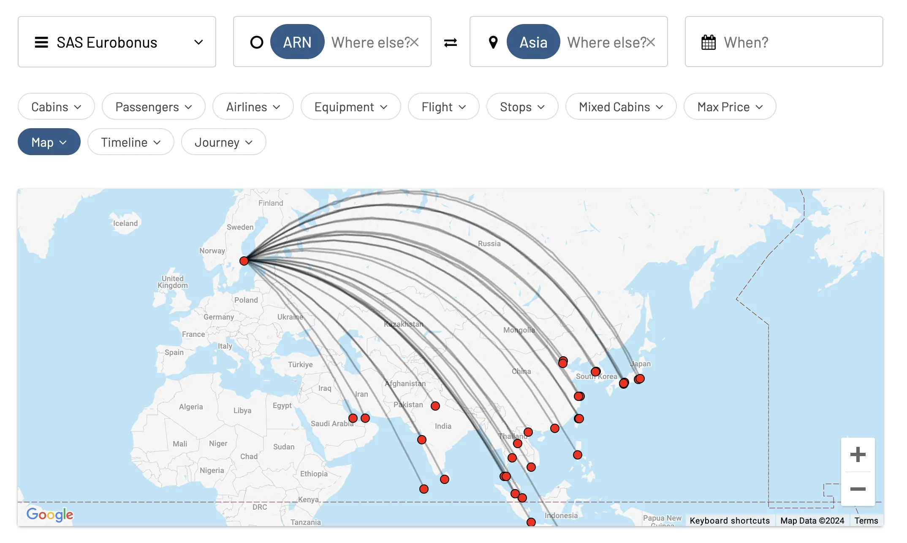
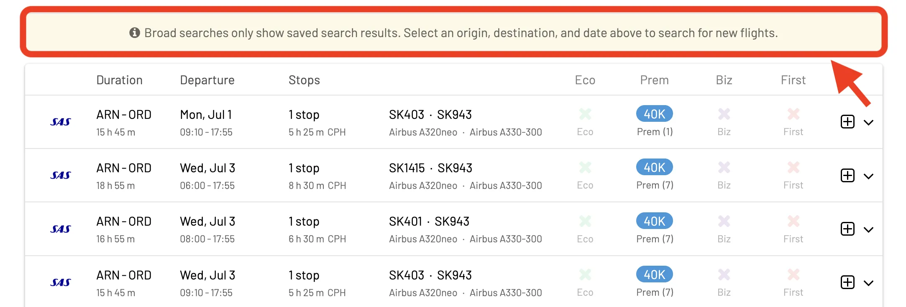
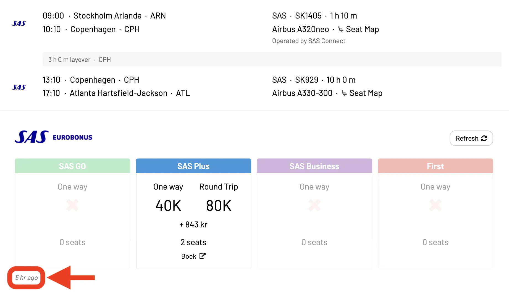
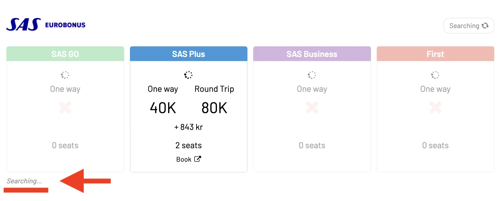

If you lack inspiration for your next travel destination and wonder what other popular places our users consider burning their points at, don't worry; we've got you covered. AwardFares saves the results from recent searches across different users and lets you easily explore what's hot.

We call it **Broad Search**, and in this brief guide we explain everything about it, so you can use it to unlock new destinations.

## Understanding Broad Searches

Typical award flight searches are point-to-point, for example, *"New York to London"*, or multi-city, as in *"New York or Boston to Paris or London"*. When these searches are triggered, AwardFares will fetch up-to-date information directly from the airline/program and show you all available seats on the dates and routes you requested.

If there are multiple airports in the same city (e.g., New York has JFK, EWR, LGA, SWF, etc.), it's also possible to search for all of them at once using [**Metro Area Searches**, check our full tutorial here](https://blog.awardfares.com/metro-area-search-guide/).

Every day, we process thousands of searches from our users to both existing and new destinations. Instead of discarding those results, we temporarily save them (cache) and aggregate them based on different regions. **Why?** Well, seat availability lasts for a while. Once we find available seats on a flight, a portion of those will likely remain bookable for some time, at least for a few hours.

This feature enables other users to explore those recent searches and use them as inspiration for further trip planning!

## How To Use Broad Searches

It's straightforward! All you need to do is enter an entire Region or Area in the *Origin* or *Destination* field, and you'll start seeing all the recent results within that region! For instance, we can search from a specific city to a whole country, like Stockholm to the United States:

Enabling the *Map View* will help you visualize all the recent flights and navigate the result list further.

Here's another example now searching to a whole continent, Stockholm to Europe:

Or Stockholm to Asia:

## Don't Forget To Hit Refresh!

Remember that these are **saved results**, which means they might not be up-to-date. To make it easier, when using Broad Search, AwardFares will display a yellow popup to clarify this.

As soon as you are interested in a particular route or flight, trigger a new point-to-point search to get the real-time availability and confirm if it's available. When tapping and expanding the details of a certain flight, you will also see a clear timestamp of when was that seat seen.

For your convenience, a few seconds after expanding the detailed view, a new search will be triggered to show you the latest availability.

Our **Gold** tier includes hourly refreshes, whereas **Diamond** members refresh in real-time and get up-to-the-minute availability.

### Valid Areas or Regions

* **Countries**: United States, France, Germany, China, Sweden, etc.
* **Continents**: Europe, North America, South America, Asia, etc.
* **Award Zones** (for zone-based programs such as SAS EuroBonus): Scandinavia, Central & Far East Asia, North & Central America, etc.

## Combine With More Pro Features

- **Combine with alerts**. Use our [**availability alerts**](https://blog.awardfares.com/alerts/) on your desired route and enable _+-1 Day Search_. You will get immediate notification should award seats become available within its three-day window, which can help you book ahead.
- **Be flexible**. Long story short: the further you search for an award seat, the better your odds of finding one. Try backdating a little further. Look beyond just one day before and after for more listings.
- **Play with filters**. Tactic filters can help you narrow your search criteria and locate the exact award seats that best suit your needs. Make Use of Alternative Airports Metro Area searches might also uncover nearby airports you didn't consider.
- **Understand Your Miles**. Understand how your frequent flyer miles are valued and the rules of what you can do with them. [Use our dedicated **Program Pages**](https://awardfares.com/programs) to read more about this and know key facts and up-to-date news about your program.

## Become a Pro Travel Hacker

You can [try AwardFares for free](https://awardfares.com/). We are rolling out new features and improvements regularly, so [sign up for our monthly newsletter](https://awardfares.com/newsletter) to stay on top of the latest news, announcements, and pro tips.

With our [Gold and Diamond tiers](https://awardfares.com/pricing), you can access premium features such as unlimited daily searches, alerts, seat maps, flight schedules, and more!

## Read More

Our guides have all the information you need to be a pro travel hacker and explore the world on points. Here are some related posts you might enjoy:

- [How To Find Cheap Award Flights And Identify Good Redemptions (Step-by-step)](https://blog.awardfares.com/how-to-find-cheap-award-flights/)
- [Metro Area Searches: Full Guide](https://blog.awardfares.com/metro-area-search-guide/)
- [How to Book Round-Trip Award Flights Like a Pro](https://blog.awardfares.com/round-trip-award-flights/)
- [Journey Planner: Building Perfect Award Trips To Difficult Destinations](https://blog.awardfares.com/journey-planner/)
