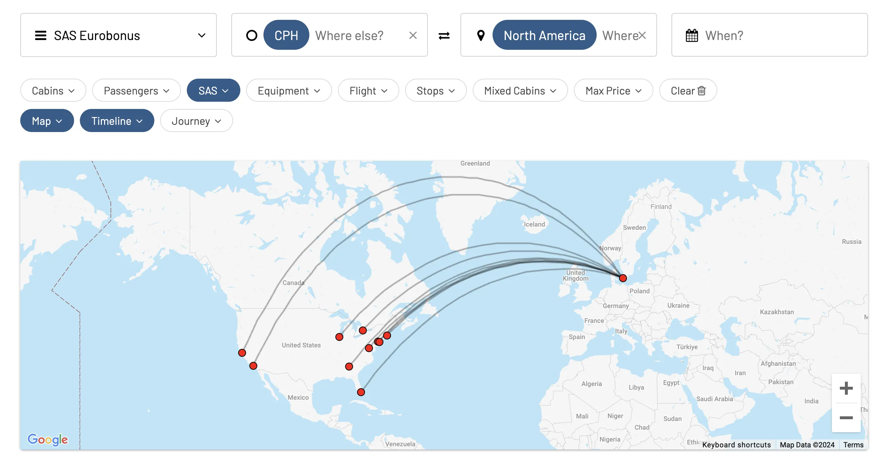

Today we are kicking off a new series of posts highlighting different sweet spots using SAS EuroBonus points, and how to find them using AwardFares. This week is aimed at EuroBonus members based in Copenhagen!

## Long-haul EuroBonus Awards from Copenhagen in 2024

### SAS Routes to Asia

SAS operates regular non-stop flights to Tokyo and Shanghai, and a seasonal route to Bangkok that will resume during Winter 2024.

#### [Tokyo (HND)](https://awardfares.com/search?CPH.HND.;a:SK;z:sas)

* **Frequency**: 5x per week (Mon, Tue, Wed, Thur, and Sat)
* **Aircraft**: Airbus A350
* **Price**: One-way awards in SAS Go Bonus (Economy) for **30k points**, in SAS Plus (Premium Economy) for **40k points** and in SAS Business for **50k points**. Round-trip requires double the number of points.

#### [Shanghai (PVG)](https://awardfares.com/search?CPH.PVG.;a:SK;z:sas)

* **Frequency**: 4x per week (Sun, Tue, Wed, Thur, and Fri)
* **Aircraft**: Airbus A350
* **Price**: One-way awards in SAS Go Bonus (Economy) for **30k points**, in SAS Plus (Premium Economy) for **40k points** and in SAS Business for **50k points**. Round-trip requires double the number of points.

#### [Bangkok (BKK)](https://awardfares.com/search?CPH.BKK.;a:SK;z:sas)

*Begins October 27, 2024*

* **Frequency**: TBD, flights will be resumed in Winter 2024.
* **Aircraft**: Airbus A350
* **Price**: One-way awards in SAS Go Bonus (Economy) for **30k points**, in SAS Plus (Premium Economy) for **40k points** and in SAS Business for **50k points**. Round-trip requires double the number of points.

### SAS Routes to North America

SAS operates regular non-stop flights to Toronto, New York, Boston, Washington, Atlanta, Los Angeles, San Francisco, Chicago, and a seasonal route to Miami that will resume during Winter 2024.

#### [Toronto (YYZ)](https://awardfares.com/search?CPH.YYZ.;a:SK;z:sas)

* **Frequency**: 4x per week (Sun, Mon, Wed, Fri)
* **Aircraft**: Airbus A330 and Airbus A321neo
* **Price**: One-way awards in SAS Go Bonus (Economy) for **30k points**, in SAS Plus (Premium Economy) for **40k points** and in SAS Business for **50k points**. Round-trip requires double the number of points.

#### [Atlanta (ATL)](https://awardfares.com/search?CPH.ATL.;a:SK;z:sas)

* **Frequency**: Daily
* **Aircraft**: Airbus A330 and Airbus A350
* **Price**: One-way awards in SAS Go Bonus (Economy) for **30k points**, in SAS Plus (Premium Economy) for **40k points** and in SAS Business for **50k points**. Round-trip requires double the number of points.

#### New York (JFK and EWR)

[**To JFK**](https://awardfares.com/search?CPH.JFK.;a:SK;z:sas)

* Frequency: Daily
* Aircraft: Airbus A32x and Airbus A330
* **Price**: One-way awards in SAS Go Bonus (Economy) for **30k points**, in SAS Plus (Premium Economy) for **40k points** and in SAS Business for **50k points**. Round-trip requires double the number of points.

[**To EWR**](https://awardfares.com/search?CPH.EWR.;a:SK;z:sas)

* Frequency: Daily
* Aircraft: Airbus A330
* **Price**: One-way awards in SAS Go Bonus (Economy) for **30k points**, in SAS Plus (Premium Economy) for **40k points** and in SAS Business for **50k points**. Round-trip requires double the number of points.

#### [Boston (BOS)](https://awardfares.com/search?CPH.BOS.;a:SK;z:sas)

* **Frequency**: Daily
* **Aircraft**: Airbus A350 and Airbus A321neo
* **Price**: One-way awards in SAS Go Bonus (Economy) for **30k points**, in SAS Plus (Premium Economy) for **40k points** and in SAS Business for **50k points**. Round-trip requires double the number of points.

#### [Los Angeles (LAX)](https://awardfares.com/search?CPH.LAX.;a:SK;z:sas)

* **Frequency**: Daily
* **Aircraft**: Airbus A330 and Airbus A350
* **Price**: One-way awards in SAS Go Bonus (Economy) for **30k points**, in SAS Plus (Premium Economy) for **40k points** and in SAS Business for **50k points**. Round-trip requires double the number of points.

#### [San Francisco (SFO)](https://awardfares.com/search?CPH.SFO.;a:SK;z:sas)

* **Frequency**: Daily
* **Aircraft**: Airbus A330
* **Price**: One-way awards in SAS Go Bonus (Economy) for **30k points**, in SAS Plus (Premium Economy) for **40k points** and in SAS Business for **50k points**. Round-trip requires double the number of points.

#### [Chicago (ORD)](https://awardfares.com/search?CPH.ORD.;a:SK;z:sas)

* **Frequency**: 6x per week (Sun, Mon, Wed, Thur, Fri, Sun)
* **Aircraft**: Airbus A330 and Airbus A321neo
* **Price**: One-way awards in SAS Go Bonus (Economy) for **30k points**, in SAS Plus (Premium Economy) for **40k points** and in SAS Business for **50k points**. Round-trip requires double the number of points.

#### [Washington, D.C. (IAD)](https://awardfares.com/search?CPH.IAD.;a:SK;z:sas)

* **Frequency**: Daily
* **Aircraft**: Airbus A330 and Airbus A321neo
* **Price**: One-way awards in SAS Go Bonus (Economy) for **30k points**, in SAS Plus (Premium Economy) for **40k points** and in SAS Business for **50k points**. Round-trip requires double the number of points.

#### [Miami (MIA)](https://awardfares.com/search?CPH.MIA.;a:SK;z:sas)

*Begins October 28, 2024*

* **Frequency**: 5x per week (Mon, Tue, Wed, Fri, Sun)
* **Aircraft**: Airbus A330
* **Price**: One-way awards in SAS Go Bonus (Economy) for **30k points**, in SAS Plus (Premium Economy) for **40k points** and in SAS Business for **50k points**. Round-trip requires double the number of points.

## How to Find EuroBonus Awards from Copenhagen

To quickly find the best available flights on SAS, and the best ways to use your EuroBonus points, follow these steps:

1. Go to [AwardFares](https://awardfares.com/search?..;z:sas).
2. Select [**EuroBonus** under *Loyalty Program*](https://awardfares.com/search?..;z:sas).
3. Select **SAS only** under *Airline*.
4. Under *Origin*, write **Copenhagen (CPH)**
5. Choose a specific *Destination* (e.g., New York). Alternatively, you can use our [Broad Search feature](https://blog.awardfares.com/broad-search-guide/) to explore hot results and recent searches from other users.
6. That's it. AwardFares will do its work and display available flights in the list below, including details such as the prices per cabin, number of stops, total travel time, aircraft used, and more!

## Become a EuroBonus Pro

You can [try AwardFares for free](https://awardfares.com/). We are rolling out new features and improvements regularly, so [sign up for our monthly newsletter](https://awardfares.com/newsletter) to stay on top of the latest news, announcements, and pro tips.

With our [Gold and Diamond tiers](https://awardfares.com/pricing), you can access premium features such as unlimited daily searches, alerts, seat maps, flight schedules, and more!

## Read More

Our guides have all the information you need to be a pro travel hacker and explore the world on points. Here are some related posts you might enjoy:

- [Should You Match Your EuroBonus Status with a Different Airline? (Yes)](https://blog.awardfares.com/eurobonus-status-match/)
- [Guide To Using SAS EuroBonus Points (Before & After They Join SkyTeam)](https://blog.awardfares.com/eurobonus-guide/)
- [From Star Alliance to SkyTeam: The SAS Transition (Official Info)](https://blog.awardfares.com/sas-transition-to-skyteam/)
- [Try These EuroBonus Award Flights Before SAS Leaves Star Alliance](https://blog.awardfares.com/eurobonus-star-alliance-awards/)
