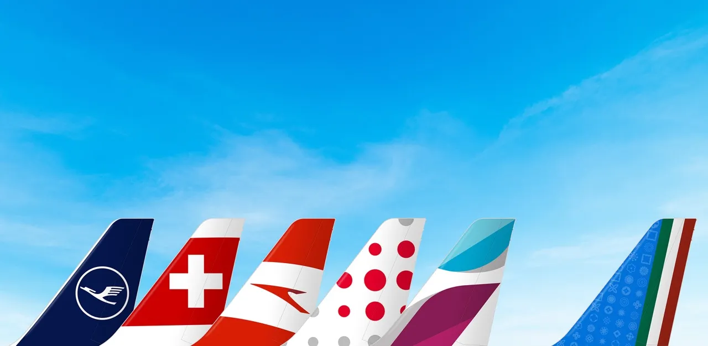
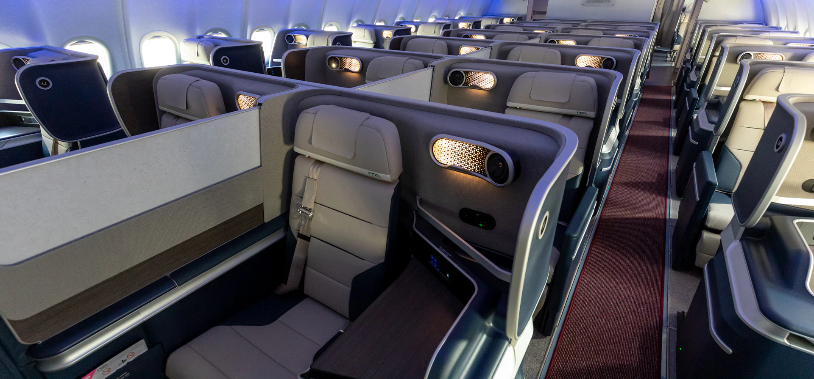

This year is coming with plenty of solid news for the aviation world Lufthansa Group, the German aviation giant, has just received the green light from the European Commission to acquire a 41% stake in ITA Airways, Italy's national airline. This means we can expect exciting changes, another alliance shift, and a whole new level of travel possibilities.

## What Does This Mean for Travelers?

To start, the deal is expected to bring closer integration between Lufthansa and ITA Airways. ITA Airways will still maintain its brand identity, but this partnership will open up a new world of travel opportunities.

The official merger isn't expected to be complete until the end of the year, to be completed in Q4, 2024.

## ITA in a Nutshell

ITA Airways, was established in 2020 as the successor to the bankrupt Alitalia. It quickly joined the SkyTeam alliance in 2021. However, in a surprising move, it was announced that ITA Airways would leave SkyTeam and join the Star Alliance as part of the process of its acquisition by Lufthansa. Just the opposite of what is [happening with SAS after their acquisition by Air France-KLM](https://blog.awardfares.com/sas-transition-to-skyteam/).

ITA Airways is headquartered in Rome and operates its primary hub at Rome Fiumicino Airport and a secondary hub at Milan Linate Airport. The airline’s fleet consists of Airbus A320 and A350.

## ITA Airways New Routes in 2024

The airline announced new routes that will start in 2024. Here's a full list:

* **North America**:
  * Chicago (April 7, 2024)
  * Toronto (May 1, 2024)
  * Miami [additional flights] (October 31, 2024)
* **Middle East**:
  * Riyadh (May 2, 2024)
  * Kuwait City (June 2, 2024)
  * Jeddah (October 27, 2024)
* **Africa**:
  * Dakar (July 3, 2024)
* **Asia**:
  * Bangkok (November 16, 2024)

## A350 Business Class Experience

One of the cabins we look forward to testing out is Business Class on ITA's A350. What you get:

* **Pre-flight**: Two free checked bags up to 32 kg each, plus carry-on and accessory. Private check-in desks and dedicated security gates. Access to lounges with Wi-Fi, refreshments, and a specialty buffet (Rome). Priority boarding.
* **Onboard Comfort**: Interiors designed by Walter De Silva for relaxation and refined essentiality. Direct aisle access from each seat for privacy and freedom of movement. Fully flat leather armchairs for restful sleep. Lighting system designed to create a harmonious ambiance throughout the flight.
* **Wellness Journey**: Elegant clutch with sustainable and reusable canvas, containing comfort items (eye mask, earplugs, socks, dental kit). QC Terme cosmetics bag with exfoliating shower gel, shampoo, conditioner, face cream, body cream, and hand butter.
* **Entertainment and Connectivity**: On-board Wi-Fi for staying connected. 17-inch screens with movies, TV shows, and music playlists. Digital newsstand with over 7,000 titles. USB port for charging devices.
* **Culinary Delights**: À la carte menu with dishes by Michelin-starred Chef Gennaro Esposito. Focus on fresh, refined Mediterranean flavors and family culinary traditions.
Selection of fine Italian wines. Limoncello or 100% Arabica Lavazza coffee to finish. Bar service and kitchen available throughout the flight.

## Want More Award Travel Intel?

You can [try AwardFares for free](https://awardfares.com/). We are rolling out new features and improvements regularly, so [sign up for our monthly newsletter](https://awardfares.com/newsletter) to stay on top of the latest news, announcements, and pro tips.

With our [Gold and Diamond tiers](https://awardfares.com/pricing), you can access premium features such as unlimited daily searches, alerts, seat maps, flight schedules, and more!

## Read More

Our guides have all the information you need to be a pro travel hacker and explore the world on points. Here are some related posts you might enjoy:

- [How To Find Cheap Award Flights And Identify Good Redemptions (Step-by-step)](https://blog.awardfares.com/how-to-find-cheap-award-flights/)
- [Best Premium Economy Cabins in 2024 (And How To Book Them With Points)](https://blog.awardfares.com/best-premium-economy-cabins-2024/)
- [Conquering First Class With Flying Blue](https://blog.awardfares.com/flying-blue-skyteam-first-class/)
- [Lufthansa Allegris Takes Flight on May 1st (Book with Points)](https://blog.awardfares.com/lufthansa-allegris-first-flight/)