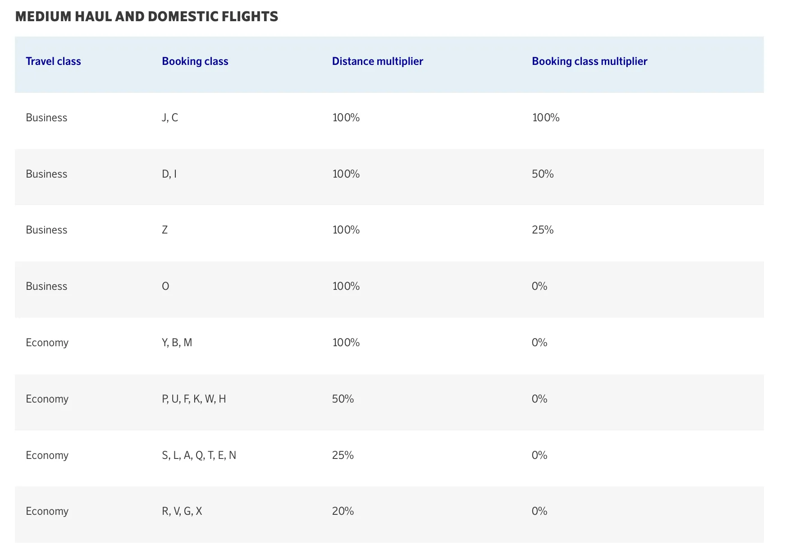

More new coming in from [SAS regarding the transition from Star Alliance to SkyTeam](https://blog.awardfares.com/sas-transition-to-skyteam)! The airline has revealed the new award charts with point prices when redeeming EuroBouns points on SkyTeam partners. Compared to the Star Alliance chart, there are some price increases and new fees, but also the exciting addition of Premium Economy. SAS also released more news on earning points with Air France and KLM after September 1st. Let's look at all the changes.

## In a Nutshell

- From September 1st, it will be possible to redeem SAS EuroBonus points on SkyTeam partners, both online and via phone.
- Premium Economy prices are now on the chart. It should be possible to book them at least via phone.
- Key changes from Europe:
  1. Within Europe:
     - Economy: Reduced from 70,000 points to 40,000 points
     - Business: Reduced from 130,000 points to 60,000 points
  2. No changes to the North America, South America, Africa, Pacific, Central, East and South Asia regions.
  3. Central America & Caribbean:
     - Economy: Increased from 70,000 points to 80,000 points
     - First: Increased from 175,000 points to 200,000 points
  4. South East Asia:
     - Economy: Increased from 90,000 points to 95,000 points
     - Business: Increased from 165,000 points to 187,500 points
     - First: Increased from 225,000 points to 257,500 points
- Redemptions on SkyTeam partners will incur and administrative fee of €50, per passenger.
- Booking via phone adds a €45 fee (total of €95).

## New Terms and Conditions

- You pay the full fare in points.
- Applicable taxes and fees must be paid with a payment card when you book
- The point price is fixed and depends on the origin, destination and travel class.
- You can use an Amex 2-for-1 voucher on SkyTeam partners. Book one-way trips for 60% of the return point price.
- No discounts for children (age 2 to 11).
- You can cancel/rebook up to 24 hours before the outbound departure. Once you’ve started your trip, you can’t cancel or rebook the return trip. If you cancel up to 24 hours before the outbound departure, any valid points will be refunded.
- No stopovers of more than 24 hours are allowed.
- You can combine different SkyTeam airlines in the same itinerary, but you cannot combine airlines from different alliances in the same itinerary.
- You don’t earn any EuroBonus Basic points.
- SAS reserves the right to change point prices and fare rules.
- For travel on SAS or Wideroe, no ticket or booking fee is charged for online bookings.
- For travel on partner airlines, SAS charges an administrative fee of 50 EUR per traveler when booking online or by phone.
- A booking fee of 45 EUR, 400 DKK/NOK/SEK per person will be added for phone bookings (with certain exceptions if it isn’t possible to book online).
- Products and services offered by partner airlines may differ from SAS-operated flights and additional baggage fees may apply.
- To book first class or other support, just call SAS Customer Service.

## New EuroBonus Award Charts on SkyTeam partners

### From Europe

In bold, we note the prices changes compared to Star Alliance.

| Flights to                        | Economy | Premium Economy | Business | First    |
|-----------------------------------|---------|-----------------|----------|----------|
| Domestic Europe                   | 20,000  |                 | 30,000   |          |
| Europe                            | **40,000**  |                 | **60,000**   |          |
| North America                     | 70,000  | 105,000         | 130,000  | 175,000  |
| Central America & Caribbean       | **80,000**  | 120,000         | 147,500  | **200,000**  |
| South America                     | 90,000  | 135,000         | 165,000  | 225,000  |
| North/Central Africa & Middle East| 60,000  | 90,000          | 105,000  | 140,000  |
| Southern Africa                   | 90,000  | 135,000         | 165,000  | 225,000  |
| Central, East & South Asia        | 90,000  | 135,000         | 165,000  | 225,000  |
| South East Asia                   | **95,000**  | 142,500         | **187,500**  | **257,500**  |
| Pacific                           | 140,000 | 210,000         | 275,000  | 380,000  |

Note: Domestic Europe includes Sweden, Norway, Denmark, Spain, Metropolitan France and Italy. Please also note that within Europe, SAS Plus is sold as Business.

### From North America

| Flights to                        | Economy | Premium Economy | Business | First    |
|-----------------------------------|---------|-----------------|----------|----------|
| Europe                            | 70,000  | 105,000         | 130,000  | 175,000  |
| North America                     | 25,000  | 37,500          | 50,000   | 70,000   |
| Central America & Caribbean       | 37,500  | 56,250          | 70,000   | 95,000   |
| South America                     | 50,000  | 75,000          | 90,000   | 120,000  |
| North/Central Africa & Middle East| 80,000  | 120,000         | 140,000  | 190,000  |
| Southern Africa                   | 100,000 | 150,000         | 175,000  | 235,000  |
| Central, East & South Asia        | 90,000  | 135,000         | 165,000  | 225,000  |
| South East Asia                   | 90,000  | 135,000         | 165,000  | 225,000  |
| Pacific                           | 90,000  | 135,000         | 165,000  | 225,000  |

### From Other Regions

Visit [SAS official website for to check point prices](https://www.sas.se/eurobonus/poang/anvand/partnerbonusresor/) from all other regions.

## Earning Points on Air France and KLM

Starting in September 2024, EuroBonus members will earn Bonus points and Level points on qualifying flights as shown in the formula and table below. The number of points depends on the travel class, booking class and distance flown.

Depending on the membership level, you can earn 25% (Silver), 50% (Gold) or 75% (Diamond) more Bonus points on flights.

On own-marketed flights, a minimum distance of 500 miles is applied. For example: for a flight with a distance of 375 miles, a distance in miles of 500 will be applied to the formula below instead of 375.

**Bonus points earned = Distance in miles x [distance multiplier + booking class multiplier + (distance multiplier x bonus point booster) ]**

**Level points earned = Distance in miles x [distance multiplier + booking class multiplier]**

### On Air France

#### Long-haul Flights

#### Medium and short-haul Flights

### On KLM

#### Long-haul Flights

#### Medium and short-haul Flights

## Become a EuroBonus Pro

You can [try AwardFares for free](https://awardfares.com/). We are rolling out new features and improvements regularly, so [sign up for our monthly newsletter](https://awardfares.com/newsletter) to stay on top of the latest news, announcements, and pro tips.

With our [Gold and Diamond tiers](https://awardfares.com/pricing), you can access premium features such as unlimited daily searches, alerts, seat maps, flight schedules, and more!

## Read More

Our guides have all the information you need to be a pro travel hacker and explore the world on points. Here are some related posts you might enjoy:

- [Guide To Using SAS EuroBonus Points (Before & After They Join SkyTeam)](https://blog.awardfares.com/eurobonus-guide/)
- [From Star Alliance to SkyTeam: The SAS Transition (Official Info)](https://blog.awardfares.com/sas-transition-to-skyteam/)
- [Should You Match Your EuroBonus Status with a Different Airline? (Yes)](https://blog.awardfares.com/eurobonus-status-match/)
- [Try These EuroBonus Award Flights Before SAS Leaves Star Alliance (Megapost)](https://blog.awardfares.com/eurobonus-star-alliance-awards/)
