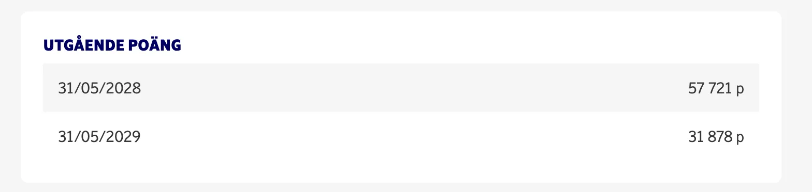
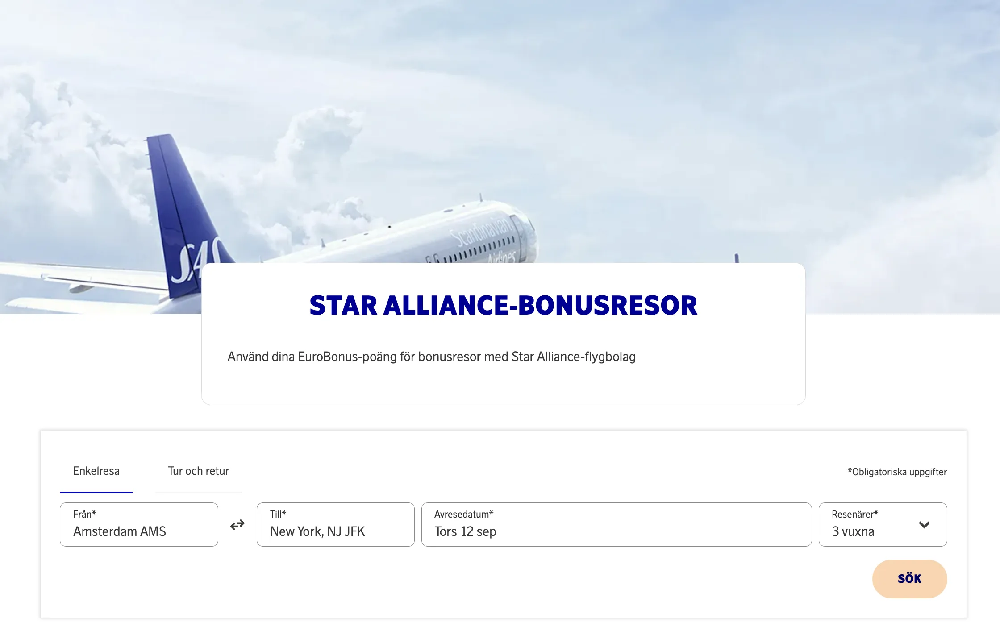
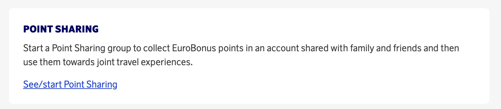
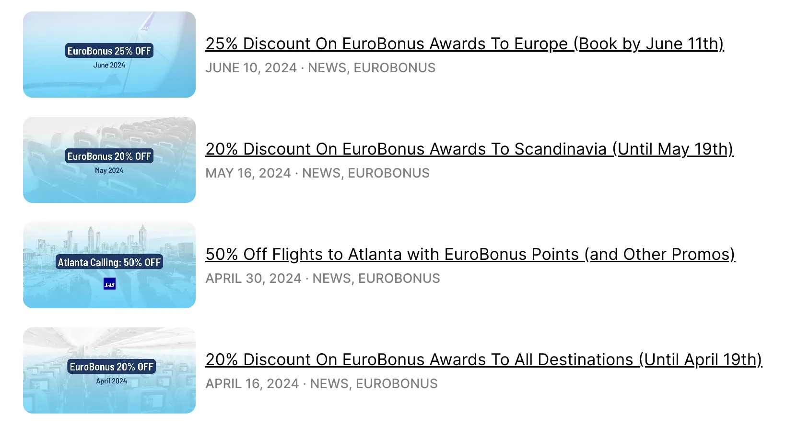
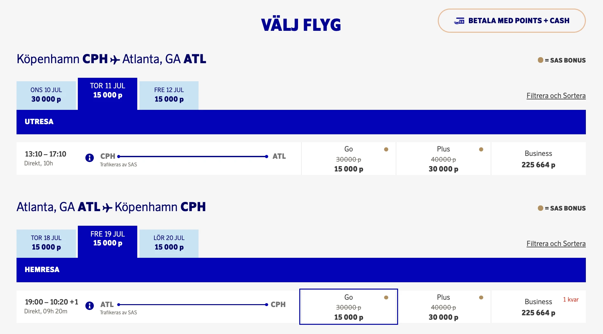
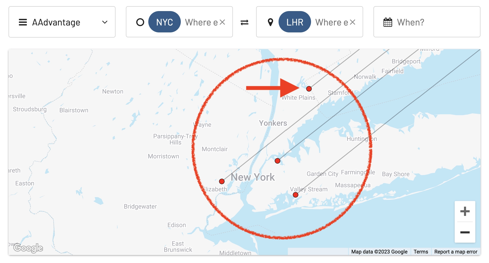
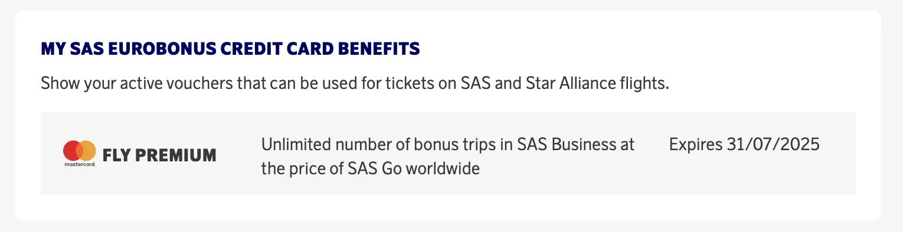

Booking EuroBonus awards can be gratifying, but getting familiar with all the intricacies, fine print, tips, and tricks takes a while. After many years of experience, our team at AwardFares has learned from a few mistakes, from wasting points to higher costs and missed opportunities. In this post, we’ll summarize a few of them.

## 1. Not Checking Point Expiry Dates

EuroBonus points expire if there is no qualifying activity on the account for a certain period (typically 4-5 years from the account creation or earning date). You can easily check these dates on your account via the SAS website or app.

You can book a trip using your EuroBonus points before they expire for travel after the expiry date, **but** note that if your points have expired, **you cannot change your ticket.**

## 2. Forgetting Vouchers Expiration Date (For SAS Amex Cardholders)

The SAS Amex 2 for 1 vouchers (*companion ticket*) also expire, typically on December 31st. It's pretty common that this date is overlooked, and many members try to book something last minute before the new year. Phone lines are typically saturated, and booking awards online is tough as their system slows down.

**Pro Tip**: Plan ahead. Set a reminder on your calendar a few months before the voucher's expiration date. Also, [set regular alerts on AwardFares](https://blog.awardfares.com/alerts/) to be notified as soon as availability opens on the flights you want.

**Remember the voucher's expiration date**. You can cancel award flights you booked using a 2-for-1 voucher as long as the cancellation is made at least 24 hours before the start of the EuroBonus trip. The voucher will be returned to the owner of the offer's EuroBonus account, **but not if it is expired!**. The validity of American Express's 2-for-1 voucher cannot be extended.

  NEXT VOUCHERS EXPIRATION

## 3. Trying to Change the Return Leg of a Started Round-trip

On Star Alliance flights (until August 31st), round-trip awards cost 20% less than booking two one-way flights. However, once the trip is started, it's not possible to change the return! Keep that in mind; if you have to make changes, you may lose your points.

Booking round-trip awards can save you points, but **be careful**! On Star Alliance flights, round trips cost 20% less than 2x one-way flights, but once your journey has started, you cannot change the return leg. This limitation can be a problem if your plans are not set in stone. After September 1st, 2024, the same rule will apply to SkyTeam redemptions.

**Pro Tip**: If you need to make changes, consider booking one-way flights instead. It may cost more points, but it provides greater flexibility.

## 4. Getting the Wrong Name

Name changes are not possible after award tickets are issued. The name on the booking must match the name on the member's passport. Double- and triple-check this before you hit *book*.

## 5. Overlooking Partner Airlines

SAS EuroBonus points can be used on more than just SAS flights. Until August 31st, 2024, booking on Star Alliance partners such as Lufthansa, Swiss, Thai Airways, and United Airlines is possible. In addition, since SAS is changing to SkyTeam, starting on September 1st, you will be able to book SkyTeam airlines.

**Pro Tip**: Don't forget to check the [**Star Alliance Award Trip search portal here**](https://www.sas.se/eurobonus/star-alliance-award-trips/).

## 6. Ignoring Stopovers and Open-jaws

EuroBonus has solid stopover rules: You can add an extended stay in a connecting city without spending additional points. However, since booking online is not straightforward, many members miss out on this opportunity.

**Pro Tip**: Use [AwardFares' Journey Planner to create complex itineraries](https://blog.awardfares.com/journey-planner/) and plan award trips to challenging destinations.

## 7. Not Utilizing Points Pooling

EuroBonus has a fantastic feature that distinguishes it from other programs: Point Pooling. It allows you to pool points with family or friends, opening up more award opportunities, especially for premium cabins or more expensive bookings. Many EuroBonus members overlook this feature.

**Pro Tip**: Set up a points pooling account with trusted family members or friends. This can increase your collective points balance, making it easier to book premium awards.

## 8. Overlooking Fuel Surcharges and Fees

While EuroBonus points can cover the cost of your flight, additional fees, and fuel surcharges are not included. These can vary significantly depending on the airline and route. Before confirming your booking, make sure to look at the **total cost**, including these extras.

SAS EuroBonus does not add fuel surcharges to award flights on its own metal (SAS-operated flights). But when booking award flights on partner airlines, you might find fuel surcharges, which vary significantly depending on the specific airline, the route, the distance, and the cabin class.

Here's what you need to know:

* Partner airlines that often add fuel surcharges: Some partner airlines are known for imposing high fuel surcharges on award flights. These include airlines like Lufthansa, Austrian Airlines, Swiss Airlines, Brussels Airlines, and others.
* Partner airlines that rarely add fuel surcharges: Other partner airlines might rarely or never add fuel surcharges on award flights booked through SAS EuroBonus. These include United Airlines, Air Canada, Singapore Airlines, Avianca, and others.

## 9. Not Keeping an Eye on Promotions

Every month, EuroBonus runs time-limited promotions with discounts on bonus trips ranging from 15% to 30%, to selected destinations. Sometimes they even increase availability for those routes.

**Pro Tip**: [Subscribe to our newsletter](https://awardfares.com/newsletter), follow our blog and social media channels to stay up-to-date with the latest promotions and ways to maximize your points’ value.

## 10. Ignoring New Routes and Seasonal Destinations

SAS frequently adds new routes and seasonal destinations to its schedule ([we cover them on our blog!](https://blog.awardfares.com/)). These are great opportunities to save points given that redemptions on SAS flights are typically cheaper than on partner airlines, and often with better availability.

**Pro Tip**: Monitor SAS announcements and our blog to stay updated on these new additions. New routes and seasonal flights can offer lower award redemption rates as an introductory offer (like recently [Atlanta](https://blog.awardfares.com/eb-atlanta-discount/), Bangkok, etc.). Take advantage of these opportunities early to get the best deals.

## 11. Overlooking Alternative Airports

Major airports usually have higher demand for award seats, which can make finding availability difficult. Plus, sometimes SAS flights to two different airports in the same city (e.g., New York JFK and EWR). Consider flying into or out of alternative airports in the same region. This can not only improve your chances of finding an available flight but might sometimes reduce the cost (taxes and fees).

**Pro Tip**: Use [Metro Area Search in AwardFares](https://blog.awardfares.com/metro-area-search-guide/) to search for award flights to multiple airports in the same Metropolitan Area. Boost it with [Broad Search](https://blog.awardfares.com/broad-search-guide/) what other awards our users are finding.

## 12. Mastercard FlyPremium vs. Amex 2-for-1 vouchers

For residents in Sweden and Norway, both the SAS Mastercard FlyPremium and the Amex 2-for-1 vouchers offer great value, but they have different terms and conditions. The FlyPremium benefit allows you to book SAS Plus or SAS Business at the price of SAS Go, which can be a fantastic way to enjoy premium cabins without the extra cost. However, this is only applicable on SAS-operated flights.

On the other hand, the Amex 2-for-1 vouchers let you book two award tickets for the points of one. This voucher can be used on both SAS and Star Alliance partner flights, providing more flexibility in terms of destinations and airlines.

**Pro Tip**: Plan your travel strategy around these benefits. For example, use the Amex 2-for-1 voucher for long-haul flights on partner airlines and the FlyPremium benefit for SAS operated flights to maximize your comfort and savings.

## Bonus Tip: Become a EuroBonus Pro with AwardFares

AwardFares is the easiest and fastest way to search for EuroBonus award flights. In just seconds, you can find available seats to multiple airports and across several days at once. You can [try it AwardFares for free](https://awardfares.com/signup), and with our [Gold and Diamond tiers](https://awardfares.com/pricing) you can unlock unlimited daily searches, alerts, seat maps, flight schedules, and more. We roll out new features regularly, so [sign up for our monthly newsletter](https://awardfares.com/newsletter) to stay on top of the latest news, announcements, and pro tips.

**Where to find more info?** [SAS has a **useful FAQ page**](https://www.flysas.com/en/help-and-contact/faq/), although a bit hard to navigate, with plenty of useful answers.

## Read More

Our guides have all the information you need to be a pro travel hacker and explore the world on points. Here are some related posts you might enjoy:

- [Guide To Using SAS EuroBonus Points (Before & After They Join SkyTeam)](https://blog.awardfares.com/eurobonus-guide/)
- [From Star Alliance to SkyTeam: The SAS Transition (Official Info)](https://blog.awardfares.com/sas-transition-to-skyteam/)
- [Try These EuroBonus Award Flights Before SAS Leaves Star Alliance (Megapost)](https://blog.awardfares.com/eurobonus-star-alliance-awards/)
- [SAS Reveals SkyTeam Award Chart, Point Prices, and Earnings on Air France-KLM](https://blog.awardfares.com/sas-skyteam-award-chart/)

