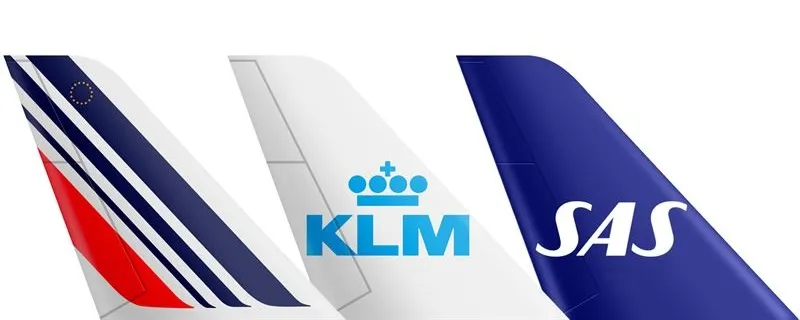
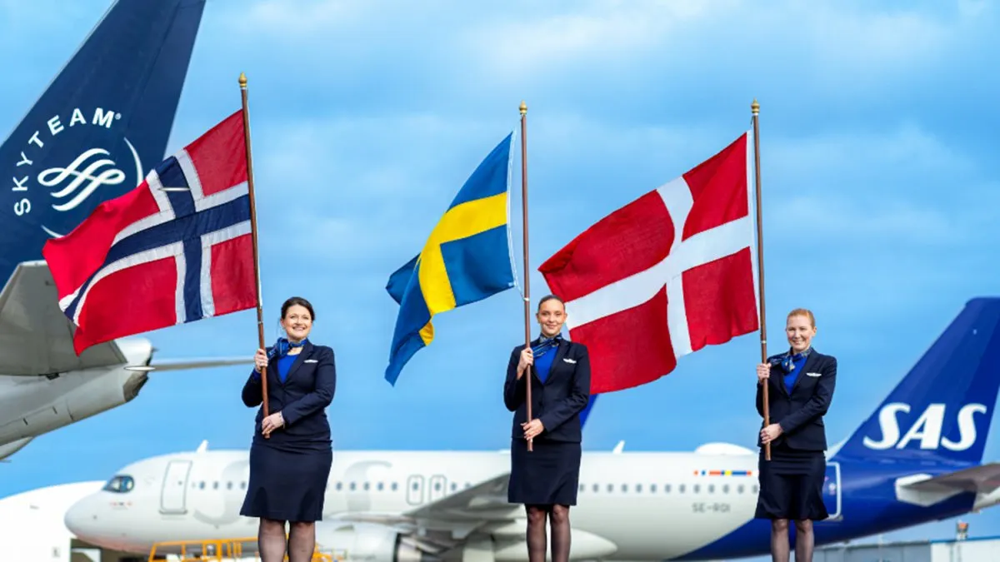

The Air France-KLM group is [taking advantage of the SAS acquisition](https://blog.awardfares.com/sas-acquisition/) as an opportunity to reshape European air travel, going full thrust on strengthening their offerings for travelers. Starting September 1, 2024, new codeshare and interline agreements will extend benefits across their European networks and loyalty programs.

## What do these agreements mean for travelers?

* **Expanding Destinations**: Air France and KLM customers will enjoy access to 33 Northern European destinations beyond SAS’s hubs in Copenhagen, Oslo, and Stockholm. Analogously, SAS flyers can explore 33 additional European destinations through Air France and KLM’s hubs at Paris-Charles de Gaulle and Amsterdam Schiphol. The airlines have plans to add intercontinental destinations to this agreement shortly.
* **Extended Travel Options**: The interline agreement will cover the entire European network of Air France, KLM, and SAS, offering a better network and connections.
* **Loyalty Program Benefits**: Members of [**Flying Blue**](https://awardfares.com/search?..;z:flyingblue) and [**EuroBonus**](https://awardfares.com/search?..;z:sas), can earn and spend Miles/Points on all flights starting September 1, 2024. Eligible EuroBonus members will enjoy SkyTeam services, including SkyPriority and lounge access.

## Flight Operations

Air France and KLM operate up to 200 weekly flights between their hubs at Paris (CDG) and Amsterdam (AMS). SAS operates up to 44 weekly flights to Paris and 65 to Amsterdam from its hubs in Copenhagen, Oslo, and Stockholm.

## Become a Pro Travel Hacker

You can [try AwardFares for free](https://awardfares.com/). We are rolling out new features and improvements regularly, so [sign up for our monthly newsletter](https://awardfares.com/newsletter) to stay on top of the latest news, announcements, and pro tips.

With our [Gold and Diamond tiers](https://awardfares.com/pricing), you can access premium features such as unlimited daily searches, alerts, seat maps, flight schedules, and more!

## Read More

Our guides have all the information you need to be a pro travel hacker and explore the world on points. Here are some related posts you might enjoy:

- [Guide To Using SAS EuroBonus Points (Before & After They Join SkyTeam)](https://blog.awardfares.com/eurobonus-guide/)
- [From Star Alliance to SkyTeam: The SAS Transition (Official Info)](https://blog.awardfares.com/sas-transition-to-skyteam/)
- [Should You Match Your EuroBonus Status with a Different Airline? (Yes)](https://blog.awardfares.com/eurobonus-status-match/)
- [Try These EuroBonus Award Flights Before SAS Leaves Star Alliance (Megapost)](https://blog.awardfares.com/eurobonus-star-alliance-awards/)
- [Top Mistakes When Booking EuroBonus Award Flights](https://blog.awardfares.com/top-mistakes-eurobonus/)