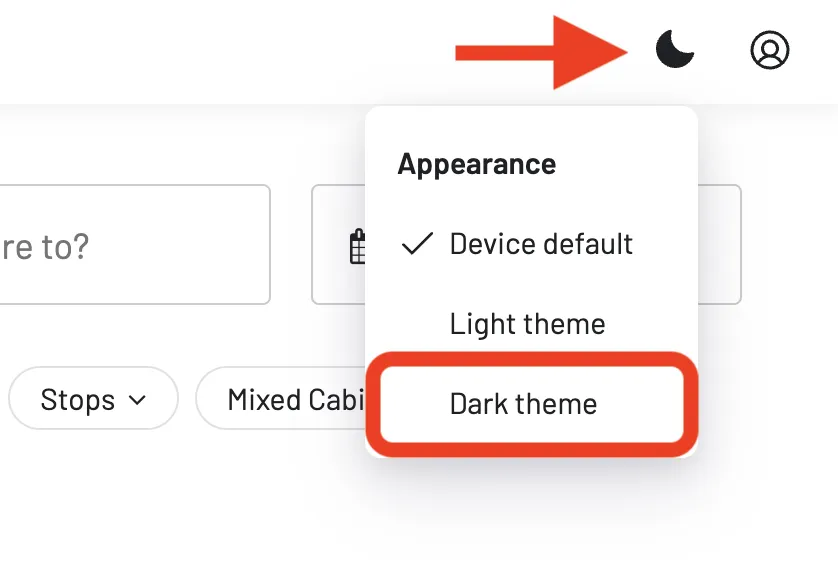
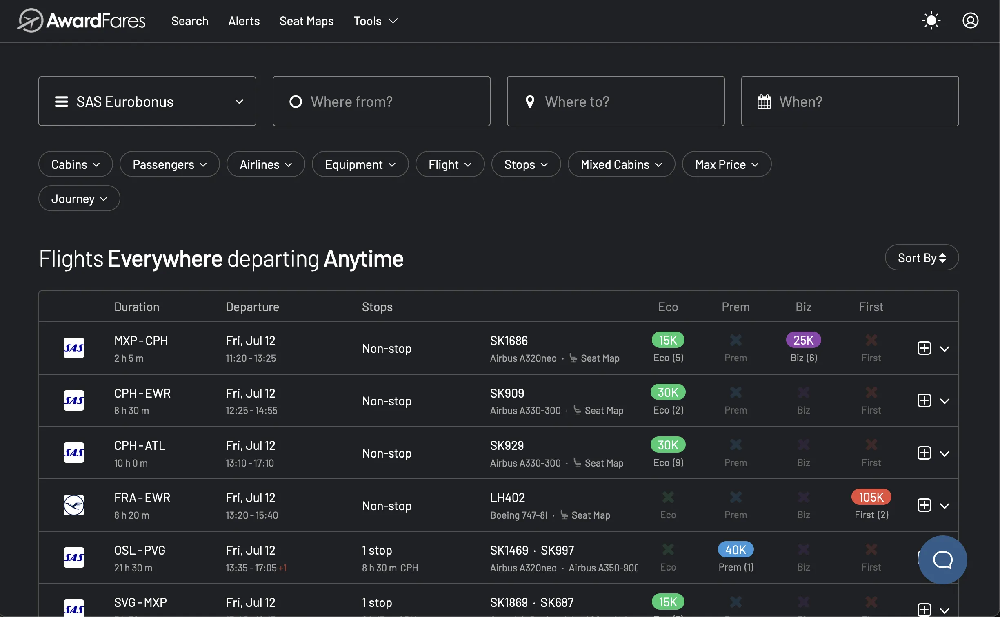
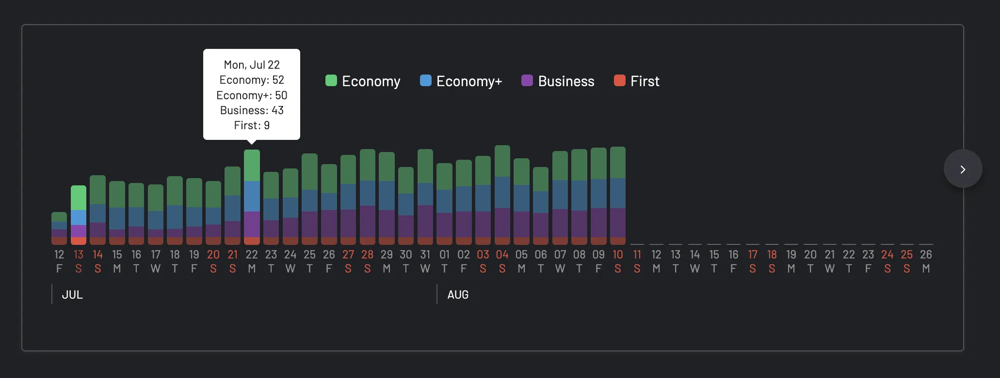
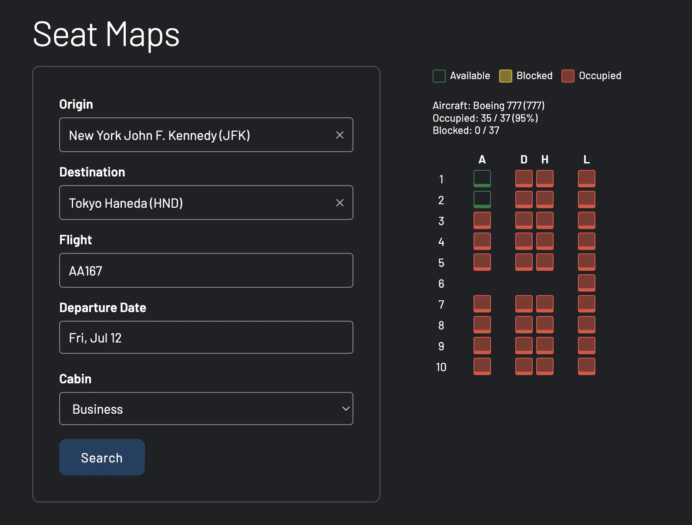
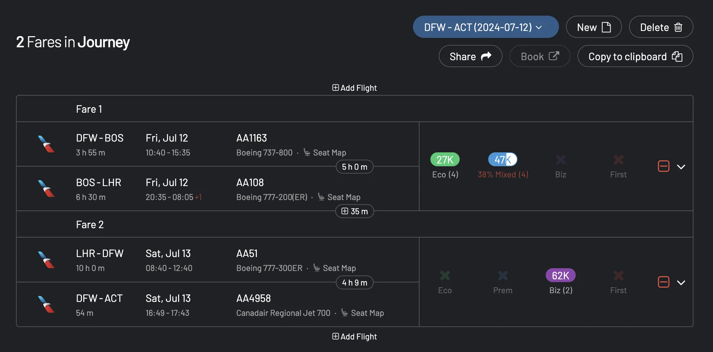
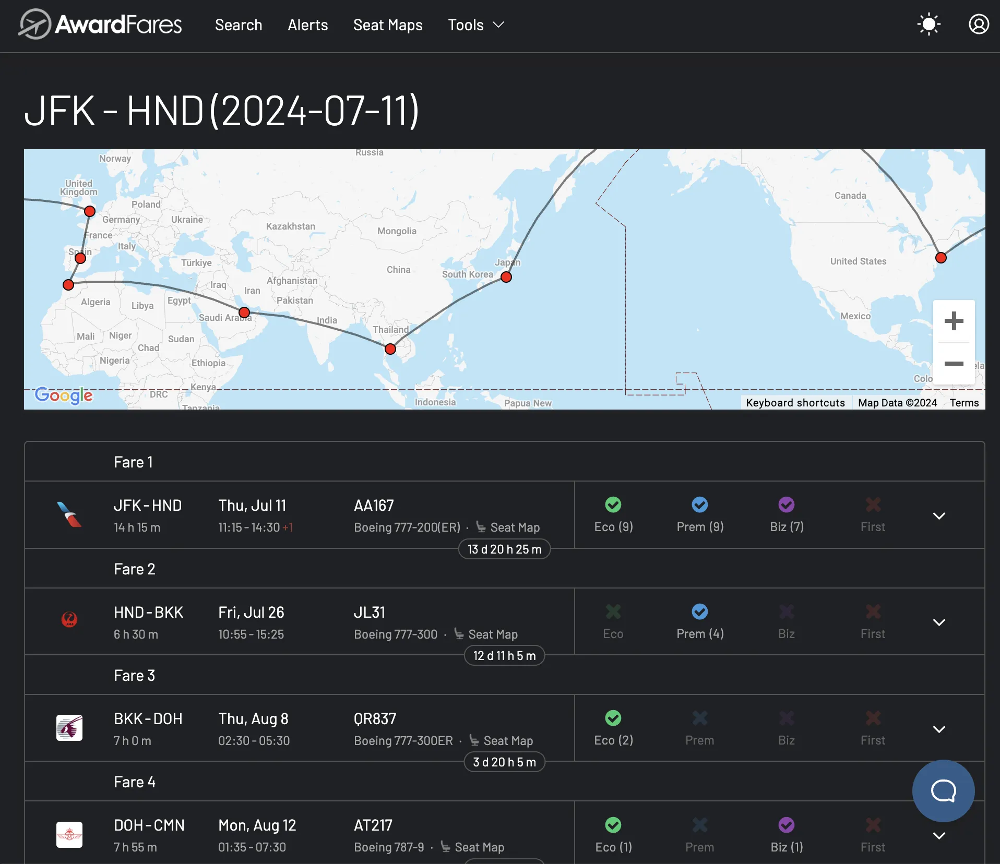
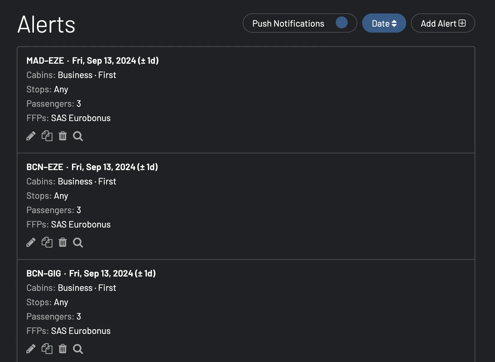

Our team at AwardFares is thrilled to launch a highly anticipated feature: **Dark Theme!** Now, you can go award hunting in the dark, making those late-night searches for the perfect flight redemption even more enjoyable (and a little easier on the eyes). Who knows, maybe you'll even find a red-eye flight you don't completely dread!

## How to Enable Dark Theme

1. Go to [AwardFares](https://awardfares.com/).
2. On the top bar, tap on the **Appearance** [☀/☾] icon.
3. You'll find a toggle for **Dark Theme** - simply switch it on!

By default, AwardFares will be set to follow your system's settings. Here are a few stills of our features look in our new Dark Mode!

### Timeline View

### Set Maps

### Journey Planner

### Alerts

## Why Dark Theme?

* **Reduced Eye Strain**: Dark mode minimizes eye strain, especially during those late-night flight searches.
* **Battery Saver**: For mobile users, dark mode can help conserve battery life, ensuring you're never left in the dark when hunting for those perfect award tickets.
* **Sleek Aesthetics**: Let's be honest, dark mode just looks cool. It provides a modern, sophisticated feel to your AwardFares experience.

## Your Feedback Matters

Our roadmap is packed! We're committed and working full-thrust to roll out features every month to enhance your award travel journey. Stay tuned for more exciting updates and features in the near future.

We value your input, too. If you have any suggestions or feedback on how we can make Dark Theme or any aspect of AwardFares even better, please don't hesitate to share your thoughts.

## How to Become a Pro Travel Hacker?

You can [try AwardFares for free](https://awardfares.com/). We are rolling out new features and improvements regularly, so [sign up for our monthly newsletter](https://awardfares.com/newsletter) to stay on top of the latest news, announcements, and pro tips.

With our [Gold and Diamond tiers](https://awardfares.com/pricing), you can access premium features such as unlimited daily searches, alerts, seat maps, flight schedules, and more!

## Read More

Our guides have all the information you need to be a pro travel hacker and explore the world on points. Here are some related posts you might enjoy:

- [How To Find Cheap Award Flights And Identify Good Redemptions (Step-by-step)](https://blog.awardfares.com/how-to-find-cheap-award-flights/)
- [Seat Maps: Getting The Perfect Seat Even Before Booking](https://blog.awardfares.com/seatmaps-guide/)
- [Demystifying Award Charts: All You Need To Know (2024)](https://blog.awardfares.com/demystifying-award-charts/)
- [Ultimate Guide to Award Release Dates](https://blog.awardfares.com/ultimate-guide-to-award-release-dates/)
