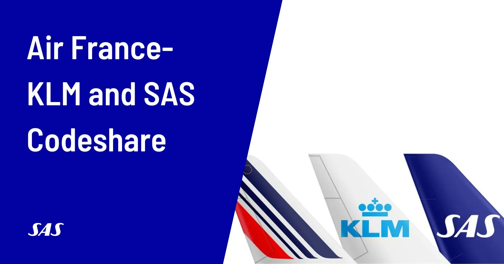

Summer of 2024 continues to heat up, and so does the EuroBonus program rolling out the news: from a special status match campaign to new benefits for Silver members and a revamped award chart with the inclusion of SkyTeam partners, there’s plenty to look forward to. There are also new ways to maximize your points through car rentals. In this post, we summarize them all!

## SAS EuroBonus Updates (July 2024)

### 1. EuroBonus Status Match (Challenge)

SAS is offering a limited-time status match campaign from **July 2 to August 30**. This campaign allows you to match your existing frequent flyer status with another airline to SAS EuroBonus Silver or Gold, which is an excellent opportunity to enjoy SkyTeam Elite or Elite Plus benefits starting September 1.

  TIME LEFT

#### Eligibility

* Hold Star Alliance Silver or Gold, OneWorld Ruby, Sapphire, or Emerald status.
* Have been a member of the qualifying program for at least three months.
* Reside in one of the eligible countries.
* Be at least 18 years old.

#### How to Apply

* Fill out the [**online application form**](https://statusmatch.flysas.com/).
* If additional information is needed, you'll receive an email with instructions on providing the required documents.
* Once your application is complete, it may take up to 20 days to process.

#### Maintaining Your Status

To keep your new EuroBonus status beyond March 31, 2025, you'll need to complete a specific number of SAS flights by that date:

* Silver: 2 flights
* Gold: 5 flights

 

### 2. New Benefit for EuroBonus Silver

Starting September 1st, EuroBonus Silver members will get a new benefit: Priority Boarding! The benefit applies to flights operated by SAS and SkyTeam partners.

 

### 2. SAS Reveals SkyTeam Award Chart, Point Prices, and Earnings on Air France and KLM

The airline has revealed the new award charts with point prices when redeeming EuroBouns points on SkyTeam partners. Compared to the Star Alliance chart, there are some price increases and new fees, but also the exciting addition of Premium Economy. SAS also released more news on earning points with Air France and KLM after September 1st.

Read more [here](https://blog.awardfares.com/sas-skyteam-award-chart/).

### 3. New Codeshare and Interline Agreements Between Air France-KLM and SAS 

The Air France-KLM group is taking advantage of the SAS acquisition as an opportunity to reshape European air travel, going full thrust on strengthening their offerings for travelers. Starting September 1, 2024, new codeshare and interline agreements will extend benefits across their European networks and loyalty programs.

Read more [here](https://blog.awardfares.com/af-klm-sas-codeshare/).

### 3. Car Rental Earning Opportunities

Currently, there are several opportunities for earning points on car rentals

* **Avis**: Earn double Extra Points with Avis. Book a medium car or larger for 3 or more days by 31 July 2024 for rentals between 18 July and 30 September 2024. Pay for your rental with a SAS EuroBonus Mastercard and earn an additional 500 Extra points. Participating locations only, terms and conditions apply. [**Book  here**](https://www.flysas.com/en/book/carrental/?ptid=125.15).
* **Enterprise, Alamo, National**: SAVE UP TO 10% ON CAR RENTAL + EXTRA DRIVER FOR FREE. Rent from over 9500 locations worldwide and experience exceptional customer service with Enterprise Rent-A-Car, National Car Rental and Alamo Rent A Car. Book before 14th August 2024 and save up to 10% and add an additional driver for free in participating countries. [**Book here**](https://www.flysas.com/en/book/carrental/?ptid=125.16).
* **Hertz**: Now introducing **Status Points** on car rentals. Book a car with Hertz to earn status points and reach a higher membership level.

### 4. Get up 5000 points with Hedvig (Sweden)

Offer for you as a EuroBonus member. Earn 5,000 Extra Points in welcome bonus with [**Hedvig's insurance policies**](https://www.hedvig.com/se/partner/sas-eurobonus), and 100 Extra Points per month per active insurance policy. Only applies to new customers to Hedvig.

 

### 5. City Breaks & Low Price Calendar

SAS keeps running heavily discounted prices on revenue tickets. With the help of the SAS low-cost calendar, you can find cheap flights to destinations all over the world. Remember that prices and available seats are updated every time a new search is made. This may mean that price differences between the cheap airline tickets may occur when you try to book.

 

## Become a EuroBonus Pro

You can [try AwardFares for free](https://awardfares.com/). We are rolling out new features and improvements regularly, so [sign up for our monthly newsletter](https://awardfares.com/newsletter) to stay on top of the latest news, announcements, and pro tips.

With our [Gold and Diamond tiers](https://awardfares.com/pricing), you can access premium features such as unlimited daily searches, alerts, seat maps, flight schedules, and more!

Our guides have all the information you need to be a pro travel hacker and explore the world on points. Here are some related posts you might enjoy:

- [Should You Match Your EuroBonus Status with a Different Airline? (Yes)](https://blog.awardfares.com/eurobonus-status-match/)
- [Guide To Using SAS EuroBonus Points (Before & After They Join SkyTeam)](https://blog.awardfares.com/eurobonus-guide/)
- [From Star Alliance to SkyTeam: The SAS Transition (Official Info)](https://blog.awardfares.com/sas-transition-to-skyteam/)
- [Try These EuroBonus Award Flights Before SAS Leaves Star Alliance (Megapost)](https://blog.awardfares.com/eurobonus-star-alliance-awards/)

