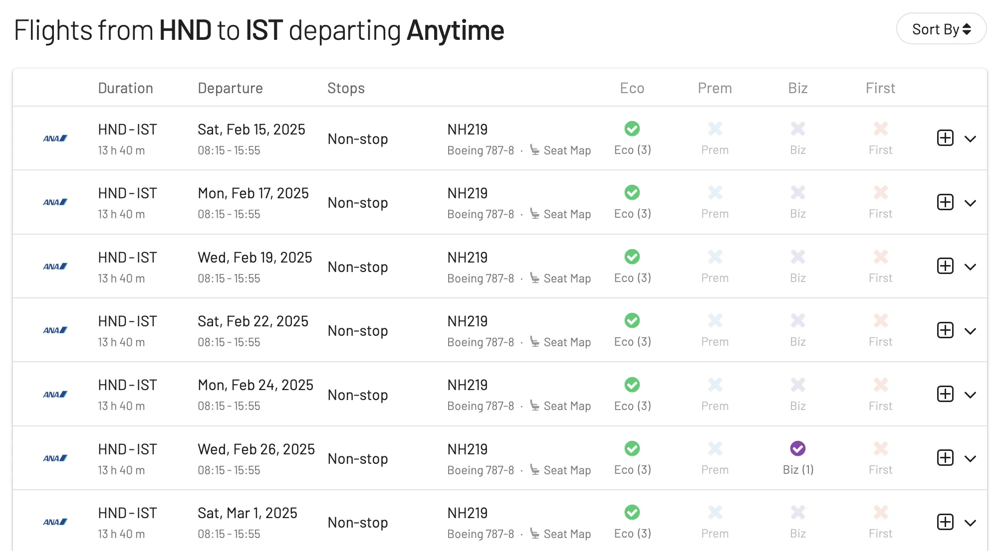

A while back, ANA announced that they were [launching three new direct flights from Europe to Tokyo](https://blog.awardfares.com/ana-new-routes-to-europe/) this winter: Stockholm, Istanbul and Milan to Tokyo. After several back-and-forths and dates postponed, tickets are now on sale, and the best part: **awards are available**. So far we've seen seats using SAS EuroBonus and United MileagePlus.

## Stockholm Arlanda (ARN) to Tokyo Haneda (HND)

Departures from Stockholm (ARN) will begin on January 31, 2025.
Scheduled to operate 3 days a week on Tuesday, Friday, and Sunday.

| Departure Location | Departure Time | Flight Number | Arrival Time | Arrival Location |
|--------------------|----------------|---------------|--------------|------------------|
| STOCKHOLM          | 9:35           | NH222         | 7:20 +1*     | HANEDA           |
| HANEDA             | 0:30           | NH221         | 6:20         | STOCKHOLM        |

\* +1 means next-day arrival.

## Istanbul (IST) to Tokyo Haneda (HND)

Departures from Istanbul (IST) will begin on February 12, 2025.  
Scheduled to operate 3 days a week on Monday, Wednesday, and Saturday.

| Departure Location | Departure Time | Flight Number | Arrival Time | Arrival Location |
|--------------------|----------------|---------------|--------------|------------------|
| ISTANBUL           | 18:10          | NH220         | 11:20 +1*    | HANEDA           |
| HANEDA             | 8:15           | NH219         | 15:55        | ISTANBUL         |

\* +1 means next-day arrival.

## Milan Malpensa (MXP) to Tokyo Haneda (HND)

Departures from Milan (MXP) will begin on December 3, 2024.  
Scheduled to operate 3 days a week on Tuesday, Thursday, and Sunday.

| Departure Location | Departure Time | Flight Number | Arrival Time | Arrival Location |
|--------------------|----------------|---------------|--------------|------------------|
| MILAN              | 10:30          | NH208         | 7:30 +1*     | HANEDA           |
| HANEDA             | 1:05           | NH207         | 8:30         | MILAN            |

\* +1 means next-day arrival.

## Want More Award Travel Intel?

You can [try AwardFares for free](https://awardfares.com/). We are rolling out new features and improvements regularly, so [sign up for our monthly newsletter](https://awardfares.com/newsletter) to stay on top of the latest news, announcements, and pro tips.

With our [Gold and Diamond tiers](https://awardfares.com/pricing), you can access premium features such as unlimited daily searches, alerts, seat maps, flight schedules, and more!

## Read More

Our guides have all the information you need to be a pro travel hacker and explore the world on points. Here are some related posts you might enjoy:

- [How To Find Cheap Award Flights And Identify Good Redemptions (Step-by-step)](https://blog.awardfares.com/how-to-find-cheap-award-flights/)
- [Seat Maps: Getting The Perfect Seat Even Before Booking](https://blog.awardfares.com/seatmaps-guide/)
- [Demystifying Award Charts: All You Need To Know (2024)](https://blog.awardfares.com/demystifying-award-charts/)
- [Ultimate Guide to Award Release Dates](https://blog.awardfares.com/ultimate-guide-to-award-release-dates/)
