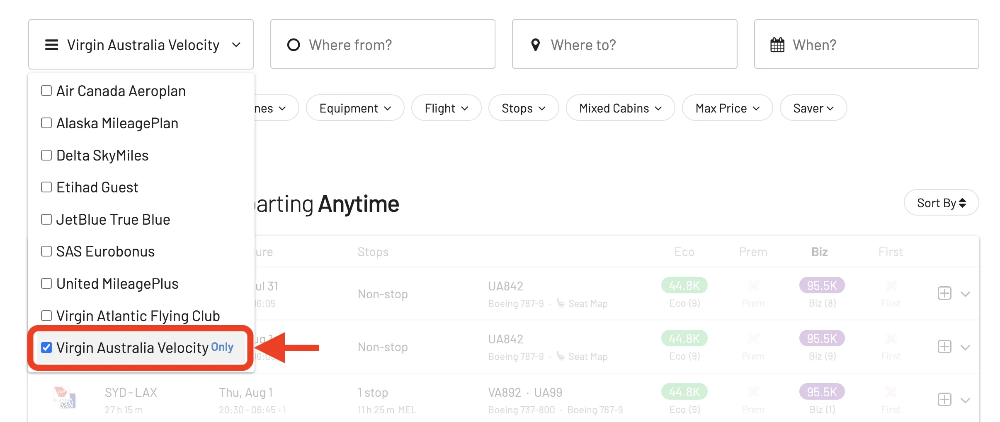
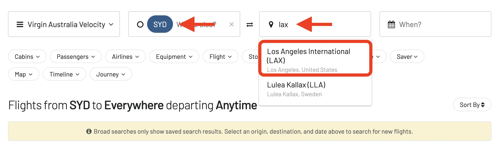
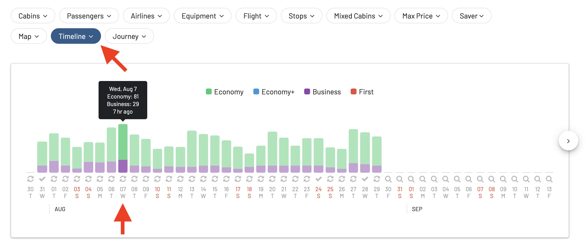
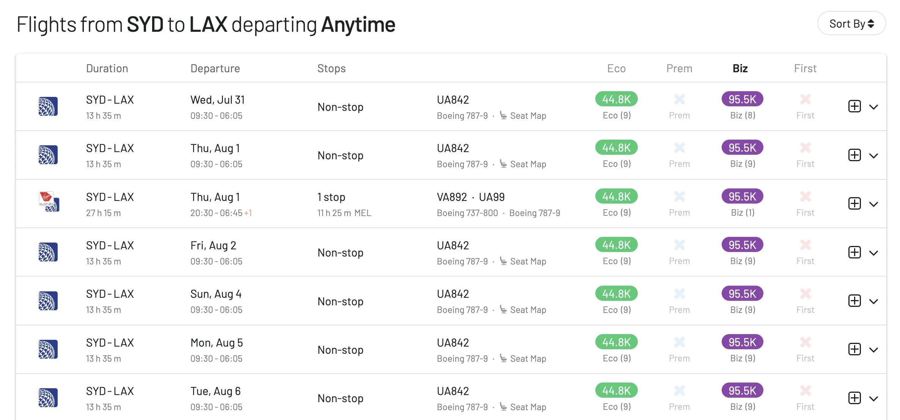
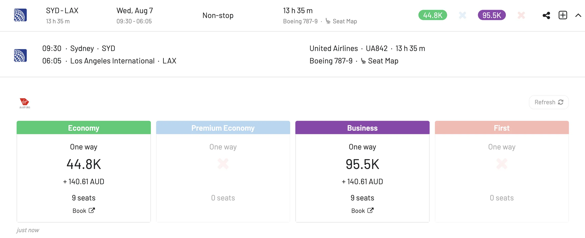
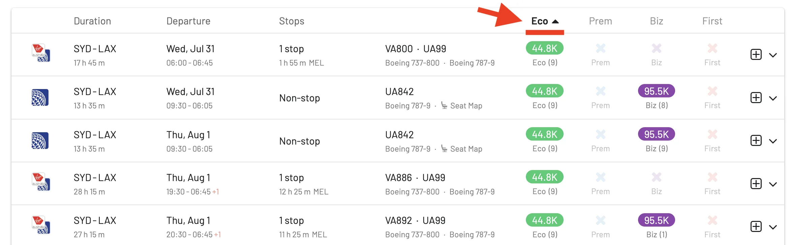
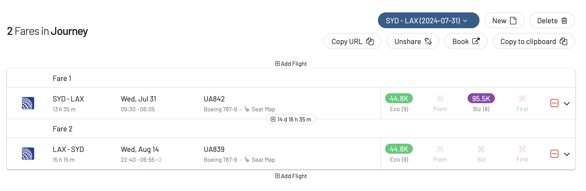
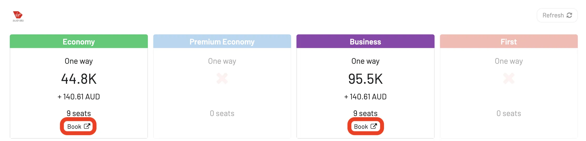
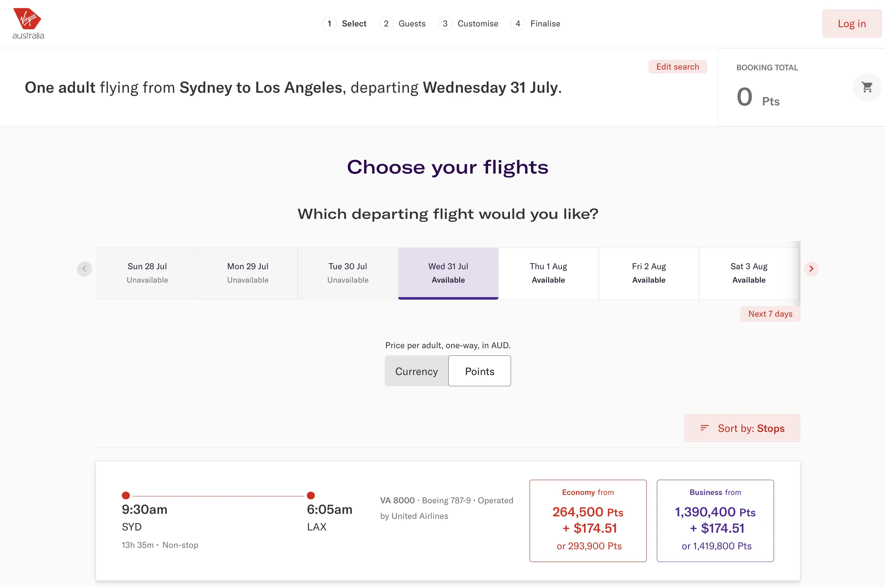

Let's look at how AwardFares can be your swiss-army knife when searching for Velocity award flights!

### What's New?

- [Why Velocity?](#why-velocity)
- [Top Things You Need To Know About Virgin Australia Velocity in 2024](#top-things-you-need-to-know-about-virgin-australia-velocity-in-2024)
- [Understanding Virgin Australia Velocity Award Chart](#understanding-virgin-australia-velocity-award-chart)
- [Finding Virgin Australia Velocity Awards with AwardFares](#finding-virgin-australia-velocity-awards-with-awardfares)
- [Top Virgin Australia Routes](#top-virgin-australia-routes)
- [Become a Velocity Pro](#become-a-velocity-pro)
- [Learn More](#learn-more)

## Why Velocity?

[**Virgin Australia Velocity**](https://www.velocityfrequentflyer.com/) is the frequent flyer program for Virgin Australia. It is a solid loyalty program for frequent flyers based in Australia, New Zealand, and others. Here's the rundown:

* **Earning**: Collect Velocity Points on Virgin Australia flights and a bunch of partner airlines (including Singapore Airlines and United as of recently). Transferring points from partner rewards programs like Citi Rewards and American Express Membership Rewards can be a great way to boost your balance quickly.
* **Redeeming**: Use your points for reward seats, upgrades, or even grab "Any Seat" award flights on Virgin Australia and many partners. For the best redemption value, consider premium cabin flights on Virgin Australia or partner airlines like Singapore Airlines and Etihad Airways.
* **Partners**: Their network extends beyond Virgin Australia with over 70 program partners, offering opportunities to earn and redeem points across airlines and other travel options.
* **Status**: Climb the tiers (Silver, Gold, Platinum) for perks like lounge access, priority boarding, and extra baggage allowance - similar to other frequent flyer programs.
* **Family Pooling**: A unique benefit that allows families to combine points and status credits, making it easier to reach higher tiers.

## Top Things You Need To Know About Virgin Australia Velocity in 2024

- **Top Performer**: Virgin Australia has been showing strong improvement, recently ranking number one for on-time performance among major Australian airlines.
- **KrisFlyer Transfer**: They also have a strong partnership with Singapore Airlines KrisFlyer program, allowing you to transfer points between the two, opening up more redemption options.
- **Important Note**: As of June 26, 2024, you cannot join the Velocity program unless you're a resident of [Australia, New Zealand, or several other specific countries](https://join.velocityfrequentflyer.com/).

## Understanding Virgin Australia Velocity Award Chart

Virgin Australia's Velocity Frequent Flyer program uses a **distance-based award chart** ([read more about award charts here](https://blog.awardfares.com/demystifying-award-charts/)). Each destination is classified into a specific zone, and the points required for a flight depend on the zones you are traveling between, and the different cabin classes (Economy, Premium Economy, Business, etc).

Here is a breakdown of the key zones:

- Zone 1: Australia (short-haul)
- Zone 2: Australia (long-haul)
- Zone 3: New Zealand, South Pacific
- Zone 4: Southeast Asia
- Zone 5: North Asia
- Zone 6: Middle East
- Zone 7: Europe
- Zone 8: North America

The award chart offers points rates for both one-way and return trips. You can use your Velocity points to book flights not only on Virgin Australia but also on partner airlines like Singapore Airlines, Etihad Airways, Qatar Airways, United Airlines, Air Canada, and others. Keep in mind that additional carrier charges may apply to reward flights, varying depending on the operating airline and distance traveled. If you don't have enough points for a full award, the program also has a Points+Pay option, where you can use a combination of points and cash to book your ticket.

## Finding Virgin Australia Velocity Awards with AwardFares

*AwardFares will not ask your Velocity login credentials for your frequent flyer program.*

### 1. Go to [AwardFares](https://awardfares.com/signup)

Creating an account is optional, but registration is free and unlocks additional features. [Sign up here to get started.](https://awardfares.com/signup)

### 2. Choose Velocity in the *Loyalty Program* Field

Select **Virgin Australia Velocity** from the dropdown menu to search for your award flight.

### 3. Enter a Route

Add your origin and destination airports, and AwardFares will search for available award flights, including those with stops. Filters for non-stop flights are also available.

In this example, we search for flights [between Sydney (SYD) to Los Angeles (LAX)](https://awardfares.com/search?AUH.LHR.;z:etihad).

### 4. Explore Dates for your Flights

Either input specific dates or use the Timeline View to explore availability over different periods. This view helps you easily compare the availability and class of service across various days.

You'll see the result list right below:

In addition, you can tap anywhere on the flight to display more details in an expanded view, such as aircraft type, and even [get the current seat maps](https://blog.awardfares.com/seatmaps-guide/) to see which seats are free or occupied.

### 5. Sort by Price

Whether you are exploring dates using the Timeline View or have selected a specific day, AwardFares will show you the available seats (with real-time data) within seconds in the result list below.

You can tap on the different header columns to sort the results by price. Use the **Eco**, **Prem**, **Biz**, and **First** class tags to find cheap awards across multiple dates, itineraries, and airlines.

Here's an example of the cheapest redemptions in Economy Class:

### 6. Build Round Trips

Use the **Journey Planner** feature to create new Journeys and craft round trip itineraries with just a few clicks. Learn more [about the Journey Planner in this full guide](https://blog.awardfares.com/journey-planner/).

### 7. Book on Virgin Australis's Website

Once you find your desired flight, click the **Book** button.

AwardFares will redirect you to Etihad's website to complete your booking without re-entering your search criteria, as it will be pre-populated.

## Top Virgin Australia Routes

Check out [this post](https://blog.awardfares.com/virgin-australia-top-routes) for our top picks on Virgin Australia.

## Become a Velocity Pro

You can [try AwardFares for free](https://awardfares.com/). We regularly roll out new features and improvements, so [sign up for our monthly newsletter](https://awardfares.com/newsletter) to stay on top of the latest news, announcements, and pro tips.

With our [Gold and Diamond tiers](https://awardfares.com/pricing), you can access premium features such as unlimited daily searches, alerts, seat maps, flight schedules, and more!

## Learn More

Our guides have all the information you need to be a pro travel hacker and explore the world on points. Here are some related posts you might enjoy:

- [Virgin Atlantic Offers 40% OFF On All Reward Routes](https://blog.awardfares.com/virgin-discount-june-2024/)
- [How To Find Cheap Award Flights And Identify Good Redemptions (Step-by-step)](https://blog.awardfares.com/how-to-find-cheap-award-flights/)
- [Top Frequent Flyer Programs To Consider In 2024 (Our Picks)](https://blog.awardfares.com/frequent-flyer-programs-2024/)
- [Best Premium Economy Cabins in 2024 (And How To Book Them With Points)](https://blog.awardfares.com/best-premium-economy-cabins-2024/)