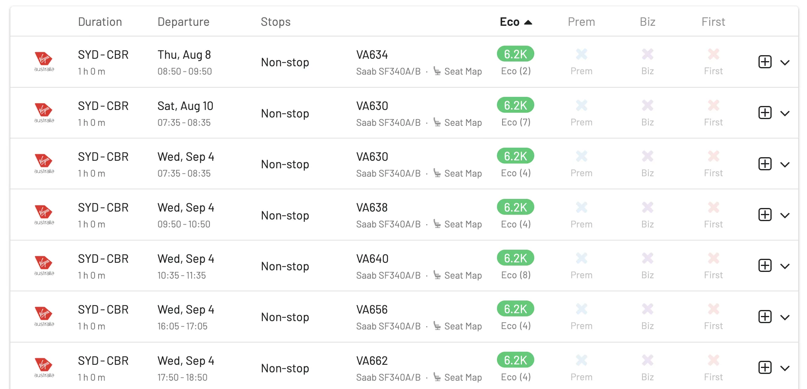

Celebrating our [recent addition of Velocity to the AwardFares family](https://blog.awardfares.com/introducing-virgin-australia-velocity/), in this blog post, we’ll highlight the top Virgin Australia routes that offer exceptional value for your points. These routes cover key destinations across Australia, no matter if you’re planning a quick business trip or a leisure adventure. Let's start!

## Top Virgin Australia Routes To Book With Velocity Points

### 1. [Melbourne (MEL) to Sydney (SYD)](https://awardfares.com/search?MEL.SYD.;z:virginaustralia)

One of the busiest routes, connecting two major cities in Australia.

* **Price range (in miles)**: 7,800 - 15,500 Velocity Points (Eco-Biz) 
* **Operating aircraft**: Boeing 737-800, Boeing 737 MAX 8

### 2. [Brisbane (BNE) to Sydney (SYD)](https://awardfares.com/search?BNE.SYD.;z:virginaustralia)

A high-traffic route important for both business and leisure travelers.

* **Price range (in miles)**: 7,800 - 15,500 Velocity Points 
* **Operating aircraft**: Boeing 737-800, Boeing 737 MAX 8

### 3. [Melbourne (MEL) to Brisbane (BNE)](https://awardfares.com/search?MEL.BNE.;z:virginaustralia)

Another major domestic route linking significant urban centers.

* **Price range (in miles)**: 9,400 - 23,500 Velocity Points
* **Operating aircraft**: Boeing 737-800, Boeing 737 MAX 8

### 4. [Sydney (SYD) to Perth (PER)](https://awardfares.com/search?SYD.PER.;z:virginaustralia)

A long-haul domestic flight connecting the east and west coasts.

* **Price range (in miles)**: 17,800 - 24,800 Velocity Points 
* **Operating aircraft**: Boeing 737-800, Boeing 737 MAX 8

### 5. [Melbourne (MEL) to Perth (PER)](https://awardfares.com/search?MEL.PER.;z:virginaustralia)

Essential for business travel across the country.

* **Price range (in miles)**: 17,800 - 35,500 Velocity Points
* **Operating aircraft**: Boeing 737-800, Boeing 737 MAX 8

### 6. [Sydney (SYD) to Canberra (CBR)](https://awardfares.com/search?SYD.CBR.;z:virginaustralia)

Short-haul flight, crucial for government and business sectors.

* **Price range (in miles)**: 6,200 - 23,500 Velocity Points
* **Operating aircraft**: Boeing 737-800

### 7. [Adelaide (ADL) to Melbourne (MEL)](https://awardfares.com/search?ADL.MEL.;z:virginaustralia)

Popular for both tourism and business purposes.

* **Price range (in miles)**: 6,200 - 15,500 Velocity Points
* **Operating aircraft**: Boeing 737-800, Boeing 737 MAX 8

### 8. [Brisbane (BNE) to Adelaide (ADL)](https://awardfares.com/search?BNE.ADL.;z:virginaustralia)

Connects Queensland with South Australia.

* **Price range (in miles)**: 11,800 - 17,800 Velocity Points 
* **Operating aircraft**: Boeing 737-800

### 9. [Sydney (SYD) to Cairns (CNS)](https://awardfares.com/search?SYD.CNS.;z:virginaustralia)

Important for tourism, especially to the Great Barrier Reef.

* **Price range (in miles)**: 17,800 - 24,800 Velocity Points
* **Operating aircraft**: Boeing 737-800, Boeing 737 MAX 8

### 10. [Melbourne (MEL) to Hobart (HBA)](https://awardfares.com/search?MEL.HBA.;z:virginaustralia)

Frequently used route for tourists visiting Tasmania.

* **Price range (in miles)**: 6,200 - 15,500 Velocity Points 
* **Operating aircraft**: Boeing 737-800

## Become a Velocity Pro

You can [try AwardFares for free](https://awardfares.com/). We are rolling out new features and improvements regularly, so [sign up for our monthly newsletter](https://awardfares.com/newsletter) to stay on top of the latest news, announcements, and pro tips.

With our [Gold and Diamond tiers](https://awardfares.com/pricing), you can access premium features such as unlimited daily searches, alerts, seat maps, flight schedules, and more!

## Read More

Our guides have all the information you need to be a pro travel hacker and explore the world on points. Here are some related posts you might enjoy:

- [Virgin Australia Velocity Key Facts: All You Need To Know](https://awardfares.com/programs/virgin-australia-velocity)
- [Virgin Australia Velocity: Welcome Onboard](https://blog.awardfares.com/introducing-virgin-australia-velocity/)
- [Top Frequent Flyer Programs To Consider In 2024 (Our Picks)](https://blog.awardfares.com/frequent-flyer-programs-2024/)
- [Best Premium Economy Cabins in 2024 (And How To Book Them With Points)](https://blog.awardfares.com/best-premium-economy-cabins-2024/)
