With just **one month left before SAS joins SkyTeam**, it’s time to take full advantage of the fantastic redemption opportunities within Star Alliance before they disappear forever. There are still plenty of hidden gems, with an impressive lineup of airlines and unique cabin experiences that can be redeemed for great value. Here’s a curated list of some of our top Star Alliance cabins and routes that can be booked using SAS EuroBonus points. Yes, there's availability too, we checked using AwardFares ;).

  TIME UNTIL SAS JOINS SKYTEAM

## 1. Lufthansa First Class

Lufthansa First Class is a fantastic product all around. From the separate terminal to the attendant fetching you when it's time to board, the limo to the flight, the whole experience is designed so that you, as a passenger, shouldn't have to think about the fact that you're flying. Flying is just a thing that happens around you while enjoying a great meal, a good selection of drinks, and a comfortable bed. We recently had a chance to [say goodbye to Lufthansa First Class on this A380 flight from Munich to Boston](https://blog.awardfares.com/lufthansa-first-muc-bos/).

### Top Lufthansa First Class Seats (Available Now)

<table id="lh-first"></table>

### Suggested Routes

- [Frankfurt (FRA) to New York (JFK)](https://awardfares.com/search?FRA.JFK.;a:LH;z:sas): A major transatlantic route connecting one of Europe's primary hubs with the US East Coast.
- [Munich (MUC) to San Francisco (SFO)](https://awardfares.com/search?MUC.SFO.;a:LH;z:sas): This route offers a connection from southern Germany to the US West Coast, a favorite among tech and business travelers.
- [Frankfurt (FRA) to Tokyo (HND/NRT)](https://awardfares.com/search?FRA.area:TYO.;a:LH;z:sas): A key intercontinental link between Europe and Japan, popular for both leisure and business.
- [Frankfurt (FRA) to Cape Town (CPT)](https://awardfares.com/search?FRA.CPT.;a:LH;z:sas): This route links Europe with one of South Africa's most iconic destinations.
- [Munich (MUC) to Bangkok (BKK)](https://awardfares.com/search?MUC.BKK.;a:LH;z:sas): A gateway to Southeast Asia, this route connects travelers from Europe to the vibrant Thai capital.

**Known Issues**: Keep an eye on potential surcharges, which can sometimes be high. First-class availability is released just a few days before departure date.

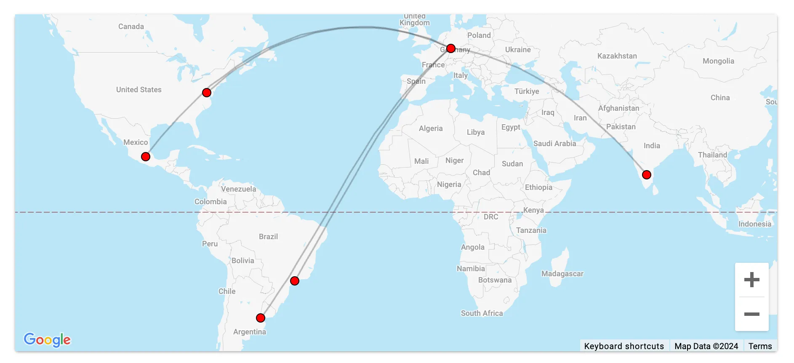

### Availability

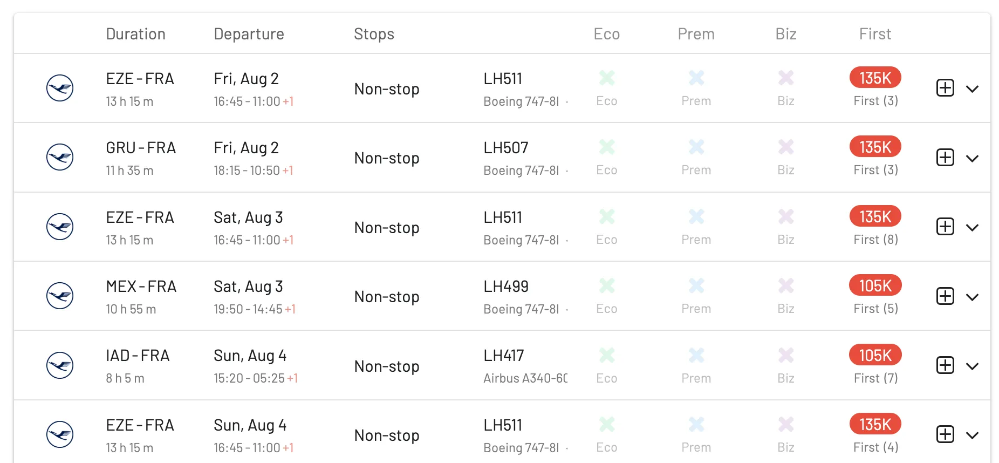

### More Posts

- [Essential Guide To Book Lufthansa Flights With SAS EuroBonus Points](https://blog.awardfares.com/lufthansa-with-eurobonus-guide/)
- [Lufthansa Allegris Takes Flight on May 1st (Book with Points)](https://blog.awardfares.com/lufthansa-allegris-first-flight/)
- [Lufthansa's A350 Long-Haul Business Class (Avoid)](https://blog.awardfares.com/lufthansa-long-haul-business-a350/)

---

## 2. Turkish Airlines Business Class

Turkish's Business Class has a spacious layout, fantastic onboard cuisine and in-flight service, which makes it an exceptional experience for long-haul journeys.

_Image from Turkish Airlines website._

### Top Turkish Airlines Business Class Seats (Long-haul Routes)

<table id="tk-business"></table>

### Suggested Routes

- [Istanbul (IST) to New York (JFK)](https://awardfares.com/search?IST.JFK.;a:TK;z:sas): A prominent transatlantic connection, this route serves as a bridge between Turkey and the East Coast of the USA.
- [Istanbul (IST) to Bangkok (BKK)](https://awardfares.com/search?IST.BKK.;a:TK;z:sas): Connecting Europe and Asia, this route is popular among both tourists and business travelers looking to explore Southeast Asia.
- [Istanbul (IST) to São Paulo (GRU)](https://awardfares.com/search?IST.GRU.;a:TK;z:sas): Bridging the gap between Europe and South America, this is a unique route providing access to Brazil's major metropolis.
- [Istanbul (IST) to Tokyo (HND/NRT)](https://awardfares.com/search?IST.area:TYO.;a:TK;z:sas): Serving as a key link between Turkey and Japan, this route is frequented by many looking to traverse between Europe and the Far East.
- [Istanbul (IST) to Cape Town (CPT)](https://awardfares.com/search?IST.CPTs.;a:TK;z:sas): A valuable connection for those keen on exploring the beauty of South Africa, leveraging Istanbul's position to connect Europe with the African continent.

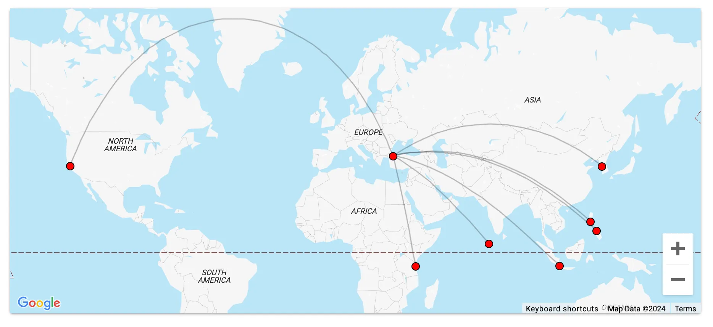

### Availability

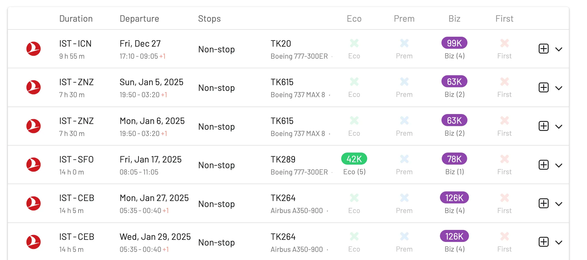

### More Posts

- [Booking Turkish Airlines Flights With SAS EuroBonus Points (Guide)](https://blog.awardfares.com/turkish-with-eurobonus/)

---

## 3. EVA Air Royal Laurel Class (Business Class)

EVA Air's award-winning business class is known as Royal Laurel. We had the chance to try EVA's long-haul business class a couple of times and were really happy with how it turned out! A solid option to travel from Europe to Asia.

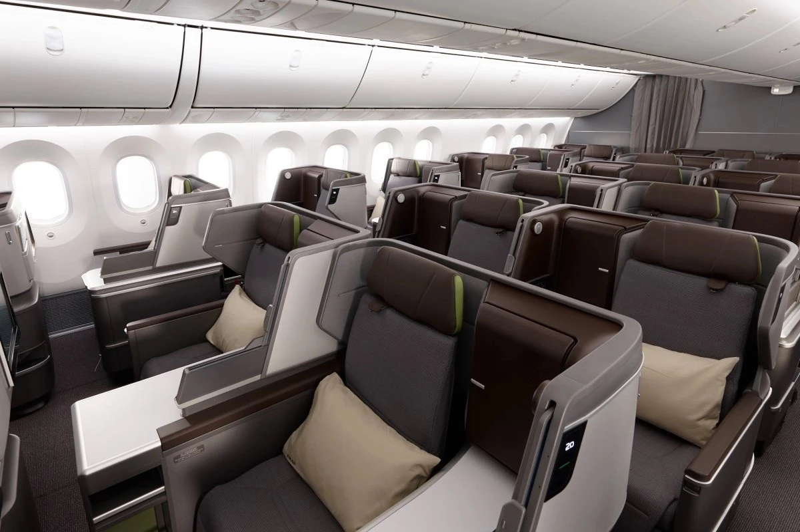

_Image from EVA Air official website._

### Suggested Routes

- [Taipei (TPE) to Los Angeles (LAX)](https://awardfares.com/search?TPE.LAX.;a:BR;z:sas): A popular transpacific route connecting Taiwan with the US West Coast.
- [Taipei (TPE) to Bangkok (BKK)](https://awardfares.com/search?TPE.BKK.;a:BR;z:sas): Offering an efficient connection between Taiwan and one of Southeast Asia's major hubs.
- [Taipei (TPE) to San Francisco (SFO)](https://awardfares.com/search?TPE.SFO.;a:BR;z:sas): Another key route for travelers looking to journey between Taiwan and the US West Coast.
- [Taipei (TPE) to London (LHR)](https://awardfares.com/search?TPE.LHR.;a:BR;z:sas): A long-haul route linking Taiwan with Europe's major transit and travel hub.
- [Taipei (TPE) to Vancouver (YVR)](https://awardfares.com/search?TPE.YVR.;a:BR;z:sas): This route provides a direct connection between Taiwan and Canada's Pacific coast.

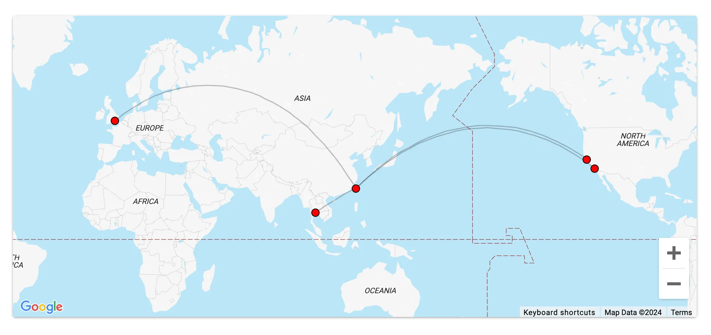

### Availability

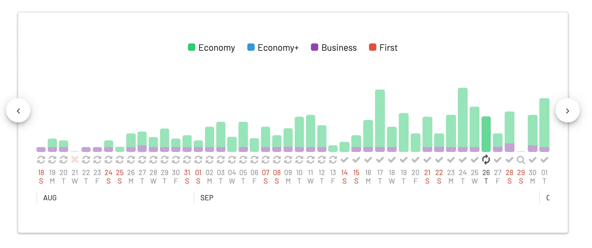

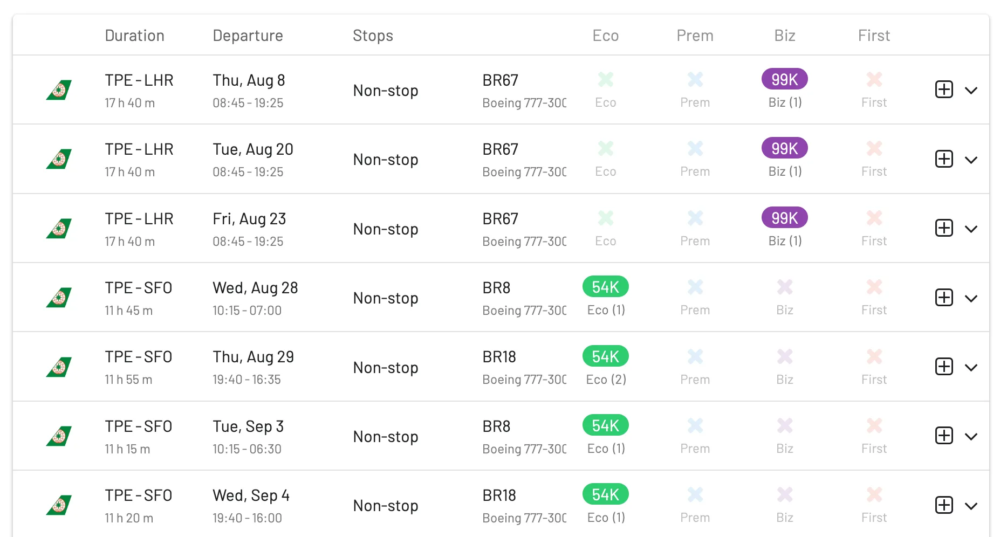

### More Posts

- [Best EVA Air Award Flights In 2023](https://blog.awardfares.com/eva-air-best-redemptions-2023/)
- [EVA Air Award Redemption Guide](https://blog.awardfares.com/eva-air-award-redemption/)
- [5 Mistakes When Searching EVA Air Award Flights (And How To Fix Them)](https://blog.awardfares.com/eva-air-mistakes/)
- [EVA Business 787-9 Dreamliner TPE-ICN Trip Report](https://blog.awardfares.com/eva-business-tpe-icn/)

---

## 4. Thai Airways Business Class

Both Thai's Royal First and Royal Silk Business Class offer a great experience, particularly on their A350 and A380.

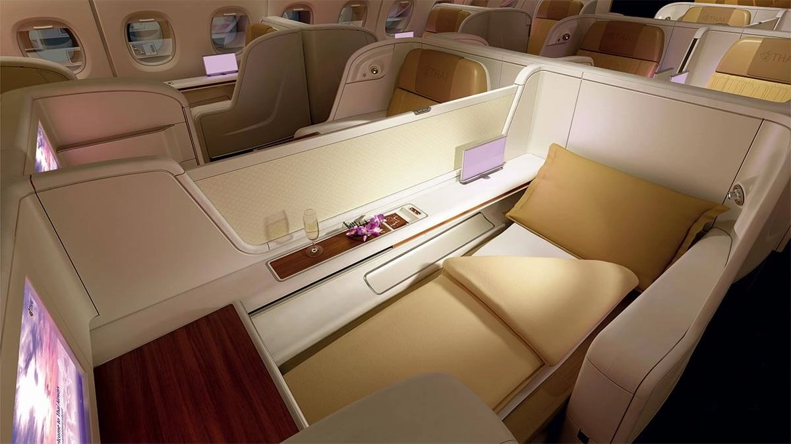

_Image from Thai website._

### Suggested Routes

- [Bangkok (BKK) to London (LHR)](https://awardfares.com/search?BKK.LHR.;a:TG;z:sas): One of Thai Airways' flagship routes, this offers a direct connection between Thailand's capital and one of Europe's primary hubs.
- [Bangkok (BKK) to Sydney (SYD)](https://awardfares.com/search?BKK.SYD.;a:TG;z:sas): A popular route for those wanting to venture to Australia while enjoying Thai hospitality.
- [Bangkok (BKK) to Tokyo (HND/NRT)](https://awardfares.com/search?BKK.area:TYO.;a:TG;z:sas): Connecting two of Asia's major cities, this route is popular among both tourists and business travelers.
- [Bangkok (BKK) to Zurich (ZRH)](https://awardfares.com/search?BKK.ZRH.;a:TG;z:sas): Another popular European destination, this route connects Thailand directly with Switzerland.
- [Bangkok (BKK) to Frankfurt (FRA)](https://awardfares.com/search?BKK.FRA.;a:TG;z:sas): This key European link is heavily used by both business travelers and tourists.

### Availability

---

## 5. ANA Business Class

A fantastic opportunity to try to score ANA's new Business Class cabin on their 777-300ER called *'The Room'*.

_Image from ANA's official website._

### Suggested Routes

- [Tokyo (HND or NRT) to New York (JFK)](https://awardfares.com/search?area:TYO.JFK.;a:NH;z:sas): A premier long-haul route where you can experience ANA's acclaimed First Class and Business Class products on their Boeing 777s or 787 Dreamliners.
- [Tokyo (HND or NRT) to London (LHR)](https://awardfares.com/search?area:TYO.LHR.;a:NH;z:sas): Another major long-haul route that showcases ANA's premium offerings, especially on their latest aircraft.
- [Tokyo (NRT) to Frankfurt (FRA)](https://awardfares.com/search?area:TYO.FRA.;a:NH;z:sas): A key connection between Asia and Europe, allowing passengers to experience ANA's award-winning service.
- [Tokyo (HND or NRT) to Los Angeles (LAX)](https://awardfares.com/search?area:TYO.LAX.;a:NH;z:sas): A popular transpacific route that links Japan with the US West Coast. Ideal for experiencing ANA's top cabins.
- [Tokyo (HND) to Sydney (SYD)](https://awardfares.com/search?area:TYO.SYD.;a:NH;z:sas): One of ANA's significant routes to Oceania, offering a chance to experience their long-haul product on a diverse route.

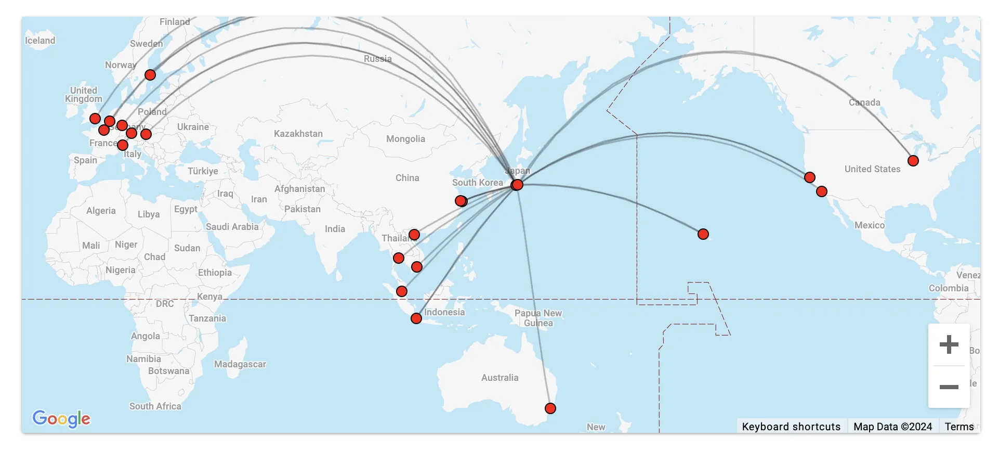

### Availability

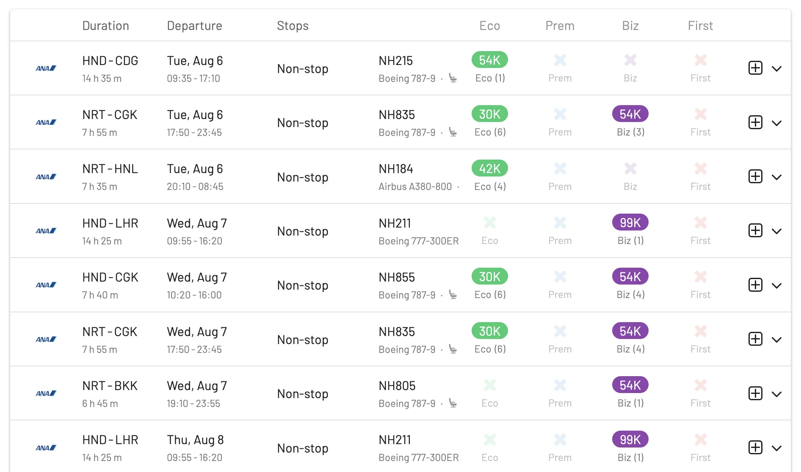
### More Posts

- [ANA 777 Liveries: How To Fly The Pokémon Jets And Other Spectacular Planes](https://blog.awardfares.com/ana-777-fleet/)
- [ANA Resumes Route Tokyo To Perth](https://blog.awardfares.com/ana-resumes-tokyo-perth/)

---

## 6. Air Canada Signature Class (Business Class)

Aim for Business Class on Air Canada's Boeing 787-9 or Boeing 777-300ER.

_Image from Air Canada's official website._

### Suggested Routes

- [Toronto (YYZ) to Tokyo (HND/NRT)](https://awardfares.com/search?YYZ.area:TYO.;a:AC;z:sas): Experience the airline's long-haul service on this trans-Pacific route.
- [Vancouver (YVR) to Sydney (SYD)](https://awardfares.com/search?YVR.area:SYD.;a:AC;z:sas): Another long-haul offering, connecting the West Coast of Canada with Australia.
- [Toronto (YYZ) to Frankfurt (FRA)](https://awardfares.com/search?YYZ.area:FRA.;a:AC;z:sas): A key European route offering the chance to fly on Air Canada's flagship Boeing 787 Dreamliners.
- [Montreal (YUL) to Paris (CDG)](https://awardfares.com/search?YUL.area:CDG.;a:AC;z:sas): A classic transatlantic route, which might provide good award availability and also features the Dreamliner on certain flights.
- [Calgary (YYC) to London (LHR)](https://awardfares.com/search?YYC.area:LHR.;a:AC;z:sas): This route allows passengers to experience long-haul service from Canada's mountainous West to the UK.

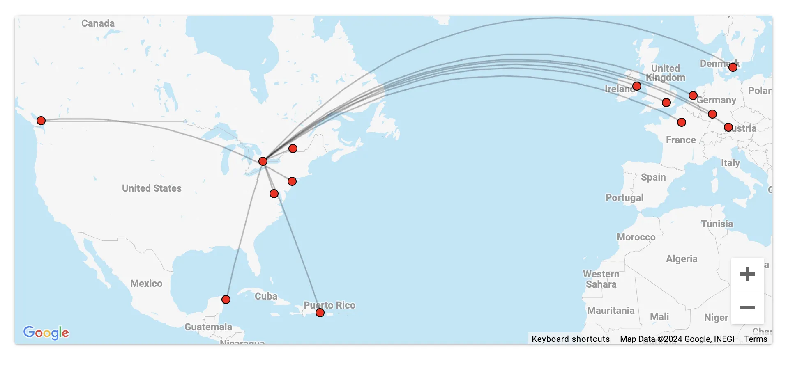

### Availability

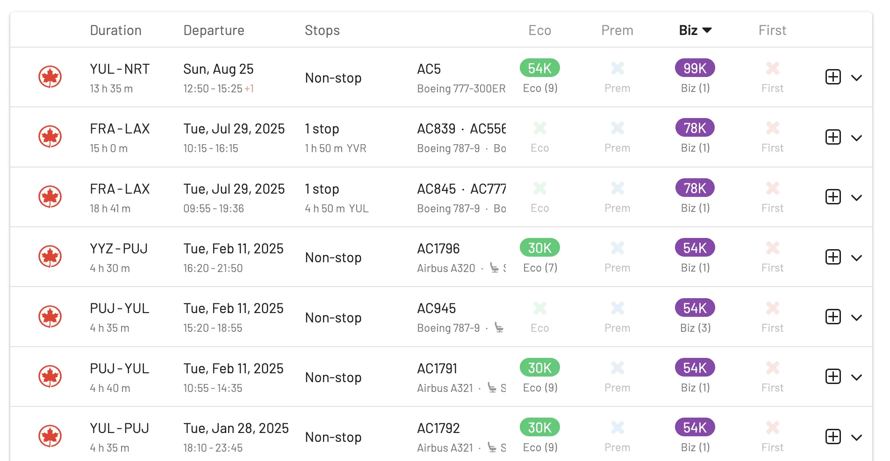
### More Posts

### More Posts

- [Air Canada Business 737 MAX 8 YVR-SFO Trip Report](https://blog.awardfares.com/air-canada-business-yvr-sfo/)
- [Air Canada Announces Route From Vancouver To Singapore](https://blog.awardfares.com/aircanada-singapore-route/)

---

## 7. Swiss Business Class

While their cabins aren't the best and can feel a bit crowded, SWISS still offers a solid option to travel on long-haul routes. Target flights operated by their Boeing 777-300ER or Airbus A330.

_Image from SWISS website._

### Suggested Routes

- [Zurich (ZRH) to Los Angeles (LAX)](https://awardfares.com/search?ZRH.LAX.;a:LX;z:sas): A direct long-haul flight that connects Switzerland's main hub with the US West Coast, and it's especially pleasant in SWISS' renowned Business or First Class.
- [Zurich (ZRH) to Bangkok (BKK)](https://awardfares.com/search?ZRH.BKK.;a:LX;z:sas): An important route for those keen on exploring Southeast Asia, while enjoying SWISS's stellar in-flight service.
- [Zurich (ZRH) to New York (JFK)](https://awardfares.com/search?ZRH.JFK.;a:LX;z:sas): This transatlantic connection between Switzerland and the US East Coast is frequently sought after by both leisure and business travelers.
- [Geneva (GVA) to London (LCY)](https://awardfares.com/search?GVA.LCY.;a:LX;z:sas): A popular European route, especially among business travelers due to the convenience of London City Airport.
- [Zurich (ZRH) to Tokyo (HND/NRT)](https://awardfares.com/search?ZRH.area:TYO.;a:LX;z:sas): Bridging Switzerland with Japan, this is one of SWISS's flagship routes in Asia.

**Known Issues with EuroBonus**: Swiss First Class is not bookable using SAS EuroBonus points. Swiss recently teased new Business and First Class cabins, but it's not clear if it will be possible to book them before SAS leaves Star Alliance.

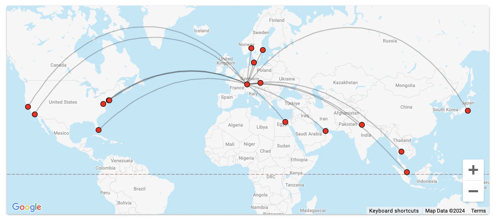

### Availability

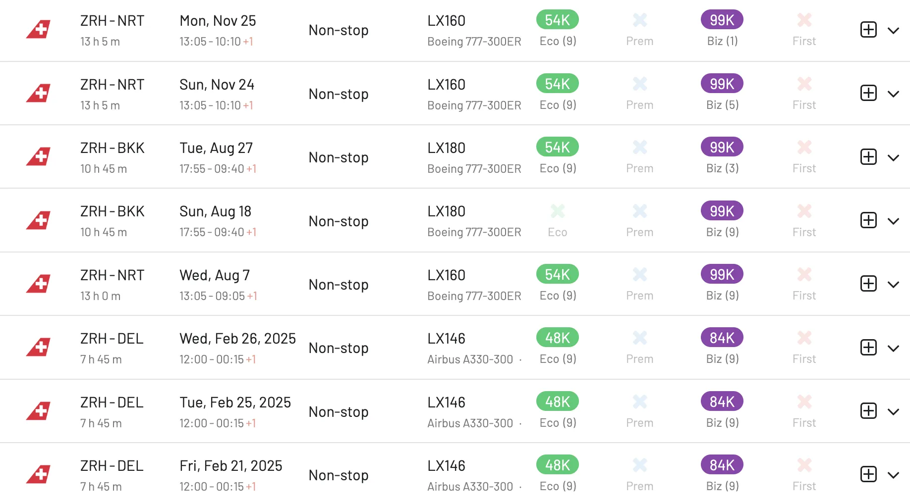
---

## 8. Asiana Airlines Business Class (Smartium)

Try to search for Business Class on their 777-200.

_Image from [Flickr](https://www.flickr.com/photos/mattweibo/25109436108) (creative commons)._

### Suggested Routes

- [Seoul (ICN) to New York (JFK)](https://awardfares.com/search?ICN.JFK.;a:OZ;z:sas#): A flagship route for Asiana, it gives passengers the chance to experience the airline's long-haul service at its best.
- [Seoul (ICN) to Frankfurt (FRA)](https://awardfares.com/search?ICN.FRA.;a:OZ;z:sas#): A key route connecting Asia with Europe, often operated with their latest aircraft and product offerings.
- [Seoul (ICN) to Los Angeles (LAX)](https://awardfares.com/search?ICN.LAX.;a:OZ;z:sas#): Another major transpacific route, linking Korea with the US West Coast.
- [Seoul (ICN) to Sydney (SYD)](https://awardfares.com/search?ICN.SYD.;a:OZ;z:sas#): This connection bridges Korea and Australia, and can offer a comfortable long-haul experience.
- [Seoul (ICN) to London (LHR)](https://awardfares.com/search?ICN.LHR.;a:OZ;z:sas#): A significant route to one of Europe's primary hubs, showcasing Asiana's premium cabins and services.

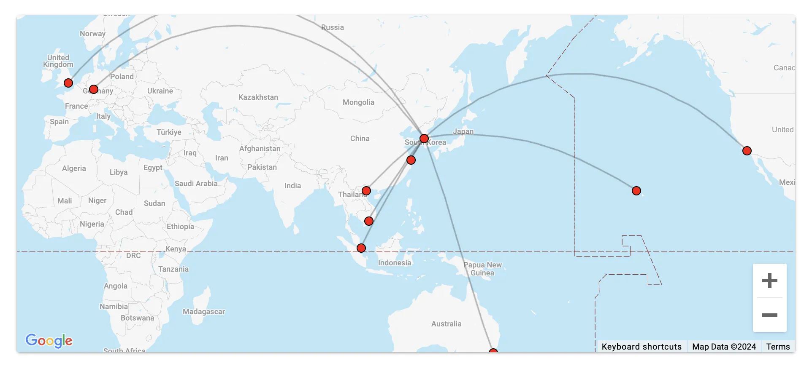

---

## 10. Avianca Business Class (787)

Avianca these days is offering a more *Low-Cost Business Class* service, similar to the one you get on [ZIPAIR (check our review here)](https://blog.awardfares.com/zipair-full-flat-nrt-sfo/). We wouldn't recommend it over other alternatives, and definitely isn't our go-to choice, but for certain routes, Avianca can offer great availability when there aren't other options. Bogota can be a cool hub also. Overall, it is a solid option within South America with great connections to the caribbean and the US.

_Image from Avianca's official website._

### Suggested Routes

- [Bogotá (BOG) to Madrid (MAD)](https://awardfares.com/search?BOG.MAD.;a:AV,OS;z:sas): A key transatlantic route connecting South America with Europe.
- [Bogotá (BOG) to Buenos Aires (EZE)](https://awardfares.com/search?BOG.EZE.;a:AV,OS;z:sas): A popular route for travelers seeking to connect to the US from South America.
- [Medellín (MDE) to New York (JFK)](https://awardfares.com/search?MDE.JFK.;a:AV,OS;z:sas): Serving as a direct link between Colombia's second-largest city and the US East Coast.
- [Bogotá (BOG) to São Paulo (GRU)](https://awardfares.com/search?BOG.GRU.;a:AV,OS;z:sas): A major connection between two of South America's largest cities.

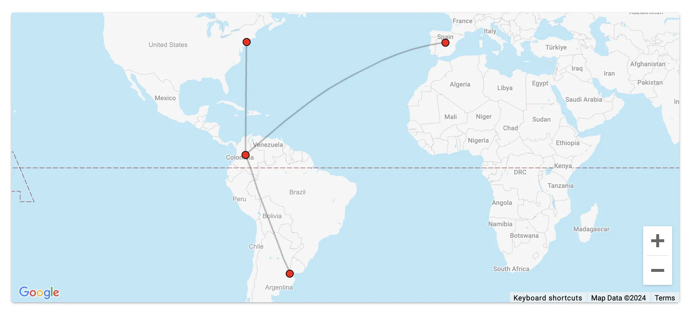

### Availability

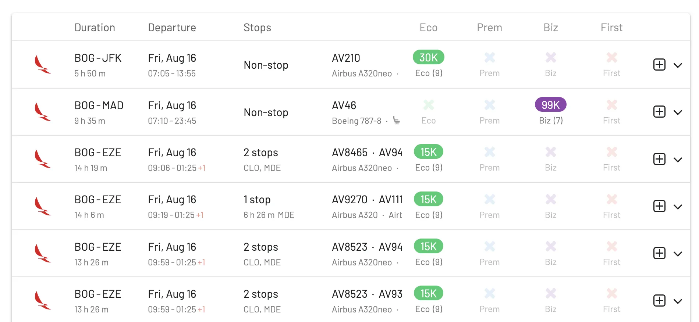
## Upgrade For More

Our [Gold and Diamond tiers](https://awardfares.com/pricing) offer access to premium features including unlimited daily searches, journey planner, alerts, seat maps, flight schedules, and more!

## Read More

Our guides have all the information you need to be a pro travel hacker and explore the world on points. Here are some related posts you might enjoy:

- [From Star Alliance to SkyTeam: The SAS Transition (Official Info)](https://blog.awardfares.com/sas-transition-to-skyteam/)
- [Guide To Using SAS EuroBonus Points (Before & After They Join SkyTeam)](https://blog.awardfares.com/eurobonus-guide/)
- [Updates For SAS EuroBonus Members (July 2024)](https://blog.awardfares.com/eurobonus-updates-july-2024/)
- [EuroBonus vs. Flying Blue: Stay or Switch?](https://blog.awardfares.com/eurobonus-vs-flying-blue/)
- [Top Mistakes When Booking EuroBonus Award Flights](https://blog.awardfares.com/top-mistakes-eurobonus/)

