July has been very busy for the aviation industry, with several announcements from both airlines and manufacturers. In this post, we look at the latest routes announced by top airlines including American Airlines, Alaska Airlines, Delta Air Lines, JetBlue, Aeromexico, and Avianca. Good news is that for almost all of them, there are award seats available, meaning you could book those new flights right away using points or miles. Let's dive in!

### Navigate

- [American Airlines](#american-airlines)
- [Alaska Airlines](#alaska-airlines)
- [Delta Air Lines](#delta-air-lines)
- [JetBlue](#jetblue)
- [Aeromexico](#aeromexico)
- [Avianca](#avianca)
- [Read More](#read-more)

## American Airlines

Book using [**AAadvantage**](https://awardfares.com/programs/american-airlines-aadvantage) or [**Alaska MileagePlan**](https://awardfares.com/programs/alaska-mileageplan).

### 1. [Charlotte (CLT) to London (LHR)](https://awardfares.com/search?CLT.LHR.;z:aadvantage)

From November 5, 2024 to March 29, 2025. Plenty of availability on this route. Prices start at 27k miles one-way (Economy).

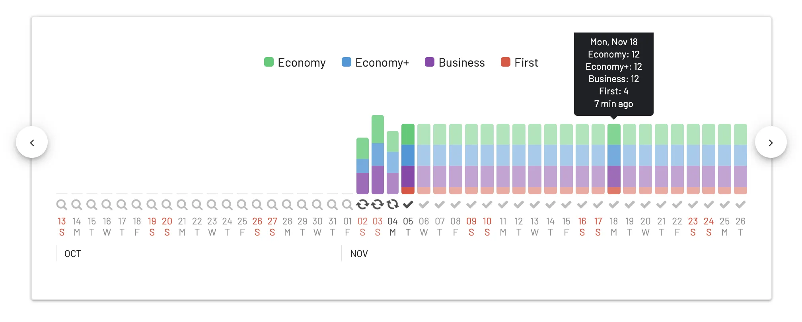

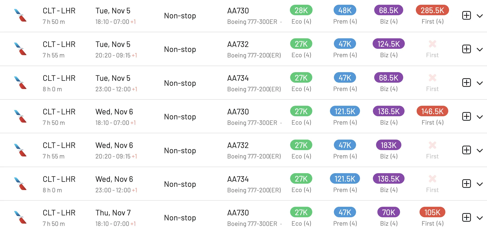

### 2. [Miami (MIA) to South Caicos, Turks and Caicos (XSC)](https://awardfares.com/search?MIA.XSC.;z:aadvantage)

Starts February 15, 2025. Seats are available but frequency is low and there aren't so many seats. Book fast! Prices start at 10k miles one-way (Economy).

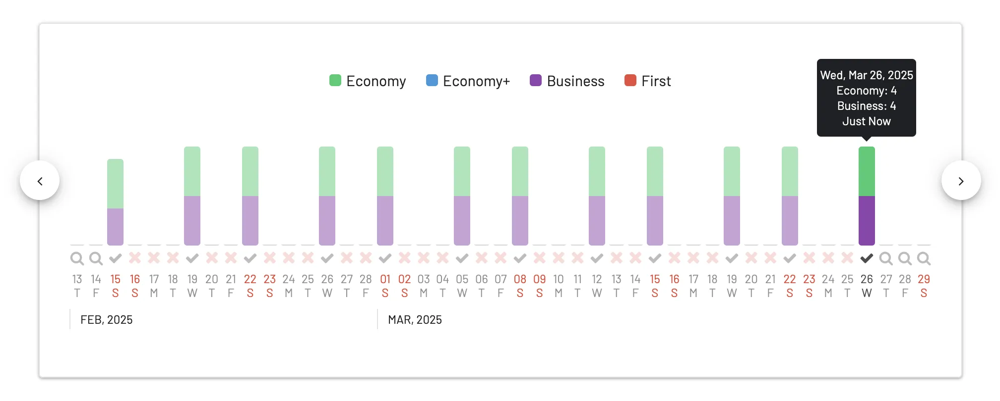

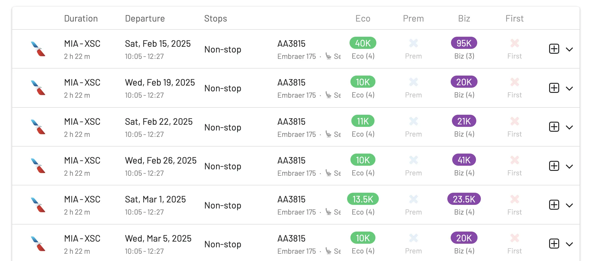

### 3. [Carlsbad, California (CNM) to Phoenix (PHX)](https://awardfares.com/search?CNM.PHX.;z:aadvantage)

Starts February 13, 2025. No seats released yet.

## Alaska Airlines

Book using [**Alaska MileagePlan**](https://awardfares.com/programs/alaska-mileageplan).

### 1. [New York (JFK) to Puerto Vallarta (PVR)](https://awardfares.com/search?JFK.PVR.;a:AS;x:0;z:alaska)

From January 8, 2025 to April 20, 2025. Decent availability. Prices start at 25k one-way (Economy) and 65k for Business (Domestic First) Class.

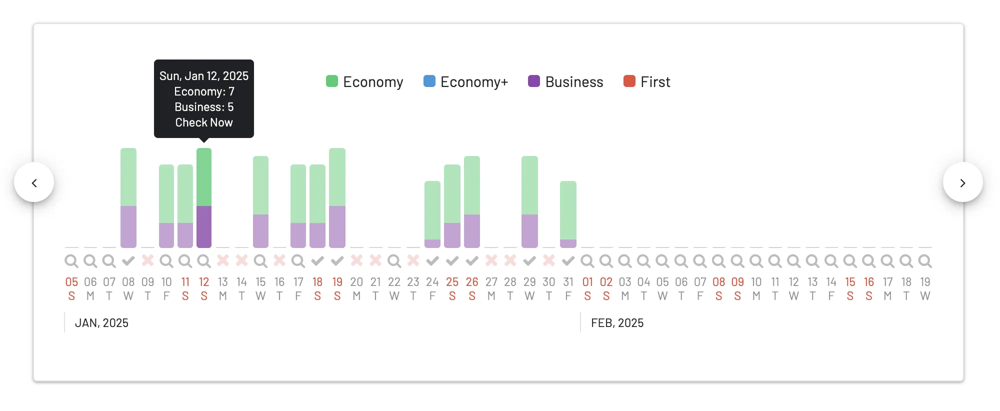

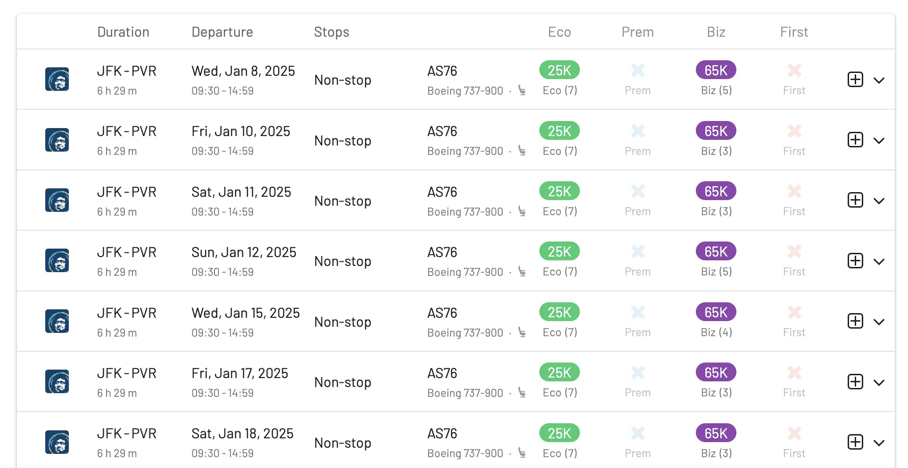

### 2. [St. Louis (STL) to Puerto Vallarta (PVR)](https://awardfares.com/search?STL.PVR.;a:AS;x:0;z:alaska)

From January 25, 2025 to April 5, 2025. Very few seats released on this route yet. Set up an [alert](https://blog.awardfares.com/alerts/) to get a notification as soon as more awards become available. Prices start at 19k (Economy).

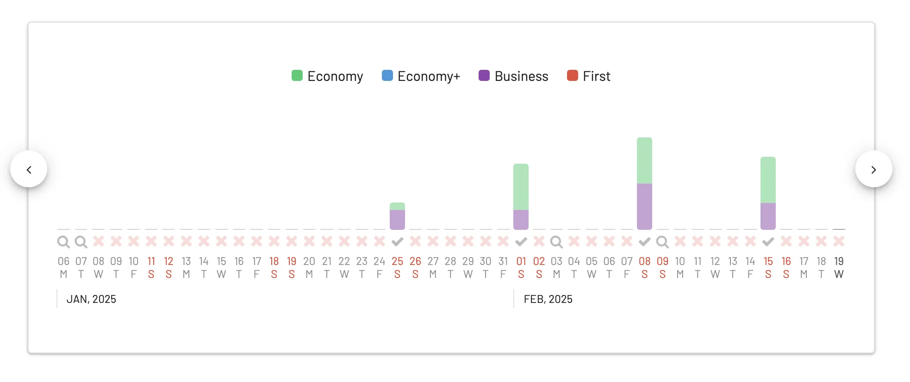

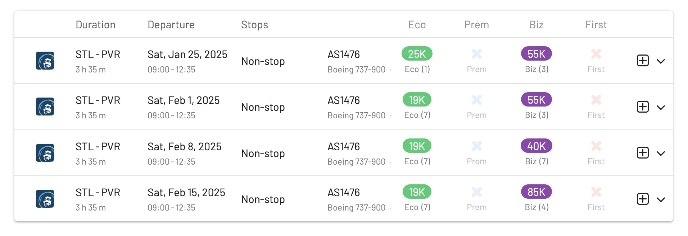

### 3. [Fresno, California (FAT) to Guadalajara, Mexico (GDL)](https://awardfares.com/search?FAT.GDL.;a:AS;x:0;z:alaska)

From December 3, 2024 to February 12, 2025. Plenty of award seats and options available across different dates. Prices start at 12.5k miles one-way (Economy).

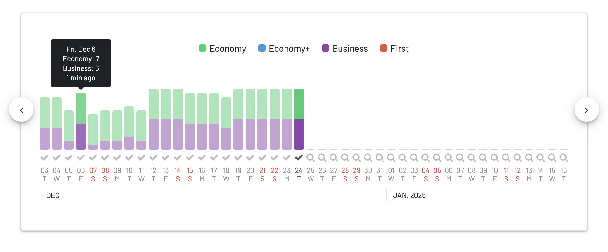

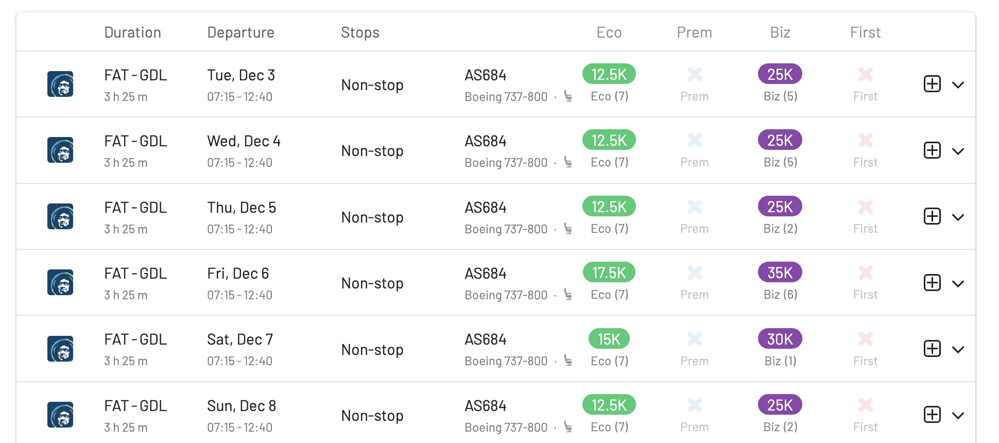

## Delta Air Lines

Book using [**Delta SkyMiles**](https://awardfares.com/programs/delta-skymiles), [**FlyingBlue**](https://awardfares.com/programs/air-france-klm-flying-blue) or [**SAS EuroBonus**](https://awardfares.com/programs/sas-eurobonus) (from September 1).

### 1. [Detroit (DTW) to Nassau, Bahamas (NAS)](https://awardfares.com/search?DTW.NAS.;a:DL;x:0;z:delta)

Starting December 21, 2024. Seats available, but flight runs once a week, so make sure to book right away! Awards start at 23k miles one-way (Economy).

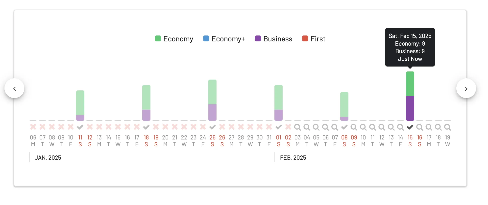

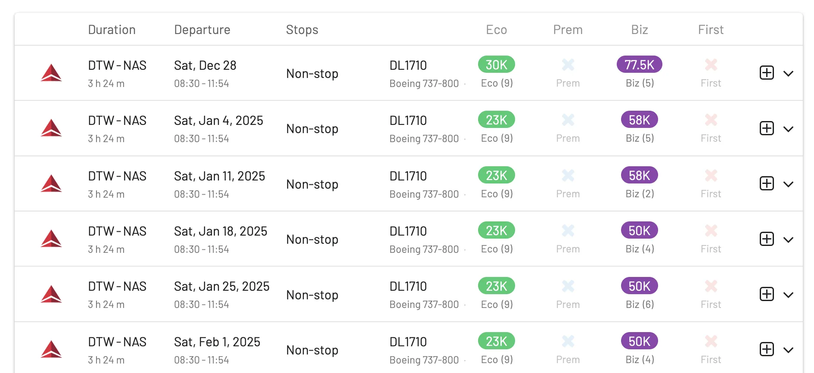

### 2. [Detroit (DTW) to Tulum, Mexico (TQO)](https://awardfares.com/search?DTW.TQO.;a:DL;x:0;z:delta)

Starting January 11, 2025. Decent availability but flight runs weekly, so they will go away soon. Awards start at 18k one-way (Economy), and there are seats in Business Class available.

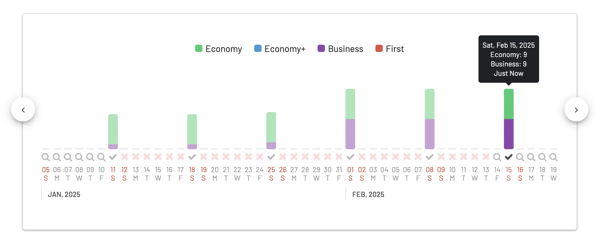

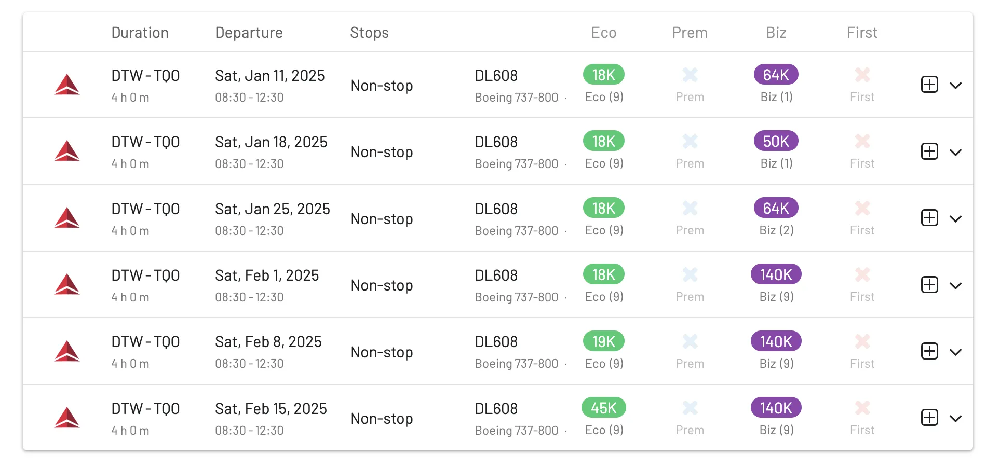

## JetBlue

Book using [**JetBlue TrueBlue*](https://awardfares.com/programs/jetblue-true-blue).

### 1. [Buffalo, New York (BUF) to Palm Beach (PBI)](https://awardfares.com/search?BUF.PBI.;a:B6;x:0;z:jetblue)

Starting October 26, 2024, as a winter seasonal. **Very few** seats left on each flight, so hurry up to book!. Awards start at 8.7k miles one-way in Economy.

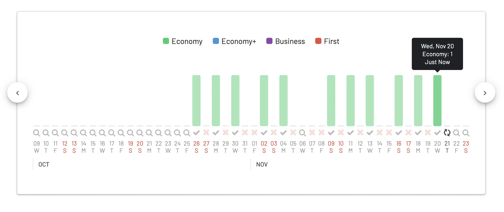

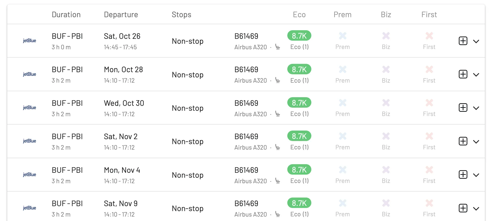

### 2. [Providence, Rhode Island (PVD) to Fort Meyers (RSW)](https://awardfares.com/search?PVD.RSW.;a:B6;x:0;z:jetblue)

Starting October 27, 2024, as a winter seasonal. As with the previous flight, very limited availability. (1-5 seats per flight). Prices start at 6.6k points one-way (Economy).

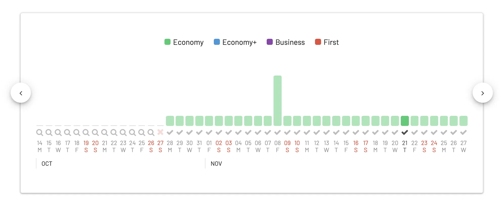

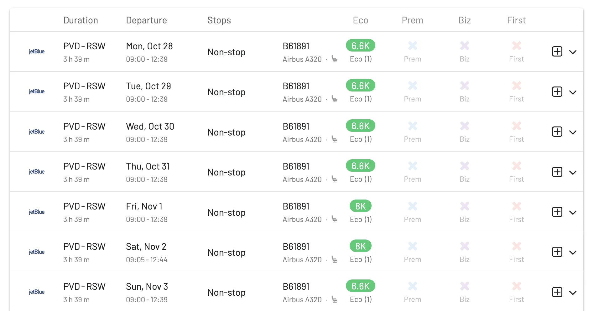

### 3. [Portland, Maine (PWM) to Orlando (MCO)](https://awardfares.com/search?PWM.MCO.;a:B6;x:0;z:jetblue)

Starting Oct. 28, 2024, as a winter seasonal. Awards start at 6.2k miles one-way, only available in Economy Class.

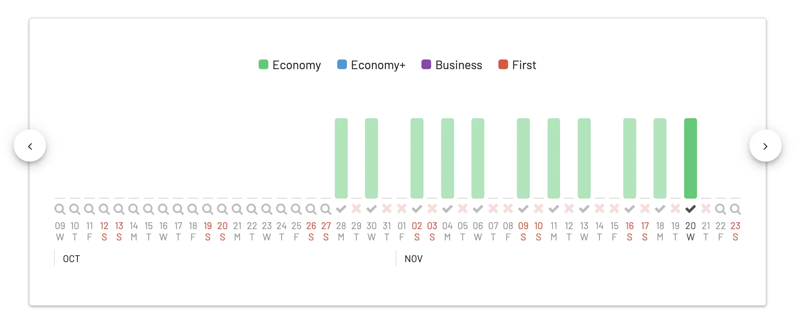

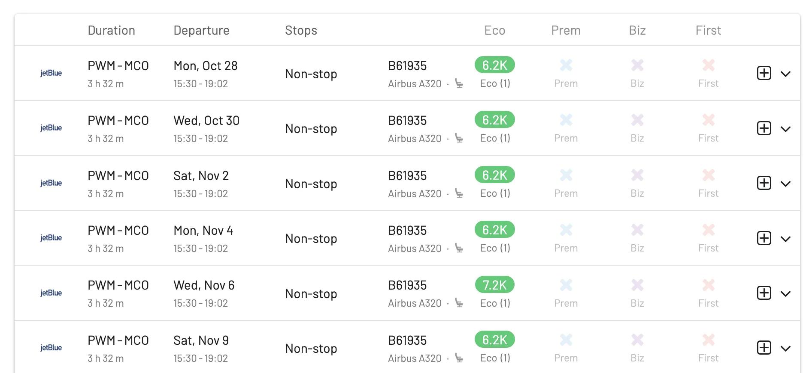

## Aeromexico

Book using [Aeromexico Rewards](https://awardfares.com/programs/aeromexico-rewards), [FlyingBlue](https://awardfares.com/programs/air-france-klm-flying-blue), or [Delta SkyMiles](https://awardfares.com/programs/delta-skymiles).

### 1. [Newark (EWR) to Mexico City (MEX)](https://awardfares.com/search?EWR.MEX.;a:AM;x:0;z:aeromexico)

Starts October 2024. This highly-demanded route has wide open availability. Runs daily operated by a 737 MAX 8. Prices start a 18k points one-way in Economy and 36k one-way in Business Class (Aeromexico Rewards).

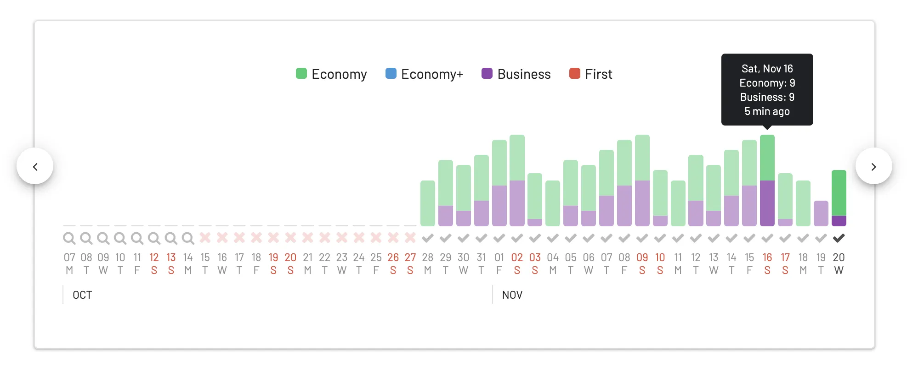

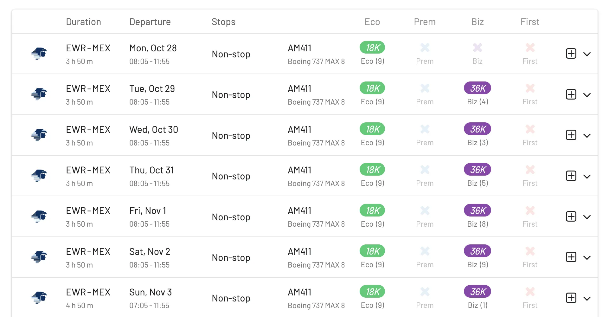

### 2. [Atlanta (ATL) to Manzanillo (ZLO)](https://awardfares.com/search?ATL.ZLO.;a:AM;x:0;z:aeromexico)

Starts November 2024. Very few seats available using Aeromexico Rewards. Flight runs once a week. Prices start a 19k points one-way in Economy Class.

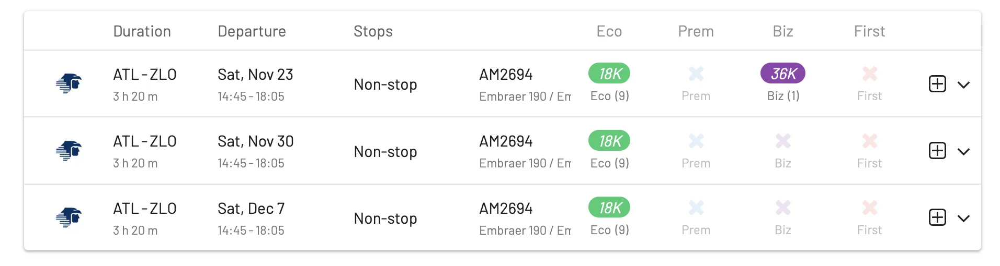

### 3. [Denver, Colorado (DEN) to Monterey, California (MRY)](https://awardfares.com/search?DEN.MRY.;a:AM;x:0;z:aeromexico)

Starts Dec 21, 2024. No award seats available yet.

## Avianca

Book using [**Aeroplan**](https://awardfares.com/programs/air-canada-aeroplan), United [**MileagePlus**](https://awardfares.com/programs/united-mileageplus), or LifeMiles.

### [Bogota (BOG) to Chicago (ORD)](https://awardfares.com/search?BOG.ORD.;a:AV)

Starts late October 2024. No award seats available yet.

## Read More

You can [try AwardFares for free](https://awardfares.com/). Upgrade to [Gold or Diamond](https://awardfares.com/pricing) to access premium features, including unlimited daily searches, alerts, seat maps, flight schedules, journey planner, and more.

Our guides have all the information you need to be a pro travel hacker and explore the world on points. Here are some related posts you might enjoy:

- [How To Find Cheap Award Flights And Identify Good Redemptions (Step-by-step)](https://blog.awardfares.com/how-to-find-cheap-award-flights/)
- [How To Find Flying Blue Award Flights (+ Sweet Spots)](https://blog.awardfares.com/flying-blue-guide/)
- [What To Do With 100k Delta SkyMiles? Guide To Finding SkyMiles Sweet Spots](https://blog.awardfares.com/100k-skymiles/)
- [How To Book JetBlue Mint With Points](https://blog.awardfares.com/jetblue-mint-with-points/)