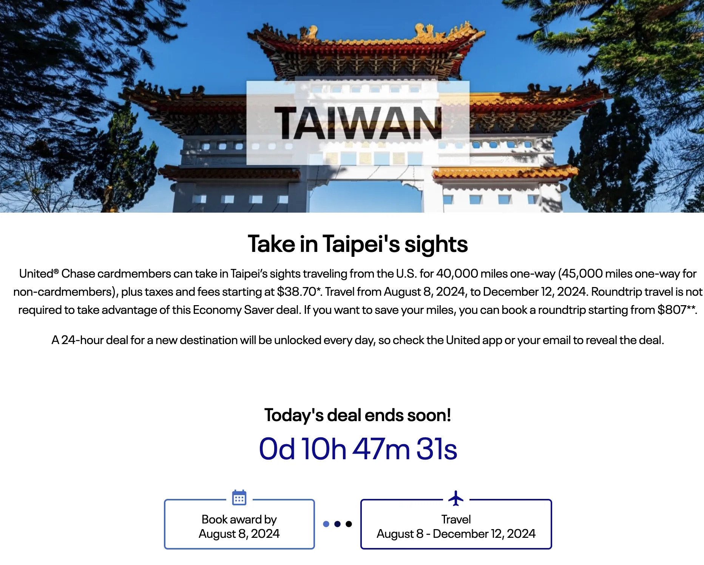
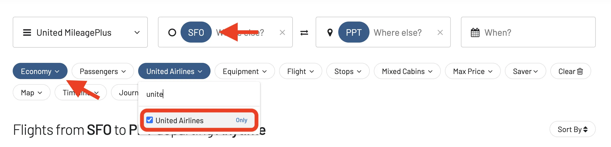
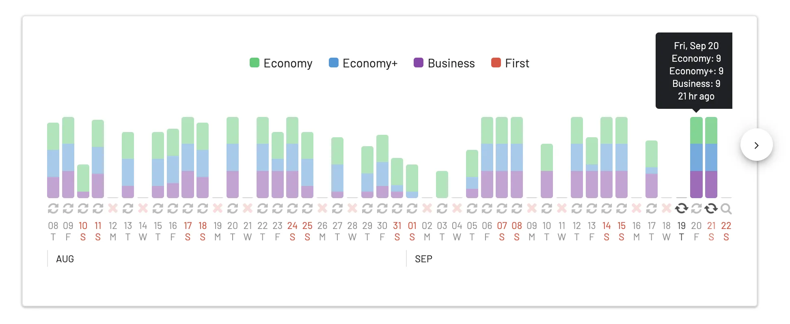
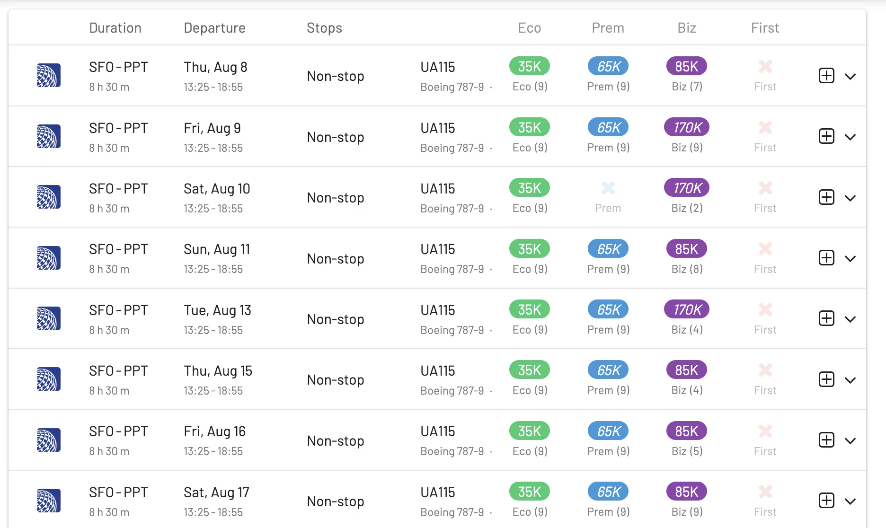
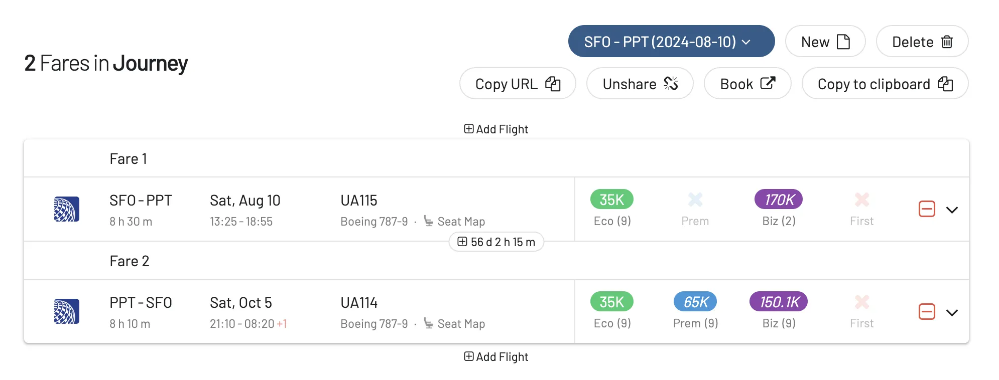

This week, [United Airlines is rolling out discounted awards](https://www.united.com/en-us/spacwod-hongkong) with a different mystery destination each day. These deals offer significant savings, but they are available [**for one day only**](https://www.united.com/en-us/spacwod-hongkong).

## General Details

* Available for Economy Class only.
* **Travel window**: August 5, 2024, through March 31, 2025, with blackout dates from December 19, 2024, to January 9, 2025.
* Save 10k miles each way, with co-brand credit card customers enjoying an additional 5k off each way (e.g., Chase)
* Cardholders and elites have access to more award space.

## Destinations

* **Monday**: Australia
* **Tuesday**: New Zealand
* **Wednesday**: Tahiti
* **Thursday**: Taiwan
* **Friday**: Hong Kong

## How To Find United MileagePlus Discounted Awards

1. Go to [AwardFares](https://awardfares.com/search) and log-in.
2. Set **United MileagePlus** as the *Frequent Flyer Program*.
3. Select the *Route* of one of the deals, [**San Francisco (SFO)** to **Papeete (PPT)**](https://awardfares.com/search?SFO.PPT.;a:UA;z:united).
4. Under *Airline* set **United airlines only**. This way you only get flights operated by United (instead of the whole Star Alliance).
5. Tap on the *Cabin* pill and set **Economy**. The discount only applies to Economy tickets.
6. Select a date or multiple dates using the Timeline View.

That's it! You'll see the availability displayed in the Timeline:

And also the full result list below. Tap anywhere on the flight to expand and see more details such as prices. Note that the extra discount for MileagePlus cardholders will be only be shown on United's website during the booking (not on AwardFares).

Keep in mind that you can use our [**Journey Planner** feature to find and plan round trips](https://blog.awardfares.com/round-trip-award-flights/).

## Become a MileagePlus Pro

You can [try AwardFares for free](https://awardfares.com/). We are rolling out new features and improvements regularly, so [sign up for our monthly newsletter](https://awardfares.com/newsletter) to stay on top of the latest news, announcements, and pro tips.

With our [Gold and Diamond tiers](https://awardfares.com/pricing), you can access premium features such as unlimited daily searches, alerts, seat maps, flight schedules, and more!

## Read More

Our guides have all the information you need to be a pro travel hacker and explore the world on points. Here are some related posts you might enjoy:

- [How To Find Cheap Award Flights And Identify Good Redemptions (Step-by-step)](https://blog.awardfares.com/how-to-find-cheap-award-flights/)
- [United Airlines Adds 100+ New Flights And Announces The Largest Summer Schedule in a Decade](https://blog.awardfares.com/united-summer-routes-2024/)
- [United 767-400 Polaris Business Class From Washington To Sao Paulo (2023)](https://blog.awardfares.com/united-polaris-review-2023/)