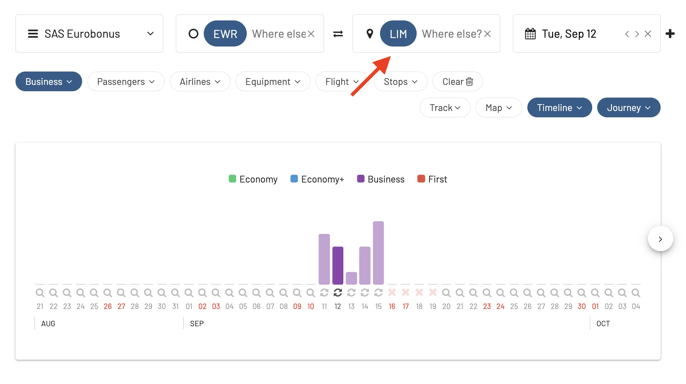
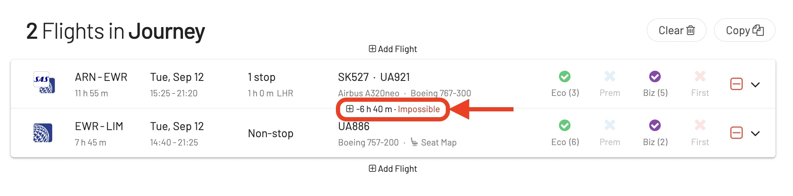

Booking flights with points or miles is fun, but finding the perfect trip to your desired destination can be tricky, especially when the journey involves multiple segments, or across different airlines. 

Each airline has its own unique set of rules, blackout dates, and seat availability constraints. Furthermore, partner airlines, despite being part of the same alliance, might not synchronize their award seat inventories, leading to gaps in available routes. This disjointed nature can make it hard to piece together an optimal itinerary. Additionally, some segments might have restrictions on the types of fares that can be redeemed further complicating the process (for example, [married segments we described here](https://blog.awardfares.com/married-segments/)).

That's why we've built the **Journey Planner**. This powerful feature lets you **unlock itineraries to your dream destination**, by planning multiple segments in a quick and convenient way. In just a few clicks, users can select add or remove legs, find connections within 24 hours, duplicate journes, and see the itinerary on a map.

## How To Use The Journey Planner: Build An Award Trip With A Complex Itinerary

To understand the power behind the Journey Planner, let's look at one concrete example. 

Dreaming of exploring Macchu Picchu and the ancient Cuzco? Perú is land of amazing culture, cuisine, history and landscape. It's a very popular destination that receives million of turists every year.

In this case, we are interested in flying from Stockholm (Sweden), to Lima (Perú) using SAS EuroBonus points.

We know upfront that availability from Europe to Deep South America is very limited, usually with long layovers and wait times. It gets even tricker when you try to find availability in premium cabins such as Business and First Class.

Nevertheless, we go to AwardFares and perform a search with the following configuration:

* **Loyalty Program**: SAS EuroBonus
* **Origin**: Stockholm Arlanda (ARN)
* **Destination**: Lima (LIM)
* **Departure Date**: Around September 13 (your desired date)

And we get these results:

<figure>

</figure>

As we can see, there's no availability in the surrounding dates, in any cabin class!

However, one way of going to Perú is to fly through the United States. There are many flights from Sweden to the US every day, and tons of options to choose from.

> *Pro tip: If you don't know which airlines fly to your dream destination, you can use tools like [Google Flights](https://www.google.com/travel/flights) or [FlightConnections](https://www.flightconnections.com/) to find out routes and options.*

Let's try splitting the trip and connect in a major US city, for example, **New York**. So, we change our search first from Stockholm to New York (NYC, metro area).

<figure>

</figure>

We see that there are plenty of seats! Let's filter further and try to select a Business Class seat with the shortest connection. We go to **Cabins** and add **Business Class Only**, and see the list below.

<figure>

</figure>

The first flight in the list doesn't look too bad, it has a quick connection in London, and a lie-flat seat in United's 767. We can use the **"+"** icon and add the flight to our Journey Planner.

AwardFares will display a **Journey** section with the segments you have selected.

<figure>

</figure>

Now it's time to find our next leg. You can tap on **Add Flight** either before or after segment in the planner. Each time a segment is added to the Journey Planner, AwardFares will automatically adjust your origin or departure airport correspondingly.

In our case, we add another segment *after* our first leg, and input **LIM** (Lima) as the destination. Note how also the business class filter is preserved.

<figure>

</figure>

In the results list, you'll notice how AwardFares displays *"Flights from EWR to LIM departing after (your flight)"*. This makes it much easier to find and select connecting flights.

<figure>

</figure>

The list is now sorted by schedule. On the left, you'll see a time indicator with how long is the layover. Typically, frequent flyer programs let you connect flights with a stopover up to 24 hs in the same ticket. Some of them, even up to 72 hs. Worst case scenario, you'll have to make two separate bookings for those flights.

From the list, we choose the first result and again add it to our journey planner. The connection is 1h 30min at EWR, which should be doable considering there are even *Express Connection* lanes at Newark.

In our Journey Planner now we see the full itinerary

<figure>

</figure>

### Map View

If we go to the top, we can tap on the **Map** button to view the full itinerary

<figure>

</figure>

### Copy Journey

You can leverage the **Copy journey** button to copy the itinerary information to your clipboard.

<figure>

</figure>

You can pase this information on a note or document to keep them at hand and compare different alternatives when building your dream trip.

<figure>

</figure>

### All set. Now, how do I book?

These complex itineraries are often not available to book online, so most likely, you will need to call your frequent flyer program service center.

As a tip, before calling, use the **copy journey** function to build a note or document with all the options you have considered. Have it at hand, and give this information to the agent to make the search faster.

### Impossible itineraries

If, by any chance you add the wrong leg to your journey, AwardFares will detect and show those connections that are impossible to make. 

<figure>

</figure>

## Journey Planner FAQ

### Can I build multiple journeys at once?

You can build **one** journey at a time. You can use the **Clear** button to start from scratch. To save the journey, use the **Copy** function and paste it in a note.

### Can I mix cabin classes?

Absolutely. Just keep in mind that when airlines price those awards, they often charge the segment as all in premium cabin.

### My next leg is several days after my first leg. Is that allowed?

As long as you see available seats in AwardFares, you can book those flights and you are able to build whatever itinerary you want. However, not all combinations are going to be considered as a *single* ticket, and it will require you more points to book them individually.

The conditions depend on your frequent flyer program. As a rule of thumb, connecting flights within 24hs are most often considered part of the same journey. Some airlines offer up to 72 hs stopovers.

## Upgrade for more.

The Journey Planner is included in all our packages, including Basic (Free), [**Gold**](https://awardfares.com/pricing) and [**Diamond**](https://awardfares.com/pricing) members.

You can [try AwardFares for free](https://awardfares.com/). We are rolling out new features and improvements regularly, so sign up for our newsletter to stay on top of the latest news, announcements, and pro tips!

## Read more.

Make sure to also check these posts out

- [10 Tips For Booking An Award Trip In 2023](https://blog.awardfares.com/award-trip-tips/)
- [Demystifying Award Charts: All You Need To Know (2023)](https://blog.awardfares.com/demystifying-award-charts/)
- [AwardFares vs. ExpertFlyer](https://blog.awardfares.com/awardfares-vs-expertflyer/)