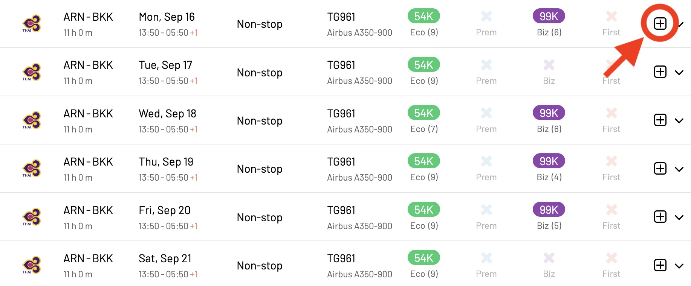
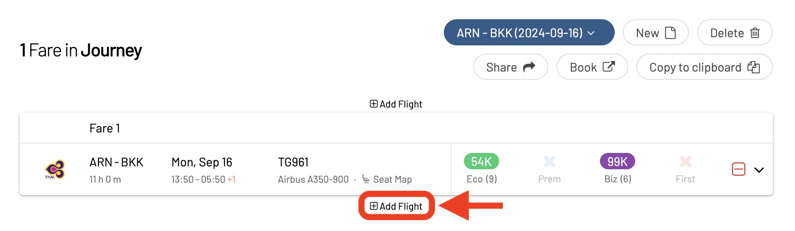
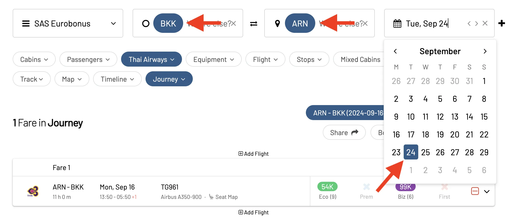
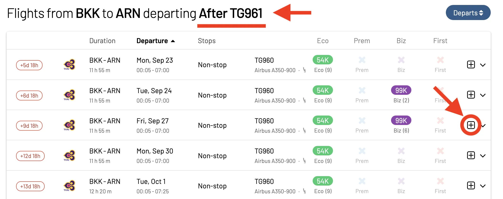
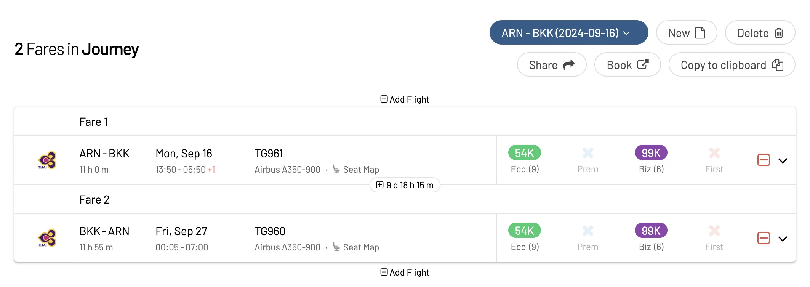
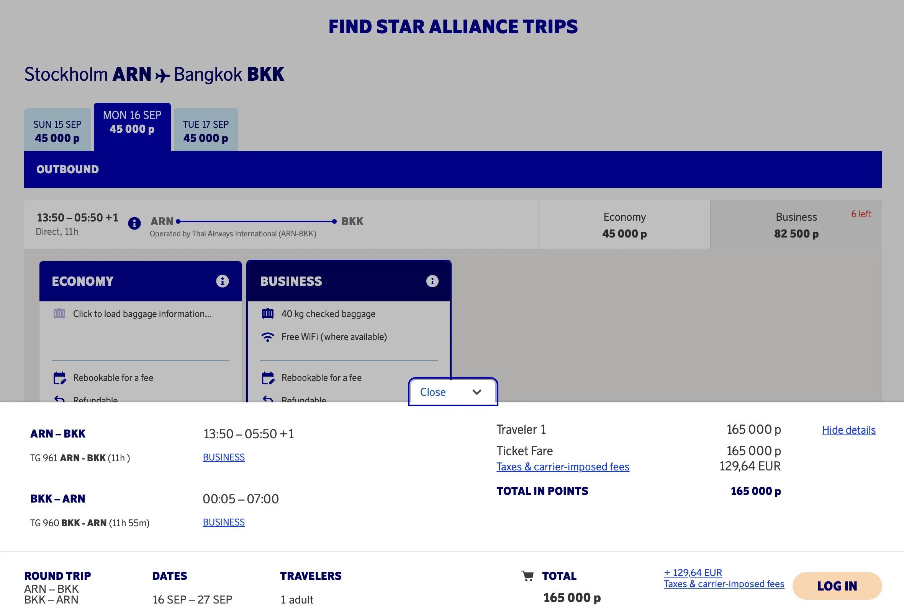
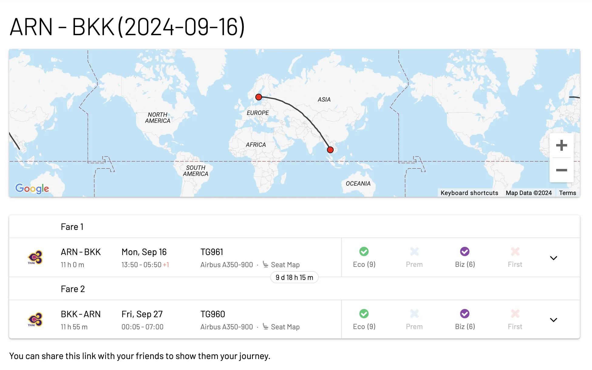

**Note**: There are only a handful of airlines and frequent flyer programs that allow a special Round-The-World (RTW) fare for award tickets (Cathay, Qantas, Aeroméxico, ANA, Lufthansa). However this guide serves beyond that purpose. Is aimed at planning and working out a full round-the-world itinerary, and check availability even if that means booking individual segments separately. AwardFares lets you find seats across multiple frequent flyer programs, which is perfect for using

## In This Post

- [In This Post](#in-this-post)
- [What is a Round-The-World Award?](#what-is-a-round-the-world-award)
- [Airlines/Programs with Round-The-World Awards](#airlinesprograms-with-round-the-world-awards)
- [How to Plan and Book Round-The-World Awards (Step-by-step)](#how-to-plan-and-book-round-the-world-awards-step-by-step)
- [Become a Pro Travel Hacker](#become-a-pro-travel-hacker)
- [Read More](#read-more)

## What is a Round-The-World Award?

A Round-The-World (RWT) award ticket is a special type of airline ticket that allows you to travel to multiple destinations around the world for a single price (in points or miles). Even though they are hard to score, these tickets can be great for maximizing the value of your points, given that most often the price is fixed.

RTW awards are offered by airlines or frequent flyer programs within an alliance (oneworld, Star Alliance, SkyTeam). Each alliance has its own rules and regulations, but they typically allow you to visit a certain number of destinations (usually between 3 and 16) within a set timeframe (e.g., up to one year). You can also choose your own itinerary, as long as it follows the rules (e.g., starting and ending in the same country, traveling in one direction only, etc.).

## Airlines/Programs with Round-The-World Awards

In practice, just a handful of airlines and frequent flyer programs have implemented Round-The-World redemptions, some of them even with an online search.

- **Star Alliance**: The Star Alliance Round-The-World Award allows members of any Star Alliance frequent flyer program (e.g., United MileagePlus, Lufthansa Miles & More, Singapore Airlines KrisFlyer) to book RTW trips using their miles. The trip must include at least three stopovers and can be up to 16 segments.
- **oneworld**: oneworld offers two types of RTW fares. The Oneworld Explorer is based on the number of continents visited, while the Global Explorer is based on the distance traveled. Frequent flyer programs like American Airlines AAdvantage, British Airways Executive Club, Cathay Pacific Asia Miles, and Qantas Frequent Flyer can be used.
- **SkyTeam**: The [SkyTeam RTW program was closed recently](https://www.skyteam.com/en/round-the-world-planner/).
- **Emirates**: Emirates Skywards does not have a formal RTW program, but it is possible to book a RTW trip using Skywards miles by combining flights with partner airlines like Qantas and JetBlue.
- **ANA (All Nippon Airways)**: ANA Mileage Club has a special Round-the-World Award which must include at least three stopovers and cannot exceed 12 segments. It's bookable online.
- **Aeroplan (Air Canada)**: Aeroplan offers a RTW award for 200,000 points in economy class and 300,000 points in business class. The itinerary can include up to 15 stopovers.

## How to Plan and Book Round-The-World Awards (Step-by-step)

Good news! AwardFares comes with a simple and powerful tool called [**Journey Planner**](https://blog.awardfares.com/journey-planner/). It's perfect for building Round-The-World itineraries, as it lets you search for available seats in realtime, accurately estimate the cost of each leg, and find options even across frequent flyer programs in a fraction of the time compared to using the airlines' search engine.

### 1. Go to [AwardFares](https://awardfares.com/signup?utm_source=round-the-world-award-flights&utm_medium=blog&utm_content=AwardFares)

Creating an account is optional, but it gives you access to many more features. Make sure to sign up for one!

### 2. Select your favorite Frequent Flyer Program

In this example, we'll choose **American AAdvantage EuroBonus** in the **Loyalty Program** picker. Let's build an itinerary on oneworld airlines.

### 3. Choose a Route

Here's a sample round-the-world itinerary with 6 stops, making the most of American Airlines AAdvantage miles and their partner airlines:

1. **New York to Tokyo**: American Airlines or Japan Airlines (JAL)
2. **Tokyo to Bangkok**: Japan Airlines (JAL) or Cathay Pacific
3. **Bangkok to Madrid**: Iberia
4. **Madrid to London**: Iberiao British Airways
5. **London to New York**: American Airlines or British Airways

We'll start by picking flights from [**New York (NYC) to Tokyo (TYO)**](https://awardfares.com/search?area:NYC.area:TYO.2024-11-14;o:duration;so:a;x:0;z:aadvantage). One-way Economy Class awards start at 35k points, and 69k points for Business Class tickets.

### 4. Add a leg to the Journey Planner

AwardFares will show you the available seats and flights in the list below. Once you've identified a good option, tap on the **[+]** icon to start planning a new *Journey*.

You'll see the new Journey created when tapping the **Journey** pill above the results. Note that this feature allows for creating and saving multiple journeys simultaneously, and you can switch between them from the dropdown menu.

### 5. Search for a return leg

After adding the outbound leg, tap on **Add Flight** to search for a return flight. AwardFares will automatically populate your origin city.

Add your destination by typing in the field, and a potential return date. In this case, we are flying back to Stockholm (ARN), and would like to spend at least a week in Bangkok.

The tool will search for available flights *after the one added to your journey*. To be extra clear, we display this information in the header of the search results. Once more, tap on the **[+]** icon to add the return leg to the Journey Planner.

### 6. Check your plans and book

After adding all your segments, you can see the entire itinerary in the Journey section and find more helpful options. Our tool displays, among other things, the time gap between flights (in days and hours). You can quickly delete segments or continue adding more before or after.

If you are ready to make your reservation, simply tap on the **Book** button, and AwardFares will redirect you to the airline's website, which will pre-fill your options.

As you can see in our example below, we confirm that the reduced price is applied: 165k points for a round trip compared to 198k points for booking two one-way tickets.

### More Features

Another handy feature is the option to copy the itinerary to the clipboard. This way you can paste it into your notes in case you have to, for example, contact the call center and book via phone.

**Copy to Clipboard**

**Share Journey**

Moreover, you can share the journey with friends or family members. Use the **Share** button, and you'll get a unique URL that you can copy and send over.

When opening the URL, you'll see the full itinerary, plus a map with the route.

In addition, you can create new trips, delete existing ones, unshare them, and more! Start exploring these features today with a [Gold or Diamond account](https://awardfares.com/pricing).

### A Few Things to Keep in Mind

- AwardFares is perfect for [helping you build complex itineraries](https://blog.awardfares.com/journey-planner/), even beyond round-trips. Today, as the rules of each frequent flyer program are different, our tool does not account for the different discounts when showing the prices. This means that **you will always see the price as if booking one-way**. You can hit the *Book* button for the final calculation and perform the final simulation on the program's page.
- You can use this tool to build round-trip itineraries even for programs that only allow one-way tickets.
- Using the Journey Planner to plan for Stopovers or Round-The-World tickets (RTW) is also possible. In this case, the booking link (*Book* button) won't take you to the airline's portal with the right information. In most cases you'd have to call the airline to book those itineraries.

## Become a Pro Travel Hacker

You can [try AwardFares for free](https://awardfares.com/). We are rolling out new features and improvements regularly, so [sign up for our monthly newsletter](https://awardfares.com/newsletter) to stay on top of the latest news, announcements, and pro tips.

With our [Gold and Diamond tiers](https://awardfares.com/pricing), you can access premium features such as unlimited daily searches, alerts, seat maps, flight schedules, and more!

## Read More

Our guides have all the information you need to be a pro travel hacker and explore the world on points. Here are some related posts you might enjoy:

- [Journey Planner: Building Perfect Award Trips To Difficult Destinations](https://blog.awardfares.com/journey-planner/)
- [Broad Searches: Full Guide](https://blog.awardfares.com/broad-search-guide/)
- [How To Find Cheap Award Flights And Identify Good Redemptions (Step-by-step)](https://blog.awardfares.com/how-to-find-cheap-award-flights/)
- [How to Book Round-Trip Award Flights Like a Pro](https://blog.awardfares.com/round-trip-award-flights/)
- [Ultimate Guide to Award Release Dates](https://blog.awardfares.com/ultimate-guide-to-award-release-dates/)
